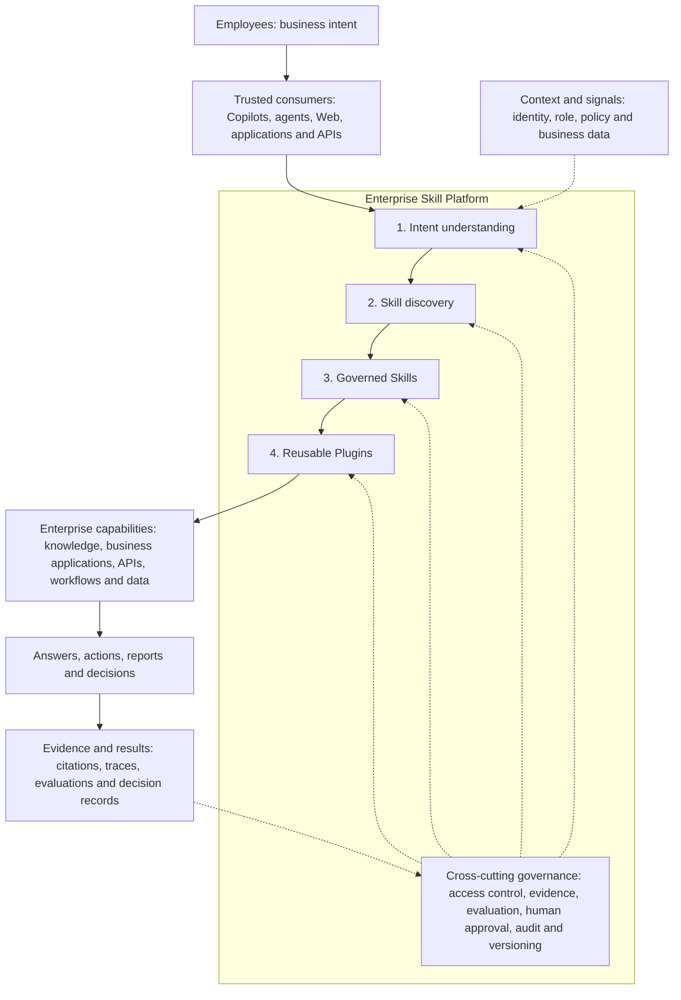

# Enterprise Skill Platform (ESP)

**Internal Hackathon 2026 Project**

### Connect Employee Intent to Enterprise Capabilities

**Employees think in intents. Enterprises store capabilities. ESP bridges the gap.**

Enterprise Skill Platform explores a capability-centric operating model for enterprise AI: discover the capability behind a request, apply its governance controls, execute through approved adapters, preserve evidence, evaluate the outcome, and retain human accountability.

The proposed enterprise asset is not another assistant. It is a portfolio of trusted capabilities that can outlive a particular interface, agent, project or model. Employees gain an outcome-oriented entry point; business teams retain ownership of their processes; engineering teams reuse implementations; and governance teams gain a consistent way to inspect how actions were authorized and supported by evidence.

**Build Once. Govern Once. Evaluate Continuously. Reuse Everywhere.**

[Azure DEV Demo](https://app-esp-dev-ygxkqw7r.azurewebsites.net/) · [Demo Story and Acceptance](HACKATHON-DEMO.md) · [Delivery Backlog](HACKATHON-BACKLOG.md) · [Quick Start](#quick-start)

> **Project context:** ESP is a project for the internal Hackathon 2026, intended for internal reviewers, colleagues and potential collaborators. It is an experimental prototype using synthetic, non-sensitive data, not a released Microsoft product or an enterprise-ready offering. The deployed experience is a Web application with an explicit shared DEV identity, not an integrated Microsoft 365 Copilot experience or a production authorization boundary. The architecture below separates the intended operating model from the capabilities demonstrated today.

## The Hackathon Proposal

**What if the reusable unit of enterprise AI were a governed business capability, rather than an implementation embedded in each agent?**

ESP uses the hackathon to explore that question through a working Security Review scenario. The project combines an architectural idea, an inspectable prototype and a proposed path to enterprise adoption. The goal is to make the idea concrete enough for internal discussion, technical evaluation and future collaboration, not to imply that the entire target platform is already built.

- **Idea to assess:** discover, govern and evaluate capabilities independently of the experiences that consume them.
- **Prototype to inspect:** intent submission, fixed review discovery, evidence-based control checks, explicit human decisions, bilingual reports and durable audit records.
- **Next proof to build:** independently reusable review Skills and an actual Copilot consumer using the same governed contracts.
- **Enterprise hypothesis to test:** reduce duplicated engineering and service-navigation effort while improving evidence, consistency and accountability.

These are the project's proposed discussion points, not official event judging criteria. Event rules, submission requirements and permitted sharing remain subject to organizer guidance. An internal-event label does not itself restrict access to the repository or the DEV application.

## AI Readiness Evaluation - September 21

The evaluation notice supplied by the project owner schedules the final evaluation for **Monday, September 21, 2026**. At least one repository must be accessible for scanning. The organizers plan to batch-scan accessible repositories, review AI Readiness results and recognize three projects. The notice does not specify a cutoff time or time zone, or establish the full hackathon judging rubric.

| Submission item | ESP status |
| --- | --- |
| Repository | https://github.com/Liming201909016/ESP2 |
| Scan branch | `main`; supply its exact commit SHA when submitting to the organizers |
| Final evaluation | September 21, 2026; exact submission cutoff/time zone still requires confirmation |
| Repository visibility | Kept unchanged; anonymous lookup returned 404, which does not establish repository type or reviewer access |
| Reviewer access | Not verified. Successful owner Git access does not prove the scanner can read this repository |
| CodeBlend evaluation | Not run: the evaluator is not installed on the current workstation; no AI Readiness score is claimed |
| Code verification | The review-race and audit-reference fixes below have regression coverage; application tests are not a substitute for the CodeBlend evaluation |

The notice recommends public repositories for easy access, **GitHub EMU Read access for `arechen_microsoft`**, or **Azure DevOps Read access for `arechen@microsoft.com`**. Do not apply the EMU account instructions to an unverified repository type. For a non-EMU private GitHub repository, confirm the appropriate scanner identity with the organizers. Do not make this internal project public merely to simplify scanning without approval.

Before final submission:

1. Confirm the repository type and sharing policy, then verify that the designated scanning identity can read the repository and target commit.
2. Obtain CodeBlend from its authorized source, review its data-handling requirements, and run the evaluator against the intended scan version. Use the output to select targeted improvements rather than optimize for an invented score.
3. Send the organizers the repository URL, branch and full commit SHA (`git rev-parse HEAD`), plus any actual evaluation results and unresolved access issues. Re-evaluate if subsequent changes alter the submitted version.

The Azure demo URL is supplementary, not a replacement for source access. GitHub CLI authorization and reviewer-access verification remain separate from Git push authentication. No repository visibility, collaborator access or automated deployment setting is changed by this documentation update.

## Why ESP?

### Capabilities Exist. Employees Cannot Find Them.

An employee needs visitor parking for a customer. The policy, booking form, approval workflow, service owner and correct URL may already exist, but the employee still needs to discover which system to use.

The employee asks for an outcome: **"I need visitor parking for a customer."** The organization presents applications, documents, portals, workflows and links.

The problem is not necessarily missing functionality. It is capability discovery. More agents and assistants can add another layer to navigate unless enterprise capabilities become discoverable through intent. Visitor parking illustrates the problem; it is not an implemented ESP workflow.

### Reuse the Capability, Not Just the Agent

HR, Finance, Legal, Security and Operations may build separate agents while repeatedly implementing knowledge retrieval, policy analysis, evidence extraction, compliance validation, risk assessment and reporting. Each implementation can develop its own prompts, integrations, quality checks and governance rules.

ESP proposes a different unit of reuse:

| Agent-centric pattern | Capability-centric model |
| --- | --- |
| A capability is embedded in each agent | A governed capability has an explicit contract |
| Each consumer maintains its own implementation | Multiple consumers invoke an approved implementation |
| Policies and evaluations vary across teams | Policy, evidence and evaluation requirements travel with the capability |
| Experience stays within a project or team | Validated experience becomes a reusable organizational asset |

**One Governed Skill = Many Consumers.**

The organizational goal is to learn once and benefit many times. Reuse does not remove consumer-specific security or governance responsibilities; it makes shared requirements and ownership easier to inspect and enforce.

## The Operating Model

**Intent → Skill Discovery → Governed Skill → Reusable Plugin → Enterprise Action → Evidence → Evaluation → Accountability**

| Concept | Responsibility |
| --- | --- |
| Intent | Express the requested business outcome; intent alone is not permission to act |
| Skill | Define a capability's inputs, outputs, version, permissions, policy and evaluation contract |
| Plugin | Bind a capability to an approved implementation, knowledge source, API or service |
| Workflow | Coordinate explicit capability dependencies and report actual invocation outcomes |
| Evidence | Retain source identifiers, excerpts, versions and the basis for findings |
| Evaluation | Check outcomes against stated criteria and disclose failures or insufficient evidence |
| Accountability | Preserve human reasons, actor identifiers, decisions and execution/audit history |

In the target model, a trusted consumer submits intent and context. ESP discovers an eligible capability, checks authorization and policy, invokes approved adapters, and returns an inspectable outcome. Writes that require confirmation or approval remain gated. A selected capability is not automatically an executed action, and a passing automated check is not human approval.

## Solution Design and Rationale

### Make the Capability a Product

A reusable Skill should be more than a prompt or a tool name. In the target design, it is a maintained business contract: what outcome it supports, who may invoke it, what evidence it needs, which implementation it uses, how its quality is assessed and who owns failures or changes.

| Design decision | Why it matters in an enterprise |
| --- | --- |
| Separate the consumer, Skill contract and Plugin implementation | A new interface need not duplicate business logic; an implementation can change within an agreed compatibility contract |
| Discover eligible capabilities, not merely semantically similar tools | A plausible match is not sufficient: identity, business scope, input requirements and policy must also permit the action |
| Keep discovery separate from execution | Finding a capability should not silently submit a request, grant access or create a business record |
| Use explicit plans and typed boundaries | Multi-step work can expose dependencies, validation failures and skipped steps instead of presenting an opaque agent answer |
| Treat evidence as an output contract | Consumers receive inspectable sources and provenance, not just a fluent answer or an unexplained risk score |
| Keep decisions and effects distinct | Recommendation, automated check, human approval and actual execution remain separately identifiable |
| Evaluate and version capabilities independently | A change can be assessed against its own consumers and criteria before promotion, rather than forcing every agent to be rebuilt |

These are architectural commitments and adoption criteria. Their complete enterprise implementation, including independent lifecycle management, remains future work.

### Two Connected Layers: Delivery and Capability Operations

**The delivery layer** handles the employee's request: understand intent, establish caller context, discover an eligible Skill, validate inputs, apply controls, invoke approved operations and return the result with evidence. If the system cannot safely choose a capability, it should clarify, decline or hand off instead of guessing.

**The capability-operations layer** manages the reusable asset: registration, ownership, contract review, evaluation, release approval, consumer dependencies, version compatibility, retirement and incident response. It answers questions such as: Who owns this capability? Which consumers use it? Which evidence supports its quality? Who must review a policy or implementation change?

The layers meet at a versioned contract. A caller cannot bypass authorization by finding a lower-level Plugin, and a catalog entry is not considered operational merely because it has a name and description.

### Reuse Mechanisms, Preserve Business Boundaries

Security review, supplier onboarding and procurement may all need evidence extraction, control checking and reporting. The proposed reuse is in those mechanisms and their explicit contracts, not in applying one department's rules to every request.

For example, a future supplier-onboarding workflow could reuse an evidence-extraction capability and a report-generation capability already used by security review, while selecting procurement-specific rules, approved supplier data and the appropriate decision owner. A second consumer would invoke those same capability versions rather than copy their logic. Reuse would be demonstrated through invocation records and compatible outputs, not by counting two buttons that call one monolithic workflow.

Tenant, department, region, purpose, data residency and resource permissions may constrain each invocation. Shared code must not imply shared access to records, identical approval authority or indiscriminate cross-team retrieval.

### Fit Existing Systems Instead of Replacing Them

ESP's target role is to connect intent to existing enterprise services, not to become a new system of record for every process. A suitable adapter could expose a governed read, start an existing workflow, create a bound action preview or return the correct approved service link. The owning business application would remain authoritative for its records and business transitions.

This supports incremental adoption: start with discoverability and read-only guidance, then add reversible or approval-gated actions where ownership, access and recovery behavior are established. Not every capability needs an LLM, not every request needs orchestration, and not every outcome should be automated.

### Federated Ownership, Shared Standards

The long-term operating model is federated: business domains own their capabilities and policies, while the platform supplies shared registration, invocation, evidence and evaluation requirements. This avoids making one central team the author of every enterprise process.

| Role | Proposed responsibility |
| --- | --- |
| Business capability owner | Define intended outcomes, scope, success criteria and business exceptions |
| Skill maintainer | Maintain contracts, approved implementations, regression coverage and compatibility |
| Data and service owner | Control source access, data quality, retention and system-of-record integration |
| Governance or risk reviewer | Approve required controls, decision boundaries and release conditions |
| Platform operator | Operate invocation infrastructure, diagnostics, budgets and incident response |
| Consumer team | Integrate the governed interface and preserve confirmation and evidence semantics |

These are proposed responsibilities, not roles already assigned to this project. Production adoption would also require real identity separation, support agreements and an accountable escalation path.

## Target Architecture

The diagram describes the **intended architecture**, not a list of completed integrations. Microsoft 365 Copilot, Copilot Studio, Teams, MCP and external business-system adapters are prospective integration points. The current implementation uses Web and CLI/HTTP consumers with a fixed set of capabilities and adapters.



### Relationship to MCP and Agent Platforms

ESP is not intended to replace an agent authoring or runtime platform. It focuses on the discovery, governance, evaluation, ownership and reuse of the capabilities those experiences consume.

- **Agent platforms:** create and operate consumer experiences. Copilot Studio is a potential integration point for ESP, not a dependency already connected to this prototype.
- **MCP:** can provide a tool/resource interoperability mechanism for an adapter. It does not, by itself, establish ESP's business authorization, evidence requirements or human approval rules. No MCP adapter is currently implemented here.
- **ESP:** explores how capabilities can be operated as reusable enterprise products across consumers, rather than hidden implementation details inside individual agents.

## Hackathon MVP: Security Review

The primary scenario is a **synthetic Docker Desktop introduction security review** for `SIM-SW-202609-0031`. Security Review demonstrates the operating model; it is not the boundary of the platform. Existing HR, Finance, Procurement, security-guidance and IT-ticket capabilities provide supporting scenarios.

Start with this supported request:

> Security review of Docker Desktop

1. Discover the fixed review workflow and inspect the capability and adapter plan.
2. Select a synthetic material pack and explicitly create a review.
3. Inspect licensing, data-processing and installer/image-source findings with their original evidence and versions.
4. Record a human decision and reason. Approval remains blocked when the control requirements are not met.
5. Open the bilingual HTML report or export the original JSON; inspect the recorded history and audit evidence.

| Material pack | Demonstrated behavior |
| --- | --- |
| Complete | Automated checks pass; an explicit human decision is still required |
| Missing | Evidence gaps block approval; request information and create a linked follow-up |
| High risk | Failing controls block approval; a human can reject or request information |
| Conflicting | Conflicting evidence remains visible; no automatic newest-source-wins resolution |

The review domain defines five capability stages: **Intake, Evidence Extraction, Control Check, Risk & Remediation Analysis, and Report Generation**. Four adapters cover **Evidence, Controls, Review Records and Reports**. These are currently domain-local implementations, not five globally registered, independently invocable Skills or four independently packaged Plugins. Report rendering is on demand, not a fabricated persisted execution stage.

### Implemented vs. Planned

| Area | Implemented in the prototype | Remaining target |
| --- | --- | --- |
| Consumer experience | English-default Web UI, Chinese switch, CLI using the same review HTTP API | Actual Copilot consumer and cross-consumer confirmation flow |
| Discovery | Permission-filtered seven-Skill catalog; bounded intent routing; fixed review discovery | Unified discovery of independently governed review capabilities |
| Execution | Two global Plugins, bounded parallel reads, fixed ticket-guidance workflow and review workflow | Global review adapter registration and independent capability reuse |
| Governance | Permission checks, input validation, ticket confirmation/approval, review decisions and audit-before-mutation | Production identity separation and broader lifecycle governance |
| Evidence and reports | Source-grounded knowledge answers, original review evidence, version labels, bilingual reports | Broader ingestion and retained-version evolution across capabilities |
| Evaluation | Deterministic review controls, knowledge evaluators and evaluation/import/proposal UI | Trusted continuous evaluation and approved improvement promotion |
| Persistence | Azure Blob review/audit records and PostgreSQL business state; bounded restart/concurrency verification | Wider reliability, retention and operational acceptance |
| Navigation | Employee Workspace, Capability Operations and Demo Center menu groups | Unified My Requests/My Tasks and complete workspace experiences |

### Verification and Boundaries

The deployed September 15 build passed **1127 tests across 70 files**, lint, build/types and data consistency checks. Live verification exercised four synthetic review branches, blocked three invalid approvals and confirmed identical review records, reports, ETags and 12 audit pairs after an application restart. Concurrent identical submissions reused one review. These results establish a bounded demonstration, not a production reliability guarantee.

- The DEV requester and reviewer share an identity. Review approval grants no real installation, licensing, purchase or production permission.
- Original source text, business records and human reasons are preserved; bilingual controls do not imply that all underlying content has been translated.
- The current reuse proof is the shared Web/CLI review service, not independent global Skill reuse or completed Copilot integration.
- "Evaluate continuously" and independent capability evolution are design goals. Automatic model evaluation schedules, training and improvement publication are not enabled.
- The historical knowledge evaluation remains **57/58**, with **QA-041 unresolved**. It was not rerun for the latest deployment and is not a new-release score.
- Full accessibility, independent version evolution and broader release-quality acceptance remain open. Audit storage is not claimed to be WORM.

## Future Enterprise Applications

The following are **illustrative expansion scenarios**, not deployed end-to-end integrations. They show how the same architectural approach could support different outcomes while retaining domain-specific policies and permissions.

| Employee intent | Proposed capability composition | Potential enterprise value |
| --- | --- | --- |
| "Arrange visitor parking for my customer." | Discover the service, retrieve applicable policy, identify the correct form and owner, optionally invoke an approved booking workflow | Reduce time spent finding services without replacing the facilities system |
| "Prepare onboarding for a new employee." | Retrieve role-specific requirements, identify equipment and access requests, coordinate permitted workflows and human approvals | Reduce handoff gaps across HR, IT and facilities; keep sensitive employee data scoped |
| "Can we introduce this software?" | Extract evidence, check license/security/data controls, identify gaps, request a decision and generate a report | Standardize the review process and make exceptions explainable; this extends the current synthetic review story |
| "Assess this supplier before procurement." | Collect authorized supplier evidence, run procurement and risk checks, route exceptions and produce a review package | Reuse evidence/reporting mechanisms while retaining procurement-specific accountability |
| "Help me prepare and claim this business trip." | Retrieve location-specific policy, check expense evidence, explain discrepancies and hand off to the expense system | Reduce preventable submission errors without allowing the assistant to invent policy or approve expenses |
| "Resolve this employee's IT issue." | Read an accessible ticket, retrieve approved guidance, suggest next steps and submit separately confirmed actions | Improve continuity between service knowledge and operational work while preserving execution controls |
| "Assemble the evidence for this control review." | Retrieve permitted records, map evidence to defined controls, flag gaps and assemble a traceable report | Reduce repeated evidence assembly; retain human judgment and avoid claiming compliance certification |

### One Employee Journey, Multiple Accountable Capabilities

Consider a future request: **"Prepare a customer workshop at our office."** It may involve visitor registration, parking, meeting space, equipment and approved information-sharing guidance. ESP should first clarify missing details and propose the applicable capabilities. Each action would retain its own owner, authorization, confirmation and completion state.

An unavailable parking service should not be hidden behind an overall "done" message. A room booking should not imply permission to share confidential material. The employee-facing result should show completed actions, unresolved work, evidence and the next accountable owner. This is the intended benefit of composable capabilities: a simpler experience without erasing business boundaries.

## Business and Strategic Value

ESP's value hypothesis is to reduce repeated capability engineering while improving discoverability, consistency and accountability. Benefits must be measured; this prototype does not claim proven ROI, production adoption or quantified cost savings.

| Stakeholder | Proposed value | Useful measures |
| --- | --- | --- |
| Employees | Express outcomes instead of navigating systems | Task completion, time to find the right capability, clarification rate |
| Enterprise teams | Reuse approved implementations and evidence requirements | Duplicate implementations retired, independent consumer count, maintenance effort |
| Governance and operations | Inspect capability ownership, policy coverage and outcome quality | Evidence completeness, gate coverage, failure rate, decision traceability |
| Microsoft ecosystem | Complement consumer and agent platforms with capability-oriented operations | Reuse across supported experiences and verified integration coverage |
| ISD and Unified Services | Leave reusable capability assets behind each engagement | Cross-project reuse, handoff completeness and demonstrated customer outcomes |

A capability-centered Services engagement can follow:

**Business Intent → Existing Capability Assessment → Gap Identification → Governed Skill Engineering → Knowledge and Plugin Integration → Evidence and Evaluation → Operational Handoff → Reuse**

Deliverables can include capability contracts, approved adapters, ownership models, evaluation criteria, policy controls, versioning requirements and operational runbooks. This is a proposed delivery approach, not a claim of an official Microsoft product, program or endorsement.

The strategic hypothesis is that enterprise AI maturity should be measured not only by the number of agents created, but also by the quality, governance coverage and reuse of the capabilities they consume. ESP does not claim that other platforms lack these features or that the model replaces agent governance.

### How Value Could Compound

**For employees: less system navigation.** The value is not simply a faster answer. It is reaching the appropriate service, understanding the applicable rule and knowing what actually happened without learning the enterprise's application topology.

**For engineering teams: lower marginal effort for the next consumer.** Once a capability has a maintained contract and a governed implementation, a new agent or application can integrate that contract instead of rebuilding the entire capability. Integration, domain adaptation and consumer-specific testing still have costs; reuse is not free.

**For governance teams: assess shared controls once, enforce them on every invocation.** Reviewable capability contracts can reduce duplicated control engineering while preserving caller-specific checks. A shared implementation also increases the impact of a defect, so rollout controls, consumer dependency mapping and rollback readiness are part of the value proposition, not optional extras.

**For business leaders: invest in a capability portfolio.** Visibility into usage, ownership, quality and dependencies could help identify duplicate work, unmet business needs and capabilities worth improving. A catalog count alone is not evidence of value; unused or unreliable capabilities should not be treated as successful assets.

**For organizational learning: turn validated lessons into reusable practice.** Execution findings can inform a reviewed change to evidence handling, policy interpretation or implementation. That change can then benefit multiple consumers. Employee content should not automatically become a shared asset or training input: privacy, permission, provenance and approval requirements still apply.

### Improvement Without Uncontrolled Self-Modification

The proposed learning loop is:

**Observed Outcome → Evidence-Based Evaluation → Owner Review → Improvement Proposal → Regression and Compatibility Checks → Approved Version → Monitored Reuse**

The purpose is governed improvement, not automatic training or silent publication. Historical reports must retain the evidence and versions that produced them. A candidate change should be rejected when it improves one metric while violating a hard safety gate or breaking another consumer. Evaluation frequency and cost budgets should be agreed explicitly rather than inferred from the phrase "continuous evaluation."

### Measure Outcomes Before Claiming Savings

A future pilot should define its baseline, scope, observation period and success criteria before implementation. Compare equivalent tasks and include unsuccessful requests, exception handling, human review, integration effort and ongoing operation costs.

| Value hypothesis | Measurement approach | Important guardrail |
| --- | --- | --- |
| Employees reach the right capability sooner | Compare median and tail time-to-service and task completion for the same scenarios | A fast wrong answer or unnecessary action is not a success |
| Teams avoid duplicate engineering | Track independently consuming applications and the implementations actually retired or avoided | Do not count renamed copies as reuse or assume all historic development cost is saved |
| Shared controls improve consistency | Measure required evidence coverage, policy-gate failures and human-adjudicated correctness | A passing automated check alone is not proof of compliance |
| Changes become easier to manage | Track change lead time, affected consumers, regressions and recovery time | Shared capabilities can increase blast radius without version controls |
| Operational effort decreases | Compare human handling time and rework, net of platform, model, review and support costs | Time released is not automatically a cash saving |

No numerical improvement is claimed yet. These measures are a framework for testing ESP's business case, not results produced by the hackathon demo.

## Enterprise Adoption Path

Adoption should progress through evidence-backed gates, not a promise to automate every process at once.

| Stage | Deliverable | Exit evidence |
| --- | --- | --- |
| 1. Discover and prioritize | Inventory existing capabilities, identify duplication and choose one bounded scenario | Named business owner, baseline, data classification and agreed acceptance criteria |
| 2. Prove a governed vertical slice | Connect one consumer to an approved capability with evidence and explicit decision boundaries | End-to-end tests, real access controls for the intended environment, failure handling and operational ownership |
| 3. Demonstrate independent reuse | Connect a second consumer or business workflow to the same capability contract | Same implementation/version used without copied logic; equivalent governance and consumer-specific authorization |
| 4. Operate a domain portfolio | Introduce reviewed registration, compatibility checks, release controls and dependency visibility | Measured usage/quality, support procedures, change-impact review and a tested recovery path |
| 5. Expand across the enterprise | Enable domain-owned capabilities under shared platform standards | Approved tenant/region boundaries, cost controls, retention policies and measurable cross-domain benefit |

The current Security Review prototype provides evidence for a bounded vertical slice and whole-workflow Web/CLI reuse. It does not establish production readiness or completion of these enterprise adoption stages. The next architectural proof is independent capability reuse through the same governance boundary, including a real Copilot consumer.

### What ESP Should Not Become

- A central agent that absorbs every department's business logic and authority.
- A tool catalog that equates discoverability with permission to execute.
- A duplicate system of record competing with the applications that own business data.
- A metrics dashboard that treats agent count, fluent answers or demo success as business value.
- An automatic improvement loop that changes rules or publishes capabilities without accountable review.

**The future enterprise value is a growing body of trusted, reusable capability, not a growing collection of disconnected assistants.**

## Quick Start

Requires **Node.js 24** and npm. From a cloned checkout:

```bash
git clone https://github.com/Liming201909016/ESP2.git
cd ESP2
npm ci
node scripts/dev-security-review.mjs
```

Open **http://127.0.0.1:3100/** and select **Security Review**. The local launcher uses fixed synthetic evidence and development-only memory storage for reviews and their audit records. This review flow does not require a model or cloud credentials. Restarting the local process clears its reviews. Other knowledge, ticket and management operations require their configured backends; the launcher does not provision those services.

```bash
npm test -- --silent
npm run lint
npm run build
npm run data:check
```

The production-mode server rejects memory review storage. Cloud use requires the explicitly configured Azure environment, approved identity/access settings and durable services. Never put credentials or real enterprise records into the repository.

### Technology and Code Map

The implementation uses Next.js 16, React 19, TypeScript and Zod, with Azure App Service, Blob Storage, AI Search, a Foundry model integration and PostgreSQL for the deployed environment.

| Location | Purpose |
| --- | --- |
| [src/app](src/app) | Web experiences and governed HTTP API routes |
| [src/lib/esp](src/lib/esp) | Skill/Plugin contracts, routing, policy, audit, evidence and review logic |
| [src/data](src/data) | Synthetic knowledge and business data |
| [scripts](scripts) | Evaluators, local launcher, packaging and controlled release tooling |
| [infra](infra) | Azure infrastructure and private-network templates |
| [.github/workflows](.github/workflows) | Validation and gated release workflows |

## Roadmap and Documentation

The [delivery backlog](HACKATHON-BACKLOG.md) tracks this internal Hackathon 2026 project plan. Official event rules, timing, sharing requirements and named owners still require confirmation. The [demo story and acceptance matrix](HACKATHON-DEMO.md) distinguish current proof from planned integration.

Priority work includes complete business-oriented workspaces, global review capability registration, actual Copilot reuse, compatible capability version evolution, QA-041 resolution, broader accessibility/quality acceptance and submission materials. Publication of capabilities, data migrations and cloud changes remain explicit, bounded operations.

**Vision: One Copilot. Thousands of Capabilities. Learn Once. Benefit Many Times.**

This is the direction of the platform, not the scale demonstrated by the prototype.

<details>
<summary><strong>Implementation Notes, Release Evidence and Operational History</strong></summary>

The notes below retain implementation and deployment history. Artifact links under the ignored local artifacts directory refer to operator-held verification files and are not available in a fresh GitHub checkout. They are not public evidence downloads. The current deployment summary and its limitations remain readable below without those files.

## Review Correctness Fixes - Not Deployed

The review panel now rejects superseded detail responses and binds decision drafts to the selected review ID and ETag. History pagination has a synchronous in-flight guard, request cancellation, stale-response rejection and ID deduplication. Refresh and pagination controls reflect their own loading state. Three DOM interaction regressions reuse the existing review generator to exercise delayed details, repeated pagination and a late page arriving after a target change; Testing Library and Happy DOM are development-only dependencies.

Failed review decisions now retain a `security_review` reference in the audit result after reading the target through the current owner's store. The audit start is still persisted before that read or any decision. Error responses may include minimal `reviewRecord` metadata (`id`, `policyVersion`) for this verified target; missing or foreign targets do not receive this reference. Existing historical audit entries are not modified or backfilled.

Validation: **1131 tests / 71 files**, full lint and production build/types passed during implementation. These fixes are included in the source update for evaluation preparation but are not included in the deployed release below. Historical audit records are not backfilled. Publishing the source is not a deployment or an AI Readiness evaluation.

## Current Azure DEV Release

User-authorized manual deployment on **2026-09-15** is complete at **https://app-esp-dev-ygxkqw7r.azurewebsites.net/**. Release **`6421747f-c475-4d2a-9239-d3b16efed4d6`**, build `fOzUgq-Cvo9wUrUhmoBau`, deployment `7ed1fb44-68c4-4210-871c-cccd2b1340a6` completed at `2026-09-15T02:38:44Z`. This includes Security Review, the bilingual presentation increments and the first grouped-navigation increment. It is a `sourceCommit=local` manual package, not a CI-provenance release or automatic deployment activation.

- [Release manifest](artifacts/azure-workspaces-review-20260915/manifest.json): ZIP SHA-256 `961273ec71bf83d563e8cad6f488df3b7d3b7ec58ea344fc50292f04e9f4ea94`. The verified [previous release package](artifacts/azure-p0-excerpt-ref-20260914-113500/manifest.json), release `9d70309a-340e-41db-9d72-0d5f275ef7b7`, remains the rollback baseline. Rolling back to it removes the new review UI/API; retained review blobs would not be deleted.
- Pre-deployment readiness found the existing PostgreSQL server stopped. With explicit user confirmation it was started, restoring running charges. Public network access remains disabled; network, SKU, identity/permissions, migration and seed settings were not changed. [Preflight evidence](artifacts/azure-workspaces-review-20260915/preflight.json) confirms the old release was healthy before replacement and knowledge digest/state schema were unchanged.
- **1127 tests / 70 files**, full lint, production build/types, 80-view/101-source consistency, archive validation and isolated packaged startup passed. [Live runtime checks](artifacts/azure-workspaces-review-20260915/runtime-verification.json) confirm the exact new release, healthy Blob/Search/PostgreSQL dependencies, English default, Chinese cookie response and Blob review storage.
- [Bounded synthetic review verification](artifacts/azure-workspaces-review-20260915/review-verification.json) created exactly four records: complete approved, missing information requested, high-risk rejected, conflicting rejected. Three invalid approvals were blocked; concurrent identical submissions reused one record. All 12 review audit pairs completed. English/Chinese HTML reports and unchanged JSON downloads passed. Reasons explicitly identify deployment tests, not real installation/licensing authorization.
- [Restart verification](artifacts/azure-workspaces-review-20260915/restart-verification.json) compared all four original records, reports and ETags plus all 12 audit pairs after app restart: identical, with no duplicate reviews. The existing ticket trial correctly returned `needs_input` and a recorded audit without creating a ticket. Existing ticket/approval counts remained 16/11. No model call, knowledge publication or data migration was performed.
- Real cloud browser inspection showed the persisted review/history, bilingual evidence with original text and zero locale-triggered requests; 1440/390/320 had no horizontal overflow. This is scoped release acceptance, not complete B08 visual/accessibility acceptance. The last model-quality result remains the historical 57/58 on the previous release; QA-041 is unresolved and no new model-quality score is claimed.

### Workspace Navigation Increment

The existing ten destinations are grouped into **Employee Workspace**, **Capability Operations** and **Demo Center**. Navigation retains the existing view callbacks and does not grant permissions. The collapsible native menu has text labels on mobile. Local browser checks retained an unsent workbench draft across navigation, sent zero POSTs and preserved locale switching without requests; 1440/800/390/320 layouts were checked. Two additional assertions reuse the existing locale test file. This is the first C01/C06/C08 increment, not independent workspaces, a unified My Requests/My Tasks experience, unsaved-form guards or a completed navigation redesign.

The sections below retain their original incremental validation history. Earlier "local only" and "not deployed" statements describe those historical runs; the current release status above supersedes them.

## English Foundation (Increment History)

The user confirmed English (`en-US`) as the default, with Chinese (`zh-CN`) selectable. The typed locale dictionaries and shared provider now translate the navigation and top-bar controls. The root layout reads the `esp-locale` preference cookie asynchronously and sends the same locale to HTML and the client provider; absent/invalid values fall back to English. This makes pages using the root layout request-time rendered rather than statically fixed to Chinese. The preference is not an identity/permission token.

Language switching updates client presentation, HTML `lang` and a one-year SameSite=Lax preference cookie (Secure on HTTPS), without navigation, network mutation or business request replay. It does not key/remount the workbench or modify canonical evidence, machine IDs, approval state or original decision reasons. Dates use the selected locale through `Intl`-backed formatting. Employee, management and demo controls, known registry metadata, Security Review and reports are bilingual locally. Dynamic source/model content is preserved as original text; complete visual/accessibility and cloud acceptance remain B08/G.

Verification: five locale tests plus the full **948 tests / 70 files** passed; full lint, production build/types and unchanged 80-view/101-source consistency passed. Independent HTTP requests checked English default, Chinese preference and invalid-cookie fallback. Browser switching retained an unsent security-review query and material selection, sent zero POSTs, and retained Chinese after reload. Viewports 1440/390/320 had no horizontal overflow and a desktop screenshot was inspected. These checks establish the foundation, not complete bilingual accessibility acceptance. Azure has not been deployed.

The [versioned English demo story, bilingual glossary and SR-01 through SR-16 acceptance matrix](HACKATHON-DEMO.md) are available. Official event materials and named owners remain pending by user choice; the performance budget is proposed, not agreed.

### Skill Catalog Localization

The Skill catalog now localizes its list, filters, overview, input/output labels, references and trial controls. The seven known Skill names/descriptions reuse the version-aware presentation mapping; original metadata remains available. Search indexes both original and English names/descriptions independently of the selected language, alongside IDs, permissions and keywords. Switching language therefore does not change the filter's meaning, reset the active detail tab or replace the selected trial case.

Known input labels translate only when both the field name and original label match. Field IDs, required flags, bounds, patterns, enum values and JSON Schema remain unchanged. Backend labels distinguish Blob/PostgreSQL and read/write without changing implementation binding. Original case titles, requests and source metadata are retained; trial execution still sends the original case query and Skill ID through the existing unconfirmed request flow. Catalog errors use fixed translation keys; permission failures, invalid responses and unavailable reads do not expose raw dependency text or masquerade as empty catalogs.

Verification: **1057 tests / 70 files**, full lint, production build/types and 80-view/101-source consistency passed. Real local catalog browser checks verified English search, confirmation filtering, keyboard tab navigation and trial-case preservation with zero locale-triggered network requests. Both languages passed DOM bounds checks at 1440/390/320, and a 390px contract-panel screenshot was inspected. One trial POST was intercepted to verify the original query, `create-it-ticket` and `confirmed: false`; no business execution occurred. Three catalog error responses were also mocked and checked for language switching/no raw error leakage. All intercepts were removed and the real catalog restored.

B03 is complete for the current local presentation scope. Evaluation, Plugin, workflow, knowledge-library, Blob source/sync, standalone source-page, audit, Demo Center and runtime controls are covered by the increments below. Original content and machine contracts are retained; full visual/accessibility and cloud acceptance remain B08/G. Source packs, evaluation contracts and results were not changed, and no model calls, real ticket/review writes or Azure deployment occurred.

### Runtime Context Localization

The [runtime trace view](src/app/runtime-context.tsx) adds bilingual labels for known request, intent, execution, approval, parallel and workflow events while keeping their original step codes visible. Unknown steps render only their original code; no success, skipped stage or explanation is inferred. Order and timestamps remain unchanged, with the original timestamp in a semantic `time` element. Labels and long codes wrap instead of truncating. Identity-source labels distinguish shared DEV, Microsoft Entra ID and no authenticated identity; the sidebar now uses the same unconfirmed-environment presentation as the header.

Validation: **1125 tests / 70 files**, full lint, production build/types and unchanged 80-view/101-source consistency passed. Two locale-parametrized cases in the existing test file cover original code/time preservation, unknown/prototype-key fallback, escaping and empty state. A single intercepted failure response verified trace order, codes and timestamps in both languages, zero locale-triggered requests and no overflow at 1440/390/320; a narrow-screen screenshot was inspected. The interception and simulated result were cleared. No execution service, audit record, model or Azure resource was modified. This completes B03 locally, not B08 accessibility or cloud acceptance.

### Demo Cases And Business Ledger Localization

The existing Demo Cases page now localizes its outer navigation, case filters, expected outcomes, reference controls, combined-demo preflight and synthetic business ledger through a [shared presentation dictionary](src/lib/esp/demo-locale.ts). Known fixed-demo titles and blocker/status labels have English representations; unknown original labels remain unchanged. Original simulation questions, reference answers, fact labels, business names, amounts, record fields/history, source links and request parameters are preserved. Search remains over original content and IDs, not an automatic translation of the data pack.

Language switching retains selected cases, lookup text, filters, ledger pagination/related-object views and demo ticket selection without requests. Preflight expiration, current-identity ticket eligibility, dependency/source checks and the fresh six-read preflight before scenario execution are unchanged. Model configuration still means **Not probed**. Case execution and ticket preparation retain the original callbacks; the domain demo request and result-checking logic were not changed.

Validation: **1123 tests / 70 files**, full lint, production build/types and unchanged 80-view/101-source consistency passed. Existing test files and fixtures were reused, with four net additional cases and no new test file. Read-only browser checks verified original case content, related-record navigation, pagination and zero locale requests. One mocked preflight flow verified ticket/query preservation, expired-run blocking and fresh preflight before a single intercepted `confirmed: false` request; no business/model execution occurred. Both languages were checked at 1440/390/320. An English case-table overflow was corrected with cell/label wrapping and rechecked at 320/390; a narrow-screen screenshot was inspected. Intercepts and simulated state were removed. Runtime notices are covered above. Full B08 visual/accessibility acceptance and the three-workspace navigation remain open; no Azure deployment occurred.

### Audit Ledger Localization

Audit list/detail controls, filters, references, actor-source labels, errors and metadata summaries now use a [typed bilingual dictionary](src/lib/esp/audit-locale.ts). Filter values reuse the audit contract enums. An incomplete audit explicitly means only the start record was saved, not that the business operation failed. Identity-scoped reads, trace/reference navigation and permissions are unchanged. Original IDs, actions, hashes, field codes, record JSON and downloaded JSON remain unchanged; language switching does not refetch records or reset lookup/filter state.

Validation: **1119 tests / 70 files**, full lint, production build/types and 80-view/101-source consistency passed. Existing audit fixtures and store tests were reused, with only three added presentation cases. One mocked read-only browser flow verified zero locale-triggered requests, unchanged JSON/export and raw trace/reference parameters, local invalid-ID rejection and unavailable-versus-empty handling without leaking raw errors. Both languages passed DOM bounds checks at 1440/390/320; a narrow-screen error-state screenshot was inspected. All intercepts and simulated state were cleared. No real audit/business write or Azure deployment occurred; complete B08 visual/accessibility acceptance remains open.

### Original Source Page Localization

The standalone `/knowledge/<source-id>` page now has bilingual navigation, simulation warning, metadata labels and a language selector. Its [presentation component](src/app/knowledge-source.tsx) uses the existing server-selected locale provider; switching language does not refetch the source. Titles, organization, owner, section, effective/snapshot date, version, source ID and body remain original content. A visible original-source label distinguishes preserved evidence from translated controls. React text escaping remains in effect, and the toolbar wraps on narrow screens.

The server still resolves the source through `publishedKnowledgeSource` before passing it to the view: built-in sources remain available, managed chunks require published status, and unavailable IDs still call `notFound()`. No new access policy, publication behavior or automatic evidence translation was introduced. This page does not establish an additional identity boundary beyond the existing source resolver.

Validation: **1116 tests / 70 files**, full lint, production build/types and unchanged 80-view/101-source consistency passed. Existing source tests retain draft/indexing/inactive/error exclusion and canonical-content checks. Two new rendering tests verify both languages, original data unchanged and HTML text escaping. Real local browser checks used the built-in VPN support source: title and 838-character body stayed identical across locale changes, with zero network requests, no DOM overflow at 1440/390/320 and visible keyboard focus. Independent HTTP checks verified English default, Chinese cookie, invalid-cookie fallback and an unknown source's 404. A narrow-screen screenshot was inspected. No source, index, model or Azure resource was modified.

### Blob Source Sync Localization

The source connector now uses a [typed bilingual dictionary](src/lib/esp/connector-locale.ts) for its list, filters, configuration, source differences, chunk preview, version comparison, history and explicit initialization/sync confirmations. Asynchronous errors retain allowlisted keys rather than rendered strings; initialization summaries retain numeric counts so they update with the selected language. Configuration reads distinguish loading from unavailable outcomes. Source titles, original content, manifest JSON, fingerprints, hashes, ETags and target IDs remain unchanged.

New/changed source versions still import as drafts without automatic publication. An unchanged version reuses its document while retaining publication status. Initialization retains existing source files. Confirmation and permission controls, recovery IDs, audit-parent headers and request contracts are unchanged; no automatic retries were added. Unknown errors use a fixed fallback without exposing raw dependency text.

Validation: **1114 tests / 70 files**, full lint, production build/types and 80-view/101-source consistency passed. Twenty-seven new tests cover both initial languages, all 24 public error codes, unknown/prototype-key fallback and draft/reuse/recovery semantics. Browser-intercepted checks simulated draft creation, reuse of a published document, source-version conflict and source initialization (four explicit POSTs). Language changes preserved confirmations, manifest JSON and all version-binding request fields, with zero extra requests; initialization counts also changed language correctly. These are synthetic presentation checks, not actual Blob writes, initialization, synchronization or publication.

Read-only controls, unavailable source content and failed-versus-empty lists were checked independently. Both languages passed 1440/390/320 DOM bounds checks, and the 390px version-panel screenshot showed wrapping fingerprints/ETags and visible keyboard tab focus. Test intercepts and simulated source records were cleared afterward. No model, cloud resource, source file, index or real business record was modified. Full B08 acceptance remains open; source-detail, audit, Demo Center and runtime controls are covered above.

### Knowledge Library Localization

Knowledge-library list/detail controls, origin/status/area filters, import forms, chunk previews and publication/deactivation confirmations now use a [typed bilingual dictionary](src/lib/esp/knowledge-library-locale.ts). Errors retain allowlisted keys and update at render time; unknown file, parsing and dependency failures never display raw content. Publication failure with a retained draft remains distinct from an inactive document whose index cleanup failed. Read-only mode does not expose management actions.

Titles, owners, document numbers, body text, built-in template content, chunk offsets and JSON contracts remain unchanged. Language switching preserves import fields, synthetic-material acknowledgement, preview content, selected document/tab and pending confirmation without requests. Draft saving still requires preview; publication and deactivation require separate explicit confirmation with the existing ETag. No automatic publication or retry was introduced. Retrieval tests retain the original document-based query. Blob provenance labels are localized, but the linked connector and standalone source pages remain separate work.

Validation: **1087 tests / 70 files**, full lint, production build/types and unchanged 80-view/101-source consistency passed. Sixteen new assertions cover bilingual loading/import safeguards, stable filter values and error semantics. Browser interception simulated preview -> draft -> publication -> deactivation with cleanup failure: four explicit POSTs, no locale-triggered requests, identical original content/preview and preserved ETags. Further checks covered read-only controls, keyboard tabs, empty versus failed reads, unsupported file extensions, malformed UTF-8 and oversized files. File validation sent no requests; saved-draft controls stayed disabled without preview. Both languages passed DOM width checks at 1440/390/320, and a narrow-screen import screenshot was inspected. All intercepts and simulated documents were cleared. No real document was saved, published or deactivated; no index, model or Azure resource was modified.

### Workflow Launch Localization

The fixed read-only workflow launch panel now localizes its title, dependency plan, current-user ticket selection, loading/empty/error states and execution controls. English and Chinese request text is generated only at initial mount or explicit ticket selection. Switching locale does not replace a draft, change the selected ID, refetch catalogs or rerun the workflow. Errors retain stable translation keys; unknown responses never expose raw dependency text. An unavailable ticket list still permits entering a known ID, but an empty or unavailable workflow catalog does not enable execution.

The existing `ticket-handling-guidance` version `1.0.3` contract, permission checks and server-owned IT guidance query are unchanged. Both language variants pass the same request schema and retain the same ticket ID. Missing tickets still skip the dependent step, and uncertain responses explicitly warn that server-side reads may still be running, without automatic retries.

Validation: **1071 tests / 70 files**, full lint, production build/types and unchanged 80-view/101-source consistency passed. New tests cover bilingual initial state, request generation, safe error mapping and execution with the same server-owned dependent query. Browser-intercepted checks covered ticket selection, manual drafts, a not-found/skipped response, permission denial, malformed responses, unavailable ticket lists and empty/unavailable workflow catalogs. Language switching preserved inputs/results with zero extra requests. Both languages passed DOM width/button checks at 1440/390/320, and the narrow-screen launch panel screenshot was inspected. These were synthetic UI checks, not live model or business executions; all intercepts and simulated results were cleared afterward.

The local server was offline on September 15 and was started with the existing DEV launcher at `http://127.0.0.1:3100/`. Prior process-memory review records must not be assumed to survive that restart. No Azure deployment, data import/migration, model call or business write was performed. Runtime, Demo Center and audit controls are covered above.

### Plugin Catalog And Trial Localization

Plugin list/search/filters, operation selection, contracts, dependency configuration and trial controls are bilingual through a [typed Plugin dictionary](src/lib/esp/plugin-locale.ts). Search includes known English operation and Skill names alongside originals, independently of the selected locale. Configuration presence remains separate from connectivity: dependencies still show **Not probed**, not an invented healthy status. JSON Schema, permission identifiers and original examples remain unchanged.

Trial inputs, saved-ticket selection, read results, write previews and errors use the current locale. Language switching does not refetch records, reset drafts, mutate preview JSON or replay operations. Unknown errors use a fixed fallback; knowledge failures reuse the established factual-verification notices. Cancellation means stopping response reception, not a guarantee that server-side reads stopped. A write preview still states **No write executed** and hands its original query/parameters to the existing workbench confirmation flow with `confirmed: false`. It does not create a ticket or bypass approval.

Validation: **1067 tests / 70 files**, full lint, production build/types and 80-view/101-source consistency passed. Added tests cover both languages, loading versus empty state, disabled trial forms, stable contract inputs, all trial statuses, configuration/preview semantics and allowlisted errors. Read-only browser checks used the real local Plugin catalog. Browser-intercepted responses exercised draft -> preview -> workbench handoff, saved-ticket selection -> read result and permission failure. Locale changes produced zero extra requests and retained original IDs, descriptions, impact and result JSON. Preview/handoff and read checks were mocked, not real writes or model calls. Both languages passed 1440/390/320 DOM width checks for the preview flow; a 390px trial screenshot was inspected. All intercepts and simulated results were cleared afterward. No Azure deployment or business record mutation occurred.

### Evaluation Panel Localization

The embedded evaluation/improvement panel now has a [typed bilingual dictionary](src/lib/esp/evaluation-locale.ts) for controls, metrics, criteria, investigation leads and comparison blockers. Import/export errors retain allowlisted keys and update with the selected language, without displaying raw file or exception contents. Ratios and durations use localized numeric formatting; report timestamps retain their original value with an explicitly UTC localized display. Unknown machine codes remain unchanged rather than being interpreted as success.

The original report parser, comparison algorithm, gate logic and proposal generator are unchanged. Unevaluated gates remain unevaluated even when case assertions pass. Provisional thresholds, unassigned owners, unverified file provenance, incomplete hard-gate coverage and missing holdout/business review remain explicit. Ticket evaluation collectors are still unavailable. Reports are processed only in the local browser session, not uploaded or used to run models. Export still produces an unapproved draft with evidence digests, original hypothesis and `automaticChanges: false`; no Skill is published, trained or edited.

Validation: **1061 tests / 70 files**, full lint, production build/types and unchanged 80-view/101-source consistency passed. Existing Chinese render tests were retained; new checks cover bilingual criteria, unknown-code/error fallback, comparison invariance, unchanged original reports and explicit not-comparable/ticket-collector limitations. Browser checks imported two sequential **synthetic UI-test reports**, not project-quality evidence. A candidate improvement still showed failed cases and all applicable blockers. Language changes retained both reports, metrics, page, filter, target and the original hypothesis with zero API requests. The proposal download was intercepted to inspect its JSON and confirm draft/unapproved/no-automatic-change fields; it was not submitted or published.

Invalid and oversized imports were rejected with bilingual errors and no raw content exposure; an invalid baseline disabled export. Both languages passed DOM bounds/button-clipping checks at 1440/390/320. A narrow-screen screenshot showed readable metrics and limitations; the broader integrated-browser capture/scrollbar inconsistency remains B08. Test reports and hypotheses were cleared afterward. No new quality run, cloud mutation, business record, source publication or Azure deployment occurred.

### Ticket And Knowledge Controls

Ticket details and business-selection form labels, validation, impact options, confirmation preview/actions and ticket receipts use the shared dictionary. Selection values remain `individual`/`team`/`organization`, and language changes do not reset description/device drafts or the confirmation/submission IDs. Workbench request failures retain a message key, bounded request ID and applicable verification/retry metadata instead of rendered text; locale changes update the visible message without replaying the operation. Unknown exceptions do not expose raw provider text. Existing confirmation/reconciliation controls and server contracts are unchanged.

Knowledge answers and exact citation excerpts remain untouched and are labelled as original content. Missing-evidence and factual-verification reasons have complete English/Chinese mappings; tentative reviewer findings remain tentative, numerical failures remain blocked, and no automatic retry or generated-content fallback was added. The pure feedback helpers keep their previous Chinese default for legacy callers; localized employee components explicitly pass the selected locale. Parallel results and dependent-workflow results translate statuses, counters, failure/skip notices and actions while retaining original task queries and IDs. Skill usage translates fixed fields and distinguishes invocation, no invocation and receipt reuse; original registry names/descriptions/bindings are not silently translated.

Validation: **1029 tests / 70 files** passed, along with full lint, production build/types and data consistency. Existing Chinese component tests remain; English tests cover reason mappings, original data unchanged, invocation counts and skipped dependencies. Browser `/api/route` interception simulated ticket input -> confirmation -> receipt (three requests), invalid-input message switching, two error responses and a knowledge answer. Drafts, impact, confirmation ID and submission ID survived switching; locale changes generated zero requests. These are **frontend-only mocked checks**, not real tickets, model outputs or cloud acceptance. All intercepts were removed. No actual ticket/review was created or modified and no model/Azure calls were made by these checks.

A 320px English workbench toolbar overflow was fixed by allowing the heading/tools to wrap. Stable post-layout checks passed at 1440/390/320 in both languages; developer hot updates required reloading before checking final styles. Integrated-browser screenshots still show inconsistent edge clipping, so full visual acceptance remains B08. The later increment below completes the remaining B02 presentation items; real cloud validation requires separately authorized scope. Workflow launch and Demo Center controls are covered above; original case and ledger content is retained.

### Employee History And Approval Completion

Ticket history now localizes labels, timestamps, empty/loading/error states and owner details. A failed read is not presented as an empty list. Record-selection buttons are keyboard accessible, and locale changes preserve the selected ID without reloading records. Approval queues, status filters, details, confirmation forms, event labels and receipt/reconciliation notices are bilingual. Approve, execute, reject, withdraw and reconcile remain distinct server-returned actions; approval is not ticket creation. Reasons remain unchanged. Rejection still requires a reason; locale changes preserve a pending action, its reason and ETag without network activity. Unknown errors use fixed messages, not raw dependency text or inherited object properties.

Known policy ID/version/rule text receives an English representation with the original available alongside it. Unknown versions or changed originals are not silently assigned a translation. [Skill presentation](src/lib/esp/skill-presentation.ts) similarly maps the seven known registry entries and three operation names for employee results, preserving the original name/description/operation in expandable metadata. Clarification choices use the same stable IDs and known name mapping; dynamic model questions and routing reasons remain explicitly labelled originals beneath bilingual action guidance. This adds no new model calls and does not change discovery, execution or permissions.

Completion checks: **1053 tests / 70 files**, full lint, production build/types and 80-view/101-source consistency passed. Tests cover every approval status/action/event, 19 error codes, unknown-error fallback, exact policy/registry matching and original-data preservation. Browser interception simulated approval -> approved (no ticket) -> execute conflict, required rejection reasons, opinion/ETag preservation and zero locale requests. Mocked ticket history tested selection, empty and failed reads; mocked clarification retained and submitted `get-ticket-status` after language changes. Approval policies/details were checked in both languages at 1440/390/320; ticket history at those widths had no DOM overflow. These are presentation checks, not actual approval/ticket writes or cloud reliability results. All intercepts are removed and simulated results are cleared after validation.

B02 and B03 are complete for current local presentation. B08 complete visual/accessibility acceptance, menu restructuring, global capability integration, actual Copilot reuse and cloud release tasks remain open. No Azure deployment, model invocation, source publication or real business mutation was performed in this increment.

### Security Review Interaction

The default workbench request is now `Security review of Docker Desktop` (localized on initial mount, never overwritten when switching language). Review plans, synthetic cases, control findings, decisions, linked resubmission, history, errors and shared audit feedback use the common dictionary. Known error codes are translated at render time; unknown failures do not expose dependency text. Memory/Blob selection uses backend codes rather than translated labels. Initial loading is distinct from an empty list.

[Security review presentation](src/lib/esp/security-review-presentation.ts) provides English representations for all five original synthetic excerpts, with translation version `1.0.0`. An exact source-content and metadata match is required; unknown source/policy versions do not receive a guessed translation. English representations are labelled as non-source material and displayed alongside exact Chinese originals and their document/ID/version. No source pack, index, record schema, decision reason or original JSON report is rewritten. Finalized review records still display original recorded reasons, including the synthetic submission reason.

Validation: **962 tests / 70 files**, full lint, production build/types and data consistency passed. Actual local browser reviews covered missing -> information requested -> linked complete -> approved, plus high-risk/conflict -> rejected with approval disabled. Locale changes preserved the unsent decision reason and selected record, issued zero POSTs and left original report bytes unchanged. Six error states were browser-intercepted for presentation testing only, not claimed as real backend failures. Both languages passed DOM width/button-clipping checks at 1440/390/320. Integrated-browser screenshots remained cropped despite in-bounds DOM; complete visual/keyboard/contrast acceptance remains open under B08.

Local acceptance records (process memory only): missing `sr-299f924ca7d7eb0bda4ef6e771e40243`, linked complete `sr-fb5436e67e48f50a45597ba0b96f6d75`, high risk `sr-3f08a4b3abb0279d8cf40f468e9c51e4`, conflict `sr-aecb4c5f0093276062224e5e56cd5505`. These four records were deliberately created for this check; no prior records were removed. No Azure deployment, source publication or model calls occurred.

### Standalone Bilingual Reports

Review details now offer **View report**, **Download report (HTML)** and **Export original report (JSON)**. The first opens a separate, script-free document; it does not replace the workbench or discard its draft. `GET /api/security-reviews?id=<review-id>&format=html&locale=en-US` returns the English report; `locale=zh-CN` selects Chinese, and absent/invalid locale defaults to English. Add `download=true` for an HTML attachment. Existing JSON GET/download contracts remain unchanged. Report language links perform read-only navigation and do not change the workbench preference cookie.

The report shows the original request, reviewer decisions and reasons, parent review link, three control findings, exact evidence and labelled English representations, evaluation flags, capability/Plugin/policy versions and rendering/translation versions. Timestamps explicitly use UTC with localized formatting. The original fixed system submission reason has a labelled English representation; human reasons are never translated or rewritten. Control pass, human approval and actual execution remain distinct. Report rendering is identified as an on-demand operation, not fabricated as a new stored stage. Memory/restart and shared-identity limitations remain visible. Print CSS hides navigation and uses a white background; this is not a PDF export or signed report.

HTML uses the existing identity/owner-checked store read, `private, no-store`, explicit content type, `nosniff`, no-referrer and a restrictive CSP. All variable text is HTML-escaped, including human reasons. No external script, font or other asset is fetched. Downloaded copies retain content but are not durable server audit evidence; live navigation links require access to the ESP service.

Report increment verification: **967 tests / 70 files**, full lint, production build/types and unchanged 80-view/101-source consistency passed. Tests cover all four control branches, original records/JSON unchanged, HTML injection escaping, permissions, missing records and locale fallback. Read-only browser checks used the existing linked approved record, confirmed both languages at 1440/390/320 with no DOM overflow, visible keyboard link focus, original reasons and zero POSTs. HTML attachments returned 200 with locale-specific filenames; original JSON remained downloadable. Mobile screenshot and print-mode style checks passed; integrated-browser desktop screenshot cropping remains a B08 limitation. This increment created no review records and made no Azure or model calls.

## Security Review First Increment (Local Only)

The new **Security Review** navigation implements a fixed simulated software-introduction review for **Docker Desktop / SIM-SW-202609-0031**. A matching natural-language request in the ordinary workbench opens the same review experience; the dedicated discovery action returns a plan, not a created review. Explicit confirmation starts the review. Unsupported, negated and recognized mixed-action requests do not silently execute this flow. Discovery is a conservative deterministic matcher, not a new model planner or a general understanding guarantee.

The review domain defines five capability stages (intake, evidence extraction, control checking, risk assessment, report generation) and four in-process adapters (evidence, controls, review records, reports), each with fixed operation identifiers. They are exposed by `GET /api/security-reviews?catalog=true` and shown in the review plan. **They are not yet merged into the original seven-Skill/two-Plugin catalogs or independently deployable plugins.** Browser and CLI share the same governed HTTP service, demonstrating workflow reuse, not an actual Copilot Studio or MCP integration or independent per-Skill execution contract.

The three versioned simulation controls cover commercial-license verification, restricted synthetic-data processing and approved installation/image sources. Four fixed evidence packets exercise complete, missing, high-risk and conflicting states. These newly authored synthetic packets are distinct from the existing software-request snapshot; they do not update that snapshot, certify vendor licensing or establish real security compliance. Evidence extraction reads structured fixed packets, not arbitrary documents or model-generated findings. Control results and risk severity are deterministic, with source IDs, exact excerpts and document/control versions retained in each record.

All successful automatic checks still require a human decision. A reviewer can approve, reject or request information with a reason. Missing evidence, failed controls or conflicts cannot be overridden by approval. A requested-information review is retained; a separate new review can link to it via `previousReviewId`, preserving the original evidence and decision. Final decisions cannot be edited. There is no risk-exception override, multilevel review or actual installation, permission grant, license purchase or network action.

Default storage is the existing private Blob container under owner-hashed `security-reviews/`. Creation is conditional and derives an ID from owner plus submission UUID; repeats reuse an identical submission while changed input conflicts. Decisions use ETags, and uncertain responses require refreshing/reusing the same input, not automatically replaying business effects. Stored reads validate evidence, derived findings and evaluation against the current fixed v1 definitions, as well as ownership and decision history. Future rule/evidence versions need retained resolvers before changing these definitions; independent lifecycle/rollback is not implemented. This is not WORM storage. Audit starts precede mutations; result references include the review ID, skills, plugins and rule version. Audit reference filtering and navigation support `security_review:sr-...`.

Access deliberately reuses the explicit DEV-management boundary (`ESP_ENVIRONMENT=dev`, `ESP_DEV_AUTH_BYPASS=true`, development identity, `knowledge.read`). **The requester and reviewer share the DEV identity; real role separation is not implemented.** Production identity configuration was not changed. Report GETs use owner checks and no-store responses; JSON export preserves evidence, findings, evaluation, stage definitions and human history. The evaluation is a deterministic evidence/control gate, not LLM factual grading, calibrated security risk or a trusted signed artifact. The four initial pipeline stages are recorded in the review; report rendering is identified separately in the report. There is no step streaming, background job, cross-step cancellation guarantee or per-stage durable audit pair.

### Local Demo

#### Bounded Bilingual Discovery

Discovery and confirmed creation use the same full-request matcher. Supported English examples include `Please review Docker Desktop for security.`, `Could you assess the security of Docker Desktop?`, `Run a security assessment for Docker Desktop adoption`, and `I would like a security review of SIM-SW-202609-0031`. Fixed Chinese equivalents include `请对 Docker Desktop 引入进行安全审查` and `请帮我评审 Docker Desktop 的安全性`. Case and whitespace differences are accepted; the object must be exactly Docker Desktop or its fixed simulation ID.

The matcher accepts a bounded set of complete sentence forms, not arbitrary text containing keywords. Negated requests, extra objects/actions, suffixes such as `Desktop Pro`, questions about what a review is, and free-text decisions such as `Approve it` do not select this workflow. Some legitimate phrasings outside the grammar will therefore need rewording. The ordinary workbench may route unmatched text through its existing general path; this review matcher does not claim to govern every other capability. Existing records and reports are not rewritten by the discovery change.

Discovery returns a plan and waiting-confirmation status, never a created review. A confirmed start revalidates the request on the server. Decisions and information follow-ups use explicit UI actions or structured API commands with record ID, ETag and a nonempty reason. An English reason is retained verbatim; natural-language text cannot override failed controls. New material creates a separately linked review and leaves the prior evidence and decision intact. There is no free-form conversational decision interpreter.

Discovery increment verification: **1023 tests / 70 files**, full lint, production build/types and 80-view/101-source consistency passed. New tests first reproduced 23 substring-matcher failures, then verified supported paraphrases, negative/mixed/unsupported inputs, direct-start rejection without records, mandatory decision inputs and English linked resubmission. Browser checks accepted three supported expressions and rejected three negative/mixed/decision requests with no review-record changes. These six discovery POSTs created normal local audit receipts, not reviews or human decisions. No model calls, Azure deployment or source changes occurred.

With no other Next dev instance running:

```powershell
node scripts/dev-security-review.mjs
```

Open `http://127.0.0.1:3100/`, select **Security Review**, or submit `Security review of Docker Desktop` in the workbench. Chinese is selectable with the language control. Discover the plan, choose a fixed simulation packet, explicitly create a review, inspect evidence, record a decision, and export its original report. Select an information-requested review to prepare a linked complete packet. Other knowledge/ticket workflows still require their existing Azure configuration.

This launcher explicitly uses **development-only process memory** for review records and their audit pairs. The UI labels it as memory/restart-clears-state. Records survive page reload but not server restart and are not durable compliance evidence. Production mode rejects memory storage. Only the review API gets the local audit writer; existing cloud audit behavior is unchanged. The current local server was restarted with user approval; Azure was not deployed or modified.

### Shared API And CLI

`POST /api/security-reviews` accepts one strict command: `discover` with a query; `start` with query, caseId, submissionId and optional previousReviewId; or `approve`/`reject`/`request_information` with id, etag and reason. No caller identity, custom evidence or arbitrary plugin operations are accepted. GET lists owner records with a continuation cursor; `?id=sr-...` opens a review/report and `&download=true` downloads JSON. `?auditId=aud-...` serves only the local memory review audit; deployed Blob audits use the ordinary audit API.

```powershell
node scripts/security-review-client.mjs http://127.0.0.1:3100/ discover "security review of Docker Desktop"
node scripts/security-review-client.mjs http://127.0.0.1:3100/ start complete <submission-uuid> "security review of Docker Desktop"
node scripts/security-review-client.mjs http://127.0.0.1:3100/ get <review-id>
node scripts/security-review-client.mjs http://127.0.0.1:3100/ approve <review-id> <etag> "Reviewed simulation evidence"
node scripts/security-review-client.mjs http://127.0.0.1:3100/ export <review-id> <new-report-file>
```

The CLI performs no automatic retries and requires explicit submission keys and decision reasons. Its first supported access mode is the shared DEV website, not production credentials. Report files are create-only. Do not point write commands at Azure without separate approval.

### Verification And Remaining Work

Local validation passed **943 tests / 69 files**, lint, production build/types and unchanged 80 linked views/101 knowledge sources. Tests cover all four review scenarios, missing/conflicting/high-risk approval blocks, owner isolation, concurrent submit reuse, stale ETags, finalized decisions, write-before-audit protection, maintenance, source tampering, Blob conditional writes and production rejection of memory mode. Blob calls are mocked in tests; **live cloud persistence is not verified**.

Actual local browser checks exercised complete/approve, missing/request-information, high-risk/reject and conflict/reject, plus linked resubmission without modifying the old review. Layouts at 1440/390/320 pixels had no horizontal overflow, and desktop/mobile screenshots were inspected. The independent CLI exported the same browser-created approved record. The integrated browser did not emit the initial object-URL download event, so export was changed to a server attachment response; its headers and report identity were verified directly and in API tests. [Local acceptance](artifacts/security-review-first/acceptance.json), [cross-consumer report](artifacts/security-review-first/report.json). These runs made no model calls or cloud business writes.

Remaining target gaps: global catalog and governed invocation integration for individual capabilities; actual Copilot/MCP consumer; durable cloud acceptance; independently versioned/released capability packages; real reviewer ownership and roles; arbitrary document ingestion; trusted report/feedback lifecycle; and broader control sets. Existing knowledge-quality P0 remains separate and is not declared fixed by this deterministic review demonstration.

## P0 Status (2026-09-14)

### Current Outcome

Current Azure DEV candidate is **`9d70309a-340e-41db-9d72-0d5f275ef7b7`**, build `46VmcvA0wRHwWUSQ83qYp`, workflow **1.0.3**, data v4/schema 1. Deployment `9a9c1e5f-d294-4cf1-ba8c-d3ba5c699874` completed at `2026-09-14T11:36:37Z`. [Manifest](artifacts/azure-p0-excerpt-ref-20260914-113500/manifest.json), ZIP SHA-256 `02d836a8cf8b320a88cf62171935ccce61f9f9aabc5c04be0c162ba23be034d4`. The verified previous `fc87aacf` package is retained. **P0 quality acceptance remains open.**

Short policy documents (8-500 characters) are offered to generation as exact source references. The model chooses `{excerptId}` and the server resolves it to that request's complete canonical source content, rather than requiring another transcription. Long sources and snapshots retain `{id,quote}`; mixed requests use the same five-citation bound. The public answer/citation shape is unchanged. Unknown reference IDs are rejected; there is no fuzzy matching, fallback to another document, source editing or expansion beyond 500 characters. Existing numeric, calculation, publication and full factual review still apply to the resolved excerpts. Selecting genuine text alone does not prove relevance, completeness or correctness. Existing direct quotation output remains subject to the normal exact-source checks. This addresses a transcription failure class, not a reconstructed diagnosis of the unsaved previous QA-012 draft.

The complete single-pass run passed **45/46 baseline and 12/12 challenge v2 (57/58)**. QA-012 passed, but QA-041 failed `unsupported_number`, request `c52003a5-3f0a-4135-afb0-f2b99d265c62`, 4,393 ms. The failed draft is not retained and the exact unsupported numeric token is unknown. Historical passing software runs were not merged into this report. All six expected no-evidence cases passed; both runtime snapshots were stable. Baseline/challenge p95 was **9,789 ms / 10,776 ms**. [Baseline](artifacts/azure-p0-excerpt-ref-20260914-113500/knowledge-baseline.json), [challenge](artifacts/azure-p0-excerpt-ref-20260914-113500/knowledge-challenge.json).

Fixed demo regression passed **4/4**. VPN passed in **15,022 ms**, request `479c6836-8689-46fd-ba05-72722bac974e`, with two completed steps, four exact quotations and three durable audits. [Demo](artifacts/azure-p0-excerpt-ref-20260914-113500/demo-regression.json), [workflow](artifacts/azure-p0-excerpt-ref-20260914-113500/workflow.json). Gates passed **926 tests / 66 files**, lint, production build/types, 80-view/101-source consistency and packaged startup. Tests cover mixed formats, 8/500-character limits, snapshot exclusion, unknown references, canonical-source changes and negative factual verdicts after reference resolution. Old generation tests that incorrectly returned review-shaped fixtures were corrected for the new strict adapter parsing. No dependencies, indexes, schema, identity, model capacity or retry settings changed. This increment did not enable cloud diagnostics; its endpoint stayed 404. Counts remain 16 tickets/11 approvals, writes enabled, dependencies ready.

### Previous Outcome (fc87aacf)

Current Azure DEV candidate is **`fc87aacf-5cee-4e04-8c40-23d527feb9be`**, build `z-zXyXBbECLH9M72-NWIP`, workflow **1.0.3**, data v4/schema 1. Deployment `e269706a-049a-4e1a-a344-854f70515785` completed at `2026-09-14T10:07:11Z`. [Manifest](artifacts/azure-p0-source-ids-20260914-100500/manifest.json), ZIP SHA-256 `d301478a86061cb8451bf432ef2752ba09d4f96e3b3716dd06cf9317b87524c5`. Previous `6bb164dd` is the verified rollback package. **One failed knowledge case remains; P0 quality acceptance is not complete.**

The reviewer now receives a unique document-ID enumeration and an explicit instruction to list a document once per statement even when several of its excerpts are cited. All excerpts are still supplied, and the server continues to reject duplicate, absent, unknown or unsupported statement sources; model output is not silently deduplicated. This removes an input-contract inconsistency, not a proven reconstruction of historical QA-042 failure. Local gates passed **922 tests / 66 files**, lint, production build/types, 80-view/101-source consistency, package verification and isolated startup.

The complete single-pass run passed **45/46 baseline and 12/12 challenge v2 (57/58)**. Both formerly failing software cases passed in this run, but QA-012 failed `invalid_citation`, request `1a31e4bd-43f9-49e9-96b6-5ca9bf162592` (4,476 ms). The failed draft was not retained; the reason code alone does not distinguish an absent source, malformed quote, length or exact-text mismatch. The answer was withheld. No retry, score adjustment or cross-run success merging was used. Baseline/challenge p95 was **10,005 ms / 8,616 ms**; all six expected no-evidence cases passed and both runtime snapshots were stable. [Baseline](artifacts/azure-p0-source-ids-20260914-100500/knowledge-baseline.json), [challenge](artifacts/azure-p0-source-ids-20260914-100500/knowledge-challenge.json).

Fixed demo regression passed **4/4**. Original VPN workflow passed in **16,002 ms**, request `07468383-83fc-4ff3-b0df-642c870bc6f9`, with two completed steps, four exact quotations and three durable audits. [Demo](artifacts/azure-p0-source-ids-20260914-100500/demo-regression.json), [workflow](artifacts/azure-p0-source-ids-20260914-100500/workflow.json). This is targeted evidence, not a universal correctness guarantee. Counts remain 16 tickets/11 approvals with writes enabled; no business, index, schema, identity or model-capacity changes occurred.

Fixed QA-041/042 diagnostics on the previous release are under `artifacts/p0-software-diagnostics-20260914/`. Both passed on those distinct requests: the license answer used its cited software record ID, and installation retained its approval/license conditions and unique statement source associations. Those results cannot explain unsaved historical failed drafts. The temporary diagnostic setting was removed and endpoint verified 404 before current acceptance.

### Previous Outcome (6bb164dd)

Release **`6bb164dd-e7ff-41ff-baf0-aafa1c0e9df3`**, build `DDNFi8H44uiEyvj3MN2t1`, workflow 1.0.3, data v4/schema 1 was deployed by `2a5f91d6-e619-4d43-bba3-0eeae36a53de` at `2026-09-14T09:35:30Z`. [Historical manifest](artifacts/azure-p0-review-20260914-093321/manifest.json). The following results belong to that candidate.

Only the factual-review structured output order changed: the model now emits statements before its overall verdict, and each statement emits text, source IDs, then its supported flag. This tests evidence-before-conclusion ordering without changing the runtime validation schema, rejection conditions, source corpus, generation prompts, case expectations, model quota, timeouts or retry policy. Schema-order assertions and the full **921-test / 66-file** suite passed, as did lint, production build/types, 80-view/101-source consistency and packaged startup. A single run cannot establish a causal improvement or calibrated accuracy from this change.

The complete one-pass run passed **44/46 baseline and 12/12 challenge v2, 56/58 total**, with p95 **10,133 ms / 8,352 ms**. All six explicit no-evidence cases passed; runtime snapshots were stable. Fixed demo regression passed **4/4**. [Baseline](artifacts/azure-p0-review-20260914-093321/knowledge-baseline.json), [challenge](artifacts/azure-p0-review-20260914-093321/knowledge-challenge.json), [demo](artifacts/azure-p0-review-20260914-093321/demo-regression.json). The earlier upstream 504 remains a failed historical request, not a failure that was replayed or erased.

Two software failures remain: QA-041 `unsupported_number`, request `24077830-c417-47e6-8f9a-845966e60e04`; QA-042 `unverified_statement`, request `17e5bb69-891e-44d3-9941-344ad56425de`. The latter means an answer segment failed supported/source-association checks despite an overall supported review; without that execution's draft it does not identify a specific false claim. Previous successful runs cannot be merged with this run to claim 58/58. The failed answers were withheld under the existing gates.

VPN regression passed: request `f9e79d43-b453-4618-b563-250d8d6da35f`, **14,637 ms**, two completed steps, four exact quotations and three durable audits. [Workflow report](artifacts/azure-p0-review-20260914-093321/workflow.json). Counts remain 16 tickets/11 approvals with writes enabled. No business records, indexes, schemas, identities or model settings were changed. Fixed QA-016/009 diagnostic executions on the previous release are retained in `artifacts/p0-policy-diagnostics-20260914/`; they passed separately and do not reconstruct older failures. The temporary diagnostic setting was removed and its endpoint verified 404 before acceptance.

### Previous Outcome (cf561a4c)

Release **`cf561a4c-348f-492a-994f-450188cabee7`**, build `R8WuTCN6EYkBazvI8wiLe`, workflow 1.0.3, data v4/schema 1 was deployed by `5e4b6b9d-8ad7-4c89-82d4-e8d98db8f5ef` at `2026-09-14T09:02:40Z`. [Historical manifest](artifacts/azure-p0-scope-20260914-090018/manifest.json). The following results belong to that candidate.

This increment supplies the intent model with at most ten exact, permission-eligible, read-only synthetic record-to-skill hints, without record contents or a forced routing override. The model must still classify the complete request, including negations, alternatives, extra tasks and writes. IT incident-specific coverage instructions are now sent only for software incident/service-desk queries or the fixed incident workflow, not unrelated HR/finance/procurement requests. Shared factual, numerical, citation and completeness checks remain unchanged. Local gates passed **921 tests / 66 files**, lint, production build/types, 80-view/101-source consistency and packaged startup.

The complete single-pass evaluation passed **45/46 baseline and 11/12 challenge v2 (56/58)**, with p95 **10,804 ms / 12,252 ms**. All six explicit no-evidence cases passed and runtime snapshots were stable. Previous QA-002/031/039 failures passed on this candidate, but results were not merged across releases. [Baseline](artifacts/azure-p0-scope-20260914-090018/knowledge-baseline.json), [challenge](artifacts/azure-p0-scope-20260914-090018/knowledge-challenge.json).

Remaining failures are distinct:

- QA-016 was rejected by factual review as `unsupported`, request `5ac29d65-f9be-465f-8f4e-4bfffeaf906f`. The rejected draft was not retained for that request; no exact semantic root cause is claimed.
- KF-012 returned application HTTP 502, request `c4c99a4a-9ffd-4b69-bfc8-d1adae060a6a`. The corresponding application log explicitly records an upstream model HTTP **504**, not a factual-verification rejection. The failure remains in the report and was not retried or reclassified as success.
- Fixed demo regression passed **3/4**. DEMO-002 was partial, request `4a428716-940a-4fb3-9c74-f423371f539b`, because finance child `67a99247-b725-4c70-8b57-b2f0c04ac241` failed factual review as `unsupported`; HR and ticket children completed. Root and three child audits were read back under trace `f7190be5-7511-4f74-b09c-942a88e6376b`. This is not a routing decomposition failure. [Demo report](artifacts/azure-p0-scope-20260914-090018/demo-regression.json).

Original VPN workflow acceptance passed: `86d097af-c205-40f1-a41d-0eeea6f288c1`, **13,408 ms**, two completed steps, four exact quotations and three durable audits. [Workflow report](artifacts/azure-p0-scope-20260914-090018/workflow.json). Counts remain 16 tickets/11 approvals; no business writes, knowledge publication, authentication, capacity or schema changes occurred. Temporary diagnostics for fixed QA-002/039 on the previous release are under `artifacts/p0-scope-diagnostics-20260914/`; both passed on those separate diagnostic executions, demonstrating variability rather than reconstructing the historical failures. The diagnostic setting was removed and endpoint verified 404 before current acceptance. No more model calls were used to seek an all-green run.

### Previous Outcome (0ce73b11)

Release **`0ce73b11-2a7a-4ed8-b40c-8009487faf89`**, build `OZpFp91Jn35mWhPICnqsU`, workflow 1.0.3, data v4/schema 1 was deployed by `5bb42126-69e5-46db-b52a-0e499d0e7847` at `2026-09-14T08:30:52Z`. [Historical manifest](artifacts/azure-p0-four-20260914-082802/manifest.json). The following results belong to that previous candidate.

The complete one-pass run passed **43/46 baseline and 12/12 challenge v2 (55/58)**, with p95 **10,041 ms / 9,541 ms**. Challenge v2 changes the zero-payment assertion, so its score is not an unchanged-criteria comparison to v1. Original prompts and canonical data are unchanged; no historical report was rescored. All six explicitly no-evidence cases passed, and runtime snapshots were stable. [Baseline](artifacts/azure-p0-four-20260914-082802/knowledge-baseline.json), [challenge v2](artifacts/azure-p0-four-20260914-082802/knowledge-challenge.json).

The three newly failing baseline cases are QA-002 (`unsupported`, `4a581bd6-d3fe-410d-a5bd-531bd868c29c`), QA-031 (`WRONG_SKILL` / not routed, `ea38cfc6-6662-4548-a700-386f864faf83`), and QA-039 (`unsupported`, `4583cbb5-3ddd-4b52-b38f-74201121f2ef`). The fixed demo suite passed **3/4**: DEMO-001 was partial (`5ed67618-5329-41c3-9041-39ac9df24a25`), with finance rejected by factual review as `unsupported` and HR completed. Its root and two child audits were subsequently read back and confirmed; this does not turn the failed demo into a pass. [Demo report](artifacts/azure-p0-four-20260914-082802/demo-regression.json). Earlier successful cases cannot be combined with this run to claim 58/58 or universal reliability.

The original VPN workflow passed on this candidate: `dd4ebf2e-ebeb-468c-91f6-86335c36ce5d`, **13,088 ms**, two completed steps, four exact quotations and three durable audits. [Workflow report](artifacts/azure-p0-four-20260914-082802/workflow.json). No new tickets or approvals were created; counts remain 16/11, writes enabled, dependencies ready. The temporary fixed-case diagnostic setting was removed and its endpoint verified 404 before acceptance. Local tests **917 / 66 files**, lint, production build/types, data consistency and packaged startup passed.

Changes and diagnostic findings:

- The Microsoft 365 E3 name exists in the canonical source title, not its body. Numeric verification now recognizes only an exact, complete `《canonical title》` label from a cited source as identity metadata. Title digits are not added to the business-number pool and cannot support amounts or calculation operands. Per-statement source restrictions and factual review still apply; arbitrary, shortened or uncited labels fail.
- A single identified Chinese procurement quotation lookup without recognized arithmetic wording uses exact selected excerpts rather than a generated summary that repeatedly invented an unsupported quote count. It retains snapshot dates and passes the normal canonical, numeric and full factual review. Multiple-record and arithmetic requests retain the standard generation path. This conservative selection is not a general semantic classifier; incomplete or irrelevant extracts must still be rejected.
- Per-person expense explanations now request the documented total, participant count and rate together, retaining approval/payment distinctions without inventing missing fields.
- Challenge `2026.09-facts-v2` checks a recorded-payment field bound to an explicit zero amount instead of a few unreliable English substrings. Offline tests reproduce the saved `actual recorded payment 0.00` answer and reject nonzero, unrelated, conditional and negated examples. Other challenge facts, quotation checks and source versions remain required. Reports using v1 retain their old verdicts. This is a narrow assertion, not a general natural-language payment adjudicator.

Four fixed built-in diagnostics on the previous release are retained in `artifacts/p0-four-diagnostics-20260914/`. They confirmed product-name/body mismatch, a procurement quote count unsupported by that statement's cited record, and valid zero-payment wording missed by v1. QA-032's answer described the requested per-person rate but omitted the total expected by the case. These diagnostic executions are separate from historical failed requests; no exact retrospective cause is claimed for unsaved drafts.

### Previous Outcome (57d96ff7)

Release **`57d96ff7-2b40-4578-a79a-d650b884adda`**, build `KsSx_LWngS9ahwp0RIE1B`, workflow 1.0.3, data v4/schema 1 was deployed by `d9b7debf-7c66-47d5-9f76-292bb6df2b2b` at `2026-09-14T07:42:00Z`. [Historical manifest](artifacts/azure-p0-evidence-first-20260914-073949/manifest.json). The following results belong to that release.

The continuation uses citation-first structured generation: `supported`, `citations`, `calculations`, then `answer`. New schema tests check the actual property order and required fields. Instructions require sentence-level evidence for identifiers, product names, quantities and approvals, avoid repeating unsupported hypothetical inputs or review dates, and distinguish an actual record count from a policy minimum. The finance description now explicitly includes cost-center quarterly budgets; semantic routing treats multiple fields of one record as one task. No forced routing override, numeric allowlist, factual-review bypass or case/score relaxation was added.

The complete one-pass run on this release passed **43/46 baseline and 11/12 challenge, 54/58 total**, with p95 **9,886 ms / 9,828 ms**. Both runtime snapshots were stable; all six explicitly no-evidence cases passed. Four fixed demo cases passed. The original VPN workflow also completed in **14,792 ms**, request `d22a823a-c3f9-411b-9903-3690af785aa9`, with four exact quotations and three durable audits. Reports: [baseline](artifacts/azure-p0-evidence-first-20260914-073949/knowledge-baseline.json), [challenge](artifacts/azure-p0-evidence-first-20260914-073949/knowledge-challenge.json), [demo](artifacts/azure-p0-evidence-first-20260914-073949/demo-regression.json), [workflow](artifacts/azure-p0-evidence-first-20260914-073949/workflow.json). Local gates passed **902 tests / 66 files**, lint, production build/types and data consistency. No new business records, dependencies or index changes were made; counts remain 16 tickets / 11 approvals.

Four failures remain, without retries or retrospective relabelling:

| Case | Failure | Request ID |
| --- | --- | --- |
| SIM-QA-032 | Expected fact missing in a completed answer | `7e21c4f9-8fe1-4ffd-868e-9fdca9e6a609` |
| SIM-QA-037 | Unsupported numeric evidence | `5a91cf8f-230b-422c-9c15-8ebf5e7cba16` |
| SIM-QA-041 | Unsupported numeric evidence | `60ea906f-053c-472c-8b42-bcafa02ada58` |
| SIM-KF-005 | Expected fact missing in a completed answer | `2b893f5c-3b7c-4980-a9d0-60a914007c2a` |

Eight fixed built-in diagnostic cases were run once on the previous release and retained under `artifacts/p0-remaining-diagnostics-20260914/`. They showed actual evidence omissions, not a demonstrated numeric-validator defect: hypothetical tenure repeated without citation, a procurement row count attributed only to a record whose excerpt does not state that count, and a product name/review date absent from its quotes. The English payment diagnostic explicitly said actual recorded payment was zero, which the existing narrow phrase matcher did not recognize; another diagnostic omitted a service error code required by its case. Diagnostic runs are not the same executions as the final failures and cannot establish their exact causes. The evaluator and case assertions were retained unchanged for this release. The temporary diagnostic setting was removed during cutover and the runtime endpoint verified 404 before acceptance. No arbitrary user or managed-source text was captured.

### Previous Outcome (49b34b48)

Release `49b34b48-d242-40c3-a605-e87d37f6ea24`, build `l6bNWyk0hweRRFb6gXY0y`, workflow 1.0.3, data v4/schema 1 was deployed by `ca7b2a4f-3856-4b8a-b0d7-7fc6d9b29e06` at `2026-09-14T07:14:12Z`. [Historical manifest](artifacts/azure-p0-extract-20260914-071201/manifest.json). The following results belong to that release, not the current candidate.

- VPN original workflow passed once on this release: request `e46799ba-b50a-41aa-a616-4ceebef34f53`, 16,416 ms, both steps completed, four canonical quotations and three durable audits verified. The answer covered intake, endpoint/software checks, conditional escalation/approval and recovery confirmation. This is a targeted acceptance, not proof of universal relevance or stability. [Workflow report](artifacts/azure-p0-extract-20260914-071201/workflow.json).
- Individual ticket binding/concurrent idempotency passed on the first P0 candidate below. Final-release recovery of that completed confirmation after expiry returned the same ticket with `receiptReused=true`, `invoked=false`; counts remained 16 tickets/11 approvals. [Recovery report](artifacts/azure-p0-extract-20260914-071201/receipt-recovery.json).
- Final full knowledge run: **38/46 baseline, 11/12 challenge, 49/58 total**; observed p95 **11,015 ms / 8,455 ms**, including validation/source reads. Both runtime snapshots were stable. All six explicitly no-evidence cases passed. Four fixed demo regressions passed. [Baseline](artifacts/azure-p0-extract-20260914-071201/knowledge-baseline.json), [challenge](artifacts/azure-p0-extract-20260914-071201/knowledge-challenge.json), [demo](artifacts/azure-p0-extract-20260914-071201/demo-regression.json).
- Remaining failures: QA-001/030/037/041 numeric evidence; QA-024 answer-required refusal; QA-032 unsupported review; QA-036 not routed (historical report says `UNEXPECTED_CORPUS` because its check ran first); QA-046 and KF-005 expected fact missing despite completed answers. Future evaluator runs now classify unselected skills before checking corpus; historical reports are untouched. These nine cases remain failed, not waived or rerun to select a passing sample.
- Full local gate: **901 tests / 66 files**, lint, production build/types and 80-view/101-source consistency passed. After the report-classification-only follow-up, 40 evaluator tests passed. No new dependencies, index publication, database migration, authentication or model-capacity changes were made.

The final knowledge changes preserve rejection gates: explicit answer-language instructions, citation coverage for business identifiers, historical simulation scope distinguished from expressly live-state requests, and a deterministic fix that finds an operand in any actual cited excerpt of its source instead of incorrectly checking only the first excerpt. Uncited, clipped and invented operands remain rejected. The fixed workflow passes a server-owned generic IT-policy question separately from the untrusted ticket background. It uses a deliberate extractive path: the model selects at most five relevant exact excerpts, the server composes a labelled simulated-policy extract, and the existing numeric/canonical/full factual review checks that exact answer. This is not a fallback after failure, an override of `supported=false`, or a bypass of incomplete/negative review. The source text must still support the requested scope; extraction alone does not prove relevance or completeness.

User-authorized temporary diagnostics were limited to fixed built-in simulation cases and the fixed VPN fixture. `POST /api/evaluation/diagnostics` accepts only `{caseId}`; an explicit `ESP_SIMULATION_DIAGNOSTICS=true` plus existing DEV-management checks are required. Internal `builtinOnly` retrieval filters out managed sources before model input. Bounded drafts, sources and review segments were returned only in explicit diagnostic responses and saved in local ignored artifacts, never ordinary audit bodies. Provider errors/invalid raw completions are not exposed. The shared DEV identity does not provide an independent administrator security boundary. **The temporary setting was removed and the live endpoint verified 404** before final acceptance. Historical diagnostic artifacts remain in the diagnostic/context release directories and are not trusted quality reports. No automatic capture, scheduler or request replay was added.

### Initial Candidate (Historical)

Azure DEV runs candidate `dca28d17-4c99-414c-9984-66b81cc28a00`, build `qyD6-JIxDFue00qhT-zrw`, deployed by `103525d4-bd24-437f-86dc-f0562cfc903b`. Knowledge remains v4/schema 1; no index import, migration, authentication or capacity change occurred. Bundle: [artifacts/azure-p0-20260914-061510/manifest.json](artifacts/azure-p0-20260914-061510/manifest.json). The previous v4 release `14c6c627` is retained as the code rollback baseline. Rolling back would remove the new individual-confirmation protection and must not be described as preserving that contract.

**P0 is not fully accepted.** Individual ticket confirmation/idempotency passed real acceptance. VPN guidance remains unsuccessful. The complete 58-case knowledge evaluation was executed once with all failures retained; it is a measured baseline, not a passing quality gate or evidence of regression against an equivalent earlier run. No acceptable-quality threshold was calibrated from these results.

| Verification | Result |
| --- | --- |
| Local tests, lint, production build, generated data | 887 tests / 64 files; build/types/lint passed; 80 views / 101 sources unchanged |
| Individual confirmation and idempotency | Passed: absent confirmation and changed input rejected; concurrent confirms and replay returned one receipt |
| Original VPN workflow | Partial, request `0753b212-0faf-4814-ac41-d6d028065808`, 15,112 ms; ticket completed, guidance rejected `unsupported`; three audits verified |
| Knowledge baseline | 22/46 passed; observed p95 9,075 ms |
| Knowledge challenge | 6/12 passed; observed p95 8,247 ms |

Reports: [workflow](artifacts/azure-p0-20260914-061510/workflow.json), [ticket](artifacts/azure-p0-20260914-061510/ticket.json), [baseline](artifacts/azure-p0-20260914-061510/knowledge-baseline.json), [challenge](artifacts/azure-p0-20260914-061510/knowledge-challenge.json). These are metadata-only artifacts; `esp-p0` is not an `esp-knowledge` import adapter. The workflow acceptance checks named topics, exact quotations, context, sequencing and durable audits, but does not replace human semantic adjudication. Rejected drafts are not saved. A shared generation/review rule distinguishing prescribed incident checks from actual device findings did not establish a successful VPN answer and must not be called a proven fix.

Across the 58 cases, 14 failed numeric evidence, 3 received an unsupported factual verdict, 1 failed calculation validation, 5 received a stale verdict, 5 missed evaluator-required facts, 1 returned an unexpected corpus and 1 failed the answer-required assertion. Both explicitly no-evidence baseline cases and all four explicitly no-evidence challenge cases passed. One of 50 answer-required cases returned no evidence; that is an observed possible false refusal, not a human-adjudicated rate. Runtime snapshots were stable. Durations include validation/source reads, not just model time. Some baseline questions combine current wording with dated simulation snapshots; the built-in-only evaluator can also reject a legitimate managed-source answer. These remain investigation items, not excuses to relabel failures or rewrite historical reports.

### Individual Ticket Confirmation

An unconfirmed complete individual ticket request now issues a 15-minute immutable server confirmation snapshot in private Blob `ticket-confirmations/{ownerHash}/{submissionId}.json`, after a durable audit start. It creates no ticket. The snapshot binds the current owner, normalized query/details, skill and policy versions, active state backend, reserved ticket ID/time and expiry. Use the returned `confirmation.id` as `confirmationId` on a subsequent explicit confirmed request. `confirmed: true` without a matching issued confirmation returns 409. Shared DEV identity still does not establish a real human's consent or separation of duties.

Retain a UUID `submissionId` for preview transport retries. The same owner/key/input reuses the snapshot; changed input returns conflict. Each deliberate new preview should use a new key. Completed-ticket recovery uses the original reserved receipt even after expiry, without invoking the plugin again. Before any first write, expired, changed, unauthorized or backend/version-mismatched confirmations fail closed. Ticket writes are create-only in both PostgreSQL and Blob and accept an existing key only for identical content. A lost commit acknowledgement is not automatically retried: resubmit the same confirmation or query its reserved ticket ID. Concurrent requests can enter the plugin more than once, but conditional persistence yields one ticket; this is an idempotent stored effect, not exactly-once invocation of a future external system.

The workbench sends the server confirmation ID, disables creation without it, and retains same-submission retry/receipt-lookup actions after an uncertain response. Changing the query or regenerating a preview resets confirmation. Preview and recovery state remain in page memory; cross-reload draft/session recovery is not implemented. Confirmation records are retained, with no cleanup scheduler. Team/organization approval uses its existing separate approval contract, not this individual-confirmation path.

Real acceptance created exactly one authorized synthetic ticket, `ESP-20260914-29B31BD9`, confirmation `fd2f5d3c-2e20-4e4a-88f8-6b9590944d85`. Ticket count changed from 15 to 16; approval count stayed 11. No records were deleted. Unit tests cover expiry, lost write acknowledgement, changed owner/input/backend/version, permissions, maintenance, audit failure and receipt collisions; SQL tests cover concurrent identical inserts. Existing intent/plugin/enterprise explicit-write evaluators now pass the server-issued confirmation ID. They were syntax/lint checked, not rerun to create more tickets.

Manual P0 acceptance (requires explicit model/write authorization):

```powershell
node scripts/evaluate-p0.mjs <origin> workflow <new-report-path> <owned-ticket-id>
node scripts/evaluate-p0.mjs <origin> ticket <new-report-path>
```

The ticket mode intentionally tests two concurrent confirmations and one receipt replay for the same submission, with exactly one expected new ticket. Both P0 and knowledge evaluators reserve the report file before any model/business request; an existing path stops the run before effects. Interrupted runs may leave an empty report reservation, which must not be interpreted as proof that no request occurred.

ESP is a governed enterprise skill router. The current MVP validates a request, filters skills by permission, combines deterministic routing with validated model assistance, requires confirmation or approval for write actions, persists created IT tickets, and returns an auditable trace. Bounded parallel reads and the independent finance index were deployed to the existing Azure DEV application on 2026-09-13.

The DEV registry includes seven scenarios:

- HR leave and attendance policy
- Travel and expense reimbursement
- Procurement and vendor onboarding
- Information security guidance
- Approved software catalog
- IT ticket status
- Confirmed IT ticket creation

The PC-first workbench includes an **Execution Records** view backed by the selected transaction-state store. It lists only tickets owned by the current identity and opens a live status lookup from a selected receipt. A lookup without an ESP ticket ID requests that missing input; an absent or inaccessible record returns `not_found`. Legacy records without an owner are intentionally excluded. The PostgreSQL backend and its controlled Blob migration are described below.

Ticket creation and ticket status lookup are executable. The five knowledge scenarios retrieve versioned DEV sample sections from Azure AI Search and generate grounded answers through the existing Foundry chat deployment. Answers include verified quotations and links to source pages. Empty retrieval or insufficient source information returns `no_evidence`; unimplemented skills return `unavailable`.

## Workbench skill visibility

The workbench includes a **Skills Used For This Request** section (`本次采用的技能`) above the business result, deployed to the existing Azure DEV application on **2026-09-13**. It names the selected skill, version, description, risk, selection source and matched keywords, alongside its registered plugin/version and operation ID. Separate selected/invoked counts distinguish a chosen skill from an execution call. Skill and plugin detail buttons open the corresponding catalog entry without invoking it. This was a separately authorized manual deployment; automatic deployment remains disabled.

`POST /api/route` returns `skillUsage`, with zero or one entry for a single-skill request and up to three distinct entries for parallel reads. The server derives it from the permission-filtered route and static plugin registry, never from generated answer text. `invoked` records whether this request entered the registered skill execution path; it is not a count of model calls or proof of a downstream read/write, correct answer or business completion. An invoked read can return missing input, no evidence or failure. Candidate choices are not adopted skills and return an empty usage list. Incomplete ticket details, confirmation/approval waits and failed approval submission do not count as skill invocations. A returned completed approval receipt is explicitly marked `receiptReused=true`, with no new invocation or newly created-ticket claim.

When an already-selected skill fails or is rate-limited, the response retains that skill's usage record and safe execution trace so the workbench can still identify what was attempted. A new or pending request clears the previous skill/result display. Responses without usable usage metadata are shown as unconfirmed, not inferred from a cached selection or catalog entry. The section reflects the current response, not a cross-request history or streaming progress feed. Existing audit records remain the persistent operation history. Usage rendering makes no additional model, knowledge, ticket, approval, deployment or configuration calls.

### DEV deployment, 2026-09-13

The workbench visibility release used [artifacts/azure-skill-usage-20260913-092227/manifest.json](artifacts/azure-skill-usage-20260913-092227/manifest.json): release marker `ea644d22-b2fd-498c-ba63-51b625b8ae9d`, Next build `eXTISItkJpDFB7ZYIMc1M`, ZIP SHA-256 `dbc46d8064acb495e92dc86e24a43fe30ad02f80a9fc2a1788da39b9658e365c`. Azure deployment `3fb7256b-289d-4f1e-8f3c-223209517631` completed at `2026-09-13T09:24:33.4576457Z` with status 4, complete and active at that time. The later verification-feedback and overview fix below is now current. The exact previous `7d923d7e` hotfix bundle is retained. Local source/CI provenance rules are unchanged; this is not an automatic-deployment bootstrap.

Before release, 650 tests, lint, the production build, data consistency and real packaged startup passed. The controlled release stopped the existing app, uploaded the verified ZIP without an implicit restart and started it once after confirmation. No configuration, model capacity, identity, network, schema, migration or knowledge-publication changes were made. Post-release checks matched the exact release/build, healthy dependencies and PostgreSQL schema 1, with the same 15 owned tickets and 11 approvals.

Live acceptance verified a complete but unconfirmed ticket request (`5bae06d5-85c1-463b-b50b-396ee9daf716`): one selected `create-it-ticket` skill, zero invocations, `tickets.create` binding, waiting confirmation and no ticket creation. A real Beijing hotel question (`55a5aaa8-de2a-400e-838f-cbeb2c87e848`) completed in 7,306 ms with the simulated 600 CNY/person/night policy, one selected/invoked `search-expense-policy` skill and the `knowledge.answer` operation. Audit metadata was recorded; no business records were created. The live skill summary rendered without overflow at 1440/390/320-pixel widths. This targeted acceptance does not replace the pending full knowledge-quality and latency evaluation.

## Bounded parallel reads

### Natural multi-question routing (deployed 2026-09-13)

This routing release has since been superseded by the question-number handling release `8d487e13` described below. Its prior partial-result acceptance remains historical evidence, not the current original-request outcome.

The update removes the requirement to say "同时" or "分别". The screenshot request "北京出差住宿上限是多少元每人每晚？连续4个工作日年假需提前几天申请？查询工单 ESP-20260911-03CE94E1 的状态。" is now eligible for semantic planning without a supplied skill ID. It is deployed to the existing Azure DEV application as release `d2965391-c328-4371-a790-96c0e74af7a8`, replacing `498a0459`.

Multiple questions, lists and common conjunctions send keyword-matched reads through semantic classification, including when only one of the requested domains has a literal keyword match. Existing unmatched/multi-domain classification also receives eligible read skills without requiring a concurrency cue. Simple single-question keyword routing and fixed skill/form follow-ups remain unchanged. The model decides whether all items are actually requested; punctuation alone does not force a parallel result. The planner's `parallelEvidence` quotes supporting original request text, not necessarily a concurrency instruction. One HR request about leave and attendance still selects one skill.

Recognized alternatives, negated query commands, requests for only one item, dependencies and write keywords continue to block parallel execution. Permission checks, exact nonoverlapping subqueries, per-task ticket IDs, whole-plan validation, at most three tasks and concurrency two remain unchanged. Conservative language heuristics can still miss an unusual expression or unnecessarily request clarification; this is not a guarantee of semantic correctness. No model verdict is overridden and no write confirmation/approval protection is relaxed.

Verification: the exact screenshot regression initially failed because `allowParallel` was false, then passed after the routing change. API tests exercise three read calls and four audit records without approval submission. Full local regression passed **783 tests across 59 files**, lint passed, and the production build/typecheck passed after an explicit route-type narrowing fix; **106 focused tests** passed again after that fix. Model outputs and execution dependencies are mocked in these tests. The separate user-authorized deployment and real-model acceptance are recorded below.

The current bundle is [artifacts/azure-natural-intent-20260913-140524/manifest.json](artifacts/azure-natural-intent-20260913-140524/manifest.json), Next build `uFykWVqYXxHeV5pp0tWIk`, ZIP SHA-256 `ba6ff0cd4450657625816073f1766dda7af70c060fe67398e5ba7f5aaae9c538`. Azure deployment `c675bcac-1e1e-440a-beab-1b19f08689e2` completed with status 4 at `2026-09-13T14:06:49.5874713Z`. The exact archive and isolated packaged startup were verified; the previous `498a0459` bundle is retained as the immediate rollback baseline. No application settings, knowledge indexes, IAM, network, model capacity or PostgreSQL schema were changed. Initialization flags remain absent and the finance index remains enabled. This is a manual release, not CI/OIDC activation.

Real-model acceptance of the original no-cue request (`560c2ba3-126e-4c85-96cb-fcbf4b17304f`, 9,285 ms) confirmed `intent.source=model`, `route.status=parallel`, three invoked skills, two plugins and two knowledge bases, without a supplied skill ID or parameters. The workbench no longer shows a skill-choice selector. Finance and the owned-ticket read completed; the HR task failed with `KNOWLEDGE_VERIFICATION_FAILED/unsupported_number`, so the aggregate is **partial**, not all-success. The negative verification was retained without bypassing it or rerunning the same request until it passed. Automatic routing acceptance passed, but complete answer-quality acceptance for this request did not.

A separate alternatives request (`6205b6b3-16b3-4a75-839f-3825161188a3`) returned clarification with zero skill calls. A same-domain leave/attendance request (`08da2c90-f284-44f5-abd2-1977f5546511`) selected one HR skill and completed. The original request's root and three child audits were read back with matching statuses and shared trace; successful quotations matched canonical originals. Final readiness was healthy, with the same 15 tickets and 11 approvals. Metadata-only results are retained in [artifacts/azure-natural-intent-20260913-140524/acceptance.json](artifacts/azure-natural-intent-20260913-140524/acceptance.json). Full factual-quality and latency evaluation remains pending.

### Execution boundaries

The original parallel-read increment was deployed with the independent finance knowledge base described below; the natural-question update above removes its earlier cue requirement. Clear requests for independent topics can select two or three distinct read skills through the existing intent-model call. Leave and attendance alone remain one HR skill. Ambiguous multi-domain wording still requires selection or separate requests; it does not automatically authorize parallel execution.

The planner receives only permission-eligible, statically registered read operations. The server requires literal supporting request text, two or three distinct skill IDs and nonoverlapping, literal subqueries from the original request. Fixed skill selection, supplied parameters, recognized alternatives/negations, write keywords and conditional/sequential wording disable parallel planning. A rejected plan is not executed as a valid subset. Before starting any task, the executor validates the entire plan again against the current registry, skill and operation permissions, read effects and parameters. Ticket IDs must come from that task's own subquery; ticket lookup retains current-subject ownership. No model-supplied plugin, effect, identity or permission is trusted.

Execution uses at most **two concurrent tasks per request**, with a maximum of three tasks, and retains original plan order. Each task runs the existing knowledge or ticket-read path independently, including source/factual verification and permission checks. One failed read does not remove a completed sibling. No task consumes another task's output, and there is no additional model-generated combined answer, automatic retry, ticket creation or approval submission. Write operations remain in the existing separately selected confirmation/approval flow; `confirmed: true` cannot execute a parallel plan.

Example request:

```json
{ "query": "请同时查询年假制度和北京差旅标准", "confirmed": false }
```

A parallel response has `route.status: "parallel"`, `route.tasks`, `execution: null`, `parallel` and one `skillUsage` entry per task. `parallel.mode` is `parallel_read`, `concurrency` is `2`, and each task contains its literal `query`, request ID, usage, execution status, typed execution or safe error, timing and audit receipt. Verification failures retain `verificationReason`; model throttling retains per-task `retryAfterSeconds`. Aggregation is deterministic:

| Aggregate status | Meaning | HTTP |
| --- | --- | --- |
| `completed` | Every task returned a completed result | 200 |
| `partial` | At least one task completed, but not all | 200 |
| `failed` | Every task failed | 502, with all task results retained |
| `no_result` | No task completed, but at least one returned missing input, no evidence or not found | 200 |

The workbench validates aggregate/task/usage consistency before display. It shows separate answers, source quotations, errors, task request IDs and audit links, plus selected/invoked/completed/failed counts. A no-evidence task is not counted as a failure or a completed answer. **Process This Item Separately** (`单独处理此项`) starts only the selected noncompleted task through the existing single-skill flow, without replaying successful siblings; it retains a usable child audit receipt as the follow-up parent. New and pending requests clear the previous batch display. Results arrive together after the batch, not as streaming progress.

Each task has an independent create-only audit start/result pair and a unique request ID under the root's shared `traceId`. The root audit includes the participating skills, permissions and returned source/ticket references. A shared trace is the batch correlation mechanism, not an asserted child `parentId` link. Read-audit unavailability/incomplete finalization remains visible without replaying the read or discarding a completed business result. Questions, answers and model drafts are not copied into audit records.

These are bounded orchestration controls, not proof that model-selected subqueries preserve every business condition or cover every requested topic. Literal spans and conservative keyword gates cannot establish semantic independence or detect all negations/dependencies. Shared dates, identities or cross-topic context that cannot be retained in self-contained literal subqueries should be submitted separately. There is no dependency graph, persistent job queue, batch cancellation/resume, overall batch deadline, deployment-wide concurrency limit or multi-skill evaluation-report adapter. Existing dependency timeouts still apply; a three-task request can take two execution waves, and multiple users can still exceed model limits. Targeted real-model acceptance is recorded below; full quality/latency evaluation remains pending.

Local verification on **2026-09-13** passed **755 tests across 58 files**, full lint, the production build/TypeScript check and unchanged 80-view/100-source data generation. Browser-only response fixtures exercised two/three-task displays, each aggregate status, separate citations, HTTP 502 task retention, malformed-response rejection, pending-state clearing, child audit navigation and a single-task continuation without replaying a completed sibling. Layout checks covered 1440/390/320-pixel widths, with desktop/mobile screenshot inspection. Audit navigation used mocked reads; these checks made no model calls or business writes and do not establish live model quality or durable cloud audit acceptance.

## Intent and follow-up input

### Fixed dependent workflow (deployed 2026-09-14)

#### Policy evidence correction (deployed version 1.0.1)

Workflow `1.0.1` is deployed in Azure DEV release `156dead1`, replacing workflow `1.0.0` in release `2a7e8008`. This correction addresses a reproducible evidence-scope mismatch, not a proven reconstruction of the previous model failure. The failed historical draft and retrieved set were not retained, so the exact reason for its `incomplete` verdict cannot be recovered.

Release bundle: [artifacts/azure-workflow-policy-20260914-032039/manifest.json](artifacts/azure-workflow-policy-20260914-032039/manifest.json), marker `156dead1-cb79-4e61-a0f3-78c5302737cd`, build `LRNKtCvclxXPeHdMVue2O`, ZIP SHA-256 `6fa1e42d80e1b0e4b7f4194879dea3f55f46239ecf50f6dfb1180ccb559537b9`. Azure deployment `c9b61873-fa59-403b-951e-e81fa05b47a3` completed with status 4 at `2026-09-14T03:22:10.1455405Z`. Archive integrity and isolated startup passed. The verified `2a7e8008` bundle is retained as the immediate rollback baseline. No application settings, data, indexes, roles, network, model quota or schema changes were made.

Previously the full derived question, including ticket text and device IDs, entered ordinary record-aware retrieval. A known asset ID selected its business snapshot plus a policy search; an unknown ID could constrain retrieval to that identifier. It was not a policy-free query, but it mixed record lookup with a request for normative guidance. A regression with the real `SIM-LT-0042` fixture confirmed that a device snapshot could be returned for this policy task.

The fixed workflow's second step now injects a server-owned policy-only retrieval function through the existing Skill/Plugin dependency interface. It uses a fixed IT service/receipt/device-compatibility/approval search phrase, keeps the same skill, permission, corpus/version and knowledge-index constraints, applies `dataKind=policy` in Search and checks that kind again on returned results. Ticket summary/device identifiers are not used as record selectors or search instructions. They still reach both generation and factual review inside the deterministically derived, untrusted question context, so the upstream dependency is preserved. Published managed policies remain eligible and canonical publication checks remain authoritative; there is no fallback to snapshots or a different knowledge base on failure. Existing ordinary asset/employee/expense lookup behavior is unchanged. This internal retrieval option is not a caller-controlled plugin field or an HTTP parameter.

The generated question explicitly requests three policy areas: intake information, device/software checks, and follow-up handling/necessary approvals. Historical ticket requests and error codes are context, not extra tasks, requests for root-cause diagnosis or proof that work was completed. Missing any required policy area still permits the reviewer to reject the answer; missing evidence returns no evidence instead of fabricated procedures. An installation policy must not be presented as applicable to every incident without its conditions. The shared model prompts, numerical validator and negative factual-review handling are unchanged. Policy documents can themselves mention historical examples; policy-only retrieval does not make all sentences current authoritative facts.

The workflow version was incremented because both its derived-input mapping and retrieval behavior changed. New contracts reject old-version result payloads rather than interpreting them with the new mapping. No stored documents or seven-skill versions were modified. Local verification passed **863 tests across 63 files**, full lint, production build/typecheck and unchanged 80-view/100-source generation. Tests cover snapshot exclusion, preserved ordinary exact asset lookup, fixed search text independent of ticket IDs, real canonical service/installation quotations through the normal Skill/Plugin/knowledge path, rejection of incomplete mocked review, no generation without evidence, no fallback after Search failure, and old-result version rejection. Model/search results in those tests are mocked, not a live quality test.

After the separately authorized deployment, the original automatic VPN-ticket workflow was run once: `89b560aa-1c80-4a97-bc27-a73564d7e2dc`, HTTP 200, 6,830 ms. Routing selected version `1.0.1`; the owned ticket completed, followed by the guidance step returning `no_evidence`. The aggregate remains **partial**. Changing the observed outcome from rejected review to insufficient evidence is not a passing guidance-quality result. The response does not reveal whether evidence was empty after retrieval/resolution or the generator judged it insufficient; no diagnosis of that internal distinction is claimed. There was no retry of this request and no bypass of verification.

Missing-ID input (`a90d829e-6835-43b9-ba3a-183e1fb00d5f`) retained `needs_input` with guidance skipped. Status-only lookup (`822d4655-2e18-48ee-adeb-483a48a363a3`) remained a single completed skill. The original input mapping and sequential timestamps were verified, and six persistent root/child audit records across these probes matched their statuses. Existing independent-demo regression passed **4/4** with stable runtime and 15-ticket/11-approval counts. Final readiness remained healthy. See [artifacts/azure-workflow-policy-20260914-032039/acceptance.json](artifacts/azure-workflow-policy-20260914-032039/acceptance.json) and [artifacts/azure-workflow-policy-20260914-032039/demo-regression.json](artifacts/azure-workflow-policy-20260914-032039/demo-regression.json). Complete IT-guidance answer acceptance and the broader quality/latency suite remain pending; earlier failed results remain historical evidence.

**Simulation Cases > Combined Workflow** (`模拟案例 > 组合流程`) contains one versioned, server-owned read-only workflow: **Ticket and IT Handling Guidance** (`ticket-handling-guidance`, current version `1.0.1`). Its original `1.0.0` release was `2a7e8008`; current publication is described above. It reuses two of the existing seven registered skills rather than adding a recursive skill or inventing a new plugin.

1. `get-ticket-status` invokes `tickets.get` for the current subject and the unique ESP ticket ID in the request.
2. Only after a validated owner-matching ticket is returned, `search-software-catalog` invokes `knowledge.answer` with a fixed question derived from that ticket's summary and optional device field. This step searches the enterprise IT/software knowledge scope and uses the existing citation, numeric and factual review gates.

This is actual data dependency: the second call waits for the first call and its audit completion, and its query is generated from returned data, not copied from a preplanned independent subquestion. The returned workflow contract verifies the same deterministic input mapping and ordered timestamps. Stored ticket text is explicitly untrusted problem context, not policy evidence or instructions. It cannot select another skill/plugin, create a ticket, grant access or prove a fault has been resolved. A model can still misinterpret that context; source/factual checks are not a proof of semantic correctness. Unrelated tickets may correctly produce no applicable knowledge evidence.

The flow validates both skills' current static bindings and all required permissions before starting either child. Each step rechecks those bindings before invocation. All reads use the server-resolved subject, never an identity supplied in JSON. The first result must match both the requested ticket ID and the current subject before it can reach the knowledge step. An absent or ambiguous/multiple ticket identifier yields missing input without selecting an arbitrary ticket. If the generated context exceeds the existing 2,000-character query limit, the second step is skipped explicitly, not silently truncated. There is no context field, step list, arbitrary dependency graph, user-supplied plugin or `confirmed` flag in the request contract.

| Result | Aggregate | Dependent step |
| --- | --- | --- |
| Ticket and cited guidance both complete | `completed` | Completed |
| Ticket found, knowledge unavailable/no evidence/verification failed | `partial` | Failed or no evidence; ticket retained |
| Ticket found, derived context too long | `partial` | Skipped, `context_too_large` |
| Missing unique ID | `needs_input` | Skipped, `upstream_not_completed` |
| Ticket not found/inaccessible | `not_found` | Skipped, `upstream_not_completed` |
| Ticket read fails | `failed` (HTTP 502) | Skipped, `upstream_not_completed` |

Skipped steps have no invocation, execution payload, child request ID or fictitious child audit. The root audit retains the workflow step statuses and skip reason. Invoked children have distinct request IDs and share the root trace; the guidance audit also references the upstream ticket ID. The root collects participating skills/plugin references and returned ticket/source references. Every flow/child audit requires the complete workflow permission set. Questions, ticket summaries, derived context and answers are not copied into audit records. The correlation is a shared trace plus explicit ticket reference, not an asserted persisted child `parentId` link. Existing read-audit degradation remains visible without discarding confirmed read results or retrying execution.

API:

```http
GET /api/workflows
POST /api/workflows
Content-Type: application/json

{"workflowId":"ticket-handling-guidance","query":"请先查询工单 ESP-20260911-03CE94E1，再根据工单背景查询 IT 处理规范。"}
```

Replace the example ticket with a receipt accessible to the current identity. `GET` returns only a whole workflow available to that identity, without dependency IO or model calls. `POST` uses the existing 32 KiB strict UTF-8 JSON reader and a strict request schema. Responses are `private, no-store`; the `workflow` result contains the fixed version, aggregate status, ordered steps, actual inputs, per-step skill usage, execution, timing and audit receipts. Failed knowledge work retains its safe verification reason or rate-limit wait metadata; no rejected draft or provider error is returned. Permission/subject failures are 401/403, invalid controls 400, and root execution failure 502; `partial` remains 200 with explicit per-step state.

The dedicated UI shows the fixed dependency plan before execution, allows current-owner ticket selection or a manually entered numbered request, and submits the entire workflow once. While running it clears old results and disables repeat submission; it does not invent step-level streaming progress. Invalid/inconsistent result payloads are not displayed as confirmed results. Every invoked step exposes its input and audit link; skipped work is explicitly labelled. The local workbench routing extension below can also select this same fixed workflow from natural language. Other wording in the dedicated workflow request does not add steps. No automatic retry, persistent workflow job, resume/cancellation guarantee, recursive nesting, write operation or general DAG engine is included. Browser timeout/navigation can stop waiting but does not prove server-side reads were cancelled. Request data/results remain in page state, not a new history store.

Local verification passed **829 tests across 63 files**, full lint and production build/typecheck. Tests cover actual sequential invocation with a held upstream promise, context mapping, complete-plan permissions, owner/ID mismatch, multiple IDs, stored instruction isolation at the dispatcher, oversized context, no evidence, verification/rate-limit failures, audit degradation and forged results/order. Browser fixtures cover completed/partial/failed/skipped/missing/no-evidence states, invalid-response rejection, pending-state clearing, one submission per action, ticket selection and exact child-audit navigation. Plan/form layouts passed at 1440/390/320 pixels and desktop/mobile screenshots were inspected. Browser responses and execution/model dependencies were mocked; there were no Azure calls, real model evaluations, business writes or deployment changes for this increment. Real IT guidance relevance, latency and durable cloud acceptance remain to be validated separately.

### Workbench workflow selection (deployed 2026-09-14)

The ordinary workbench can now interpret a request such as "先查询工单 ESP-20260911-03CE94E1，再根据工单背景查询 IT 处理规范。" and select `ticket-handling-guidance` without the user supplying a workflow or skill ID. Replace the sample receipt with an owned ticket. Status-only questions keep the single-ticket fast path; independent questions keep the existing parallel-read route. A new example without a ticket ID is intentionally incomplete: it can select the workflow, return missing input and show the dependent step as skipped. Complete the original question with one ticket ID and submit again; there is no fabricated default ticket.

The classifier may return `decision=workflow`, a fixed `workflowId` and a literal `workflowEvidence` excerpt. It receives the workflow only if both static read bindings and permissions are eligible, no skill/manual parameters are fixed, and conservative request cues indicate a ticket-dependent guidance request without recognized negation, alternatives, conditionals or write keywords. The API additionally disables this choice for `confirmed: true` and identities without a subject. Invented workflow IDs, rewritten evidence, mixed parallel tasks/candidates and ticket-creation fields are rejected before execution. Model-selected steps, recursive workflows and arbitrary operations are never accepted. The model is instructed to clarify extra tasks or requested scopes not covered by the complete fixed flow instead of running a subset. These cue checks and model judgments are not proof of full semantic coverage; unusual wording may be rejected and model misclassification remains possible.

`POST /api/route` returns `route.status=workflow`, the fixed workflow ID/version, the ordinary `intent.source=model`, `execution=null`, `workflow` and server-owned `skillUsage` for invoked steps. It executes the same existing two-step workflow in-process, not by issuing a second client request. Actual step usage is marked `selectionSource=model`; manual workflow calls retain `selection`. Skipped steps have no adopted/invoked usage entry, but remain visible in the full workflow result. Root audit references include both fixed skills, both permissions, plugin references, returned ticket/sources and step/skip traces. The workbench validates root ID/status/audit/route plus exact step-usage agreement before showing results. HTTP 502 with a valid failed workflow still shows its confirmed step results; invalid aggregate or usage metadata cannot claim completion. New requests clear prior workflow results and counts. No automatic replay or business write was added.

This extension passed **857 tests across 63 files**, lint, production build/typecheck and editor diagnostics. Tests cover English/Chinese dependency expressions, fixed selection/manual fields, permissions/subject/confirmation, forged or mixed plans, ambiguous/negated/conditional/write requests, model outage, existing status-only/parallel behavior, all workflow aggregates and root audit references. Browser-only fixtures verified completed/partial/missing/not-found/failed responses, malformed-response rejection, one ordinary route POST per action with no supplied skill/workflow, pending-state clearing, accurate counts, child audit navigation and desktop/mobile result layouts at 1440/390/320 pixels. Screenshots were inspected and intercepts removed. These are mocked-model/API tests, not real-model routing-quality acceptance. The four-case `esp-demo` report does not yet evaluate dependent workflows.

The current DEV bundle is [artifacts/azure-auto-workflow-20260914-024458/manifest.json](artifacts/azure-auto-workflow-20260914-024458/manifest.json): release `2a7e8008-1f26-47ad-af3b-8b3a60143ad4`, build `BrGy0wAszi5HI9-vRqsy6`, ZIP SHA-256 `3531b647a9b00525f3d82b5c079720110ecdd58320357f6d4a715dc7f1c88ced`. Deployment `0e70e9dd-f799-47da-b6b1-fa32cd1e376e` completed with status 4 at `2026-09-14T02:46:25.4700297Z`. The exact archive, isolated startup and unchanged 80-view/100-source data were verified. The prior `a0c46d6e` bundle is retained as the immediate rollback baseline. No application settings, knowledge indexes, permissions, network, model capacity or PostgreSQL schema changes were made.

Real automatic-workflow acceptance selected the correct fixed workflow without client-supplied skill/workflow controls (`c06aab5d-6a3c-47ac-9c43-0e0bcbdc2443`, HTTP 200, 11,384 ms). The owned ticket read completed before guidance began; the second query's JSON context exactly matched the first result's summary/device. However, the guidance answer failed `KNOWLEDGE_VERIFICATION_FAILED/incomplete`, so the aggregate is **partial**. Dispatch and dependency transfer passed; complete guidance-answer quality did not. The rejected draft was not displayed, the ticket result was retained, and the request was not retried to obtain a passing result.

Automatic missing-ID input (`deaf9d3c-a305-44f3-83b7-41f842ec8872`) and the dedicated workflow endpoint with missing ID (`42894a31-0b80-4d7a-a30c-d0d28bc891ec`) both returned `needs_input` with an uninvoked/skipped guidance step. Status-only input (`8b0ab04b-335c-40bc-a314-85f826ec04d5`) remained a single completed ticket lookup. Eight root/child audit records across these probes were read back with matching statuses, trace and permission scope; guidance retained its upstream ticket reference. Metadata-only results are in [artifacts/azure-auto-workflow-20260914-024458/acceptance.json](artifacts/azure-auto-workflow-20260914-024458/acceptance.json).

The existing four-case real-model demo suite passed **4/4** on this release, including both independent parallel scenarios, clarification and missing-identity refusal. [artifacts/azure-auto-workflow-20260914-024458/demo-regression.json](artifacts/azure-auto-workflow-20260914-024458/demo-regression.json) records four canonical quotation checks and nine durable audit checks, a stable runtime and unchanged 15-ticket/11-approval counts. Final readiness was healthy. The workbench showed `2/2/1/1` selected/invoked/completed/failed counts for the dependent request, retained its ticket, and had no overflow at 1440/390/320-pixel widths. The full knowledge-quality/latency evaluation and successful end-to-end guidance answer remain pending; independent-demo success does not override the dependent workflow's failed quality check.

### Independent finance knowledge base

`ESP_FINANCE_KNOWLEDGE_ENABLED=true` binds `search-expense-policy` to the separate `esp-finance-dev-v1` index on the existing configured Azure AI Search service. Other knowledge skills retain `esp-knowledge-dev-v1`. Disabled or absent keeps legacy single-index routing. These are two independently addressable indexes, not two labels on a single retrieval query; they share the service, managed identity, `knowledge.read` permission and canonical source store, so this is not a separate security/tenant boundary or an external finance-system integration.

The server uses the same binding for retrieval, sample import, managed publication and withdrawal. Finance retrieval never falls back to the original index after a failure. Existing source IDs, original text, publication controls, source links and factual checks remain unchanged. Skill usage, catalog entries, library details and answers carry server-owned `knowledgeBase` metadata. The existing readiness Search check verifies one exact sentinel from each active index, and evaluation configuration digests include index bindings. Original finance documents are retained in the original index as a cutover baseline, but the enabled finance skill does not query those copies.

`npm run knowledge:index -- --finance` creates or validates the fixed finance schema, imports bundled synthetic finance documents and copies existing managed finance chunks from the original index, then compares every imported source with its original. It never deletes original documents or changes Blob draft/publication state; canonical publication checks continue to reject inactive/unpublished evidence. `--finance --verify-only` performs no index creation or uploads. An incompatible existing schema, foreign-domain source or incomplete import fails closed. Run only from an authorized network with index-management and data access; do not enable public Search access for setup.

For this private DEV installation, `ESP_FINANCE_KNOWLEDGE_BOOTSTRAP=true` is an explicitly temporary startup gate, allowed only with `ESP_ENVIRONMENT=dev` and finance enabled. It uses packaged data and the application's managed identity, waits for import verification before serving, and fails startup on initialization failure. It is not a scheduled sync or an HTTP administration endpoint. Stop the application for cutover, retain the old ZIP/configuration, initialize with temporary Search Service Contributor on the existing service, verify, then remove the bootstrap setting and revoke that temporary role. Keep the normal Search Index Data Contributor role. No automatic role assignment, retry or cleanup is performed by application code.

After cutover, new finance publications exist only in the finance index. Restoring old code/disabled routing later requires reconciling those publications into the original index before claiming equivalent knowledge coverage. Retaining the old index alone is not an ongoing dual-write or complete data rollback. Both indexes still use synthetic data and the same Knowledge plugin; a three-task HR + finance + owned-ticket request uses three skills, Knowledge and Ticket plugins, two indexes and PostgreSQL.

### Finance and parallel-read deployment, 2026-09-13 (historical release)

This finance release has been superseded by the natural-question release `d2965391` above. The `498a0459` package remains the immediate rollback baseline for that update.

The current Azure DEV release is [artifacts/azure-finance-knowledge-20260913-132534/manifest.json](artifacts/azure-finance-knowledge-20260913-132534/manifest.json): `498a0459-b37e-498d-b748-538449be3e97`, Next build `-iaSUVEcbEDrs6ONNJEtq`, ZIP SHA-256 `338dd6425538953df343f0075a60fe27ddee796a6bff345fc35e5521a16c5ed7`. Deployment `e07a3156-00cc-4998-a7ac-b458877a0416` completed at `2026-09-13T13:28:17.1227859Z` with status 4. The previous `d60d1035` bundle is the immediate code rollback baseline. This is an authorized manual release, not CI activation.

The application initialized and verified **25 synthetic finance sources** in `esp-finance-dev-v1`; there were no existing managed finance chunks to migrate. Original-index data was retained. Temporary Search Service Contributor assignment `1964d8e6-8bb8-412f-91e8-72e2aa71d22e` was revoked, the bootstrap setting was removed, and the application restarted with only its existing Search Index Data Contributor role. `ESP_FINANCE_KNOWLEDGE_ENABLED=true` remains. Search stays private; no model capacity, network, authentication policy, PostgreSQL schema or business records changed. Current-owner counts remained 15 tickets and 11 approvals.

Verification passed **769 tests across 59 files**, lint, production build/typecheck, 80-view/100-source consistency, archive checks and isolated packaged startup. A final initializer path adjustment was rechecked with focused tests and a clean production rebuild. Live readiness checked both indexes after temporary-role removal. Workbench layouts passed at 1440/390/320 pixels, with desktop/mobile screenshot inspection.

The real three-task request below completed all tasks (`6aecff43-baca-45a2-9562-045d0c1ad203`, HTTP 200, 7,564 ms to response): finance returned the simulated 600 CNY/person/night limit from the finance index; HR returned the seven-working-day advance application rule from the original index; Ticket read the existing owned receipt. Both citations were compared with canonical source text; the root plus all three child audits were read back under the same trace. Replace the ticket ID with an accessible owned receipt in other environments.

> 请分别查询：北京出差住宿上限是多少元每人每晚？连续4个工作日年假需提前几天申请？查询工单 ESP-20260911-03CE94E1 的状态。

The first, broader request included hotel exceptions/approval requirements and returned `partial` (`c93f4639-0a98-460f-9871-401092892ad2`): its finance task was rejected with `KNOWLEDGE_VERIFICATION_FAILED/unsupported`, while HR and ticket results completed. That failed quality case was retained, not relabelled as a success or bypassed. A separate finance-only limit check completed (`b7667922-d008-47ec-a739-1aaa8272e0d9`, 5,758 ms). This proves targeted cross-index execution, citation provenance and partial-result isolation, not reliable answers to every complex finance question or completion of the full quality/latency evaluation. Metadata-only acceptance details are in [artifacts/azure-finance-knowledge-20260913-132534/acceptance.json](artifacts/azure-finance-knowledge-20260913-132534/acceptance.json).

Unambiguous keyword requests keep the deterministic fast path. Unmatched or multi-domain requests use the existing Foundry deployment to produce a schema-validated skill choice. Only currently permission-eligible registry IDs can be selected. Ambiguous requests return `intent_clarification`; the PC workbench presents a business selector and continues the same request after selection. No calibrated confidence score is fabricated for model or manual selections.

Ticket creation now requires `description` (3-2000 characters) and `impact` (`individual`, `team`, or `organization`); `device` is optional. The model may prefill literal facts from the request but cannot supply an unstated impact or ticket identifier. Missing fields return `ticket_details_required`. Users can complete the form, review/edit the confirmation preview, and explicitly confirm. The stored ticket includes `details`, also returned by status lookup and execution records. Existing tickets without `details` remain readable.

Follow-up requests send `selectedSkillId` and `parameters` instead of re-running model interpretation. Selection is validated against current permissions and incomplete inputs cannot execute even with `confirmed: true`. Individual-impact tickets retain the original confirmation flow; team/organization requests now enter the approval workflow below. General confirmation-token binding and individual-ticket idempotency remain deferred. Authentication, the DEV shared identity and IP allowlist are unchanged.

If parameter extraction fails for an already matched ticket request, manual entry remains available. If semantic classification is required but unavailable, the API reports `INTENT_UNAVAILABLE` without executing a guessed skill.

The `2026.09-sim-v3` knowledge pack contains **100 sources** for Chengchuan Digital, a fictional software and delivery company: 16 operational policies and 84 business snapshots dated `2026-09-11`. It retains the original 20 source IDs and policy thresholds, expands their operational controls, and generates the four original summary snapshots from the same master data as the new individual records. No real employee data, bank accounts, credentials or confidential documents are included. Contact addresses use the reserved `.example` domain; real software/device product names provide realistic context, but quantities, prices, approvals and transactions are synthetic, not vendor offers.

Retrieval uses full-text Search with scenario, permission, corpus and version filters; embedding-based retrieval is not yet enabled. Recognized business IDs retrieve up to five exact records separately from up to five policy results, so generic policies cannot displace the requested record. Unknown IDs use phrase retrieval and must occur in the returned content or search terms, including when provided by a managed document. Simulated balances and request statuses do not describe the logged-in person, are not live integrations, and do not change when DEV tickets are created.

Returned quotations remain exact continuous source excerpts of 8-500 characters, with no more than five citations. If the model selects a shorter field, the server may add adjacent original text only when that field occurs exactly once in the cited source. Blank, absent, ambiguous short excerpts and rewritten quotations remain errors; source text is never paraphrased to make a citation pass. The two software baseline cases explicitly permit either their reviewed catalog/summary source or the matching individual software record, while retaining identical fact and exact-quotation checks.

## Knowledge factual reliability

### Missing-evidence diagnosis and VPN policy (deployed 2026-09-14)

This increment adds a server-owned optional `reason` to `knowledge_not_found` without changing its `no_evidence` status. Existing responses without the field remain supported. The four reasons identify actual control-flow exits, not model-generated explanations:

| Reason | Meaning |
| --- | --- |
| `no_search_results` | Retrieval returned no in-scope candidates; generation was not called |
| `no_current_evidence` | Candidates existed, but canonical resolution/publication/effective-date filtering left no usable source |
| `model_unsupported` | Usable canonical text reached generation, which returned `supported=false` |
| `evidence_changed` | A cited managed source failed the post-generation or post-review recheck |

The workbench, independent-task results, dependent workflow and plugin trial display the same fixed messages. Unknown reasons use a generic message and never echo arbitrary provider text. Audit outcomes append only allowlisted `knowledge.no_evidence.<reason>` trace steps, including nested results, without storing draft text or quotations. Existing citation, number, calculation, negative-review, source-withdrawal and permission checks remain unchanged. This identifies stages for future executions; it cannot reconstruct the cause of the earlier `89b560aa` response, whose draft and candidate set were not retained.

Read-only inspection of the three currently published IT policies found generic software catalog/installation and incident-intake rules, but no complete VPN incident-specific device verification, escalation or recovery-confirmation procedure. Installation budget approval cannot simply be applied to a VPN fault. With explicit user approval, the generator now adds **Enterprise VPN Incident Intake and Escalation (Simulation)**, source `dev-software-vpn-support`, document `SIM-IT-005`. It covers intake fields and sensitive-data handling, authorized checks of managed endpoints/client configuration/access scope, conditional escalation to endpoint/network support, approvals for actual changes, and applicant confirmation before resolution. It explicitly forbids diagnosing from an error code alone, bypassing security controls, collecting credentials in tickets or treating advice as completed remediation. It is a newly authored fictional policy, not a recovered company document or evidence that the original historical rejection was erroneous.

The generated local data pack is **`2026.09-sim-v4`**, with **101 sources (17 policies and 84 snapshots)** and the same 80 linked business views. All original IDs, policy thresholds and business records are retained. The new source belongs to the existing enterprise index/software skill; the finance index remains a distinct binding. The workflow remains `1.0.1` because its fixed input mapping and retrieval behavior are unchanged in this increment. Source identity/version and evaluation digests distinguish the new evidence. The normal indexed-source/canonical-original checks still apply to the added policy.

After explicit approval to deploy and perform real-model acceptance, Azure DEV now runs release **`14c6c627-4cff-41cb-a9c7-7f187cb60c6c`**, build `R75JZLtU5YGzt1-IfIUkA`, workflow `1.0.1`, data v4. Deployment `726953d7-3cbd-4ed1-9e85-9991532c043b` completed successfully. During the controlled stop/write-pause window, the existing app-identity seed updated 76 enterprise and 25 finance sources. Seed now reads back every canonical field and fails startup on import/verification failure; the successful 101-source log is dated `2026-09-14T05:40:38.2357026Z`. The seed setting was removed, original writes restored, and readiness/15 tickets/11 approvals verified. No schema migration, new role, model-capacity change or finance schema bootstrap was performed.

Existing source keys are upserted, so an old ZIP alone is **not** a sufficient knowledge-data rollback. The v3 canonical pack was extracted from verified release `156dead1` into [artifacts/v3-data-baseline-20260914/enterprise-pack.json](artifacts/v3-data-baseline-20260914/enterprise-pack.json), and its 100-source digest matched `2ebc83eb074ddf8c73fd44cec317df71fca34065d2f27b248f7ba0bf94165307`. A rollback must exclude publication/writes and restore/reconcile matching indexed versions in both bindings alongside the old code. Historical reports remain unchanged.

Real-model acceptance is **not fully passed**. Original VPN workflow request `e5f4f5c5-1970-4e62-9a67-75516f67b26c` returned `partial` in 5886 ms: ticket completed, guidance returned `model_unsupported`. This proves usable canonical evidence reached generation, not that the new VPN source was necessarily among the candidates. Terminal multiline completion ambiguity caused one accidental additional execution, `22e92336-1e5a-49f0-859d-0a315040b8c9`; it also returned `partial`, with guidance rejected as `incomplete` by factual review. Both failures are retained, with no unreviewed answer or weakened validation. Six workflow audit records were read back. All four existing real demo regressions passed, including enterprise/finance parallel queries, ticket reads, clarification and unknown-identity refusal; four quotations and nine audit records were verified. No further reruns were used to seek a passing VPN answer. See [acceptance report](artifacts/azure-vpn-evidence-20260914-053608/acceptance.json), [demo regression](artifacts/azure-vpn-evidence-20260914-053608/demo-regression.json) and [release manifest](artifacts/azure-vpn-evidence-20260914-053608/manifest.json).

Local verification passed **869 tests across 63 files**, lint, production build/typecheck, plus prior generator consistency. Coverage includes both-index seed/readback mismatch protection, all four reason paths, withdrawal during generation/review, safe audit traces, unknown-message redaction, VPN policy boundaries and the real executor/plugin/canonical-citation pipeline with mocked model output. A pre-existing unsourced-duration test now uses a duration absent from metadata: v4 itself contains digit 4, demonstrating again that numeric presence is not proof of correct business meaning. Numeric enforcement was not relaxed. Browser fixtures verified all reason messages and legacy fallback, no stale answers, one request per check and 1440/390/320 layouts. The new policy's live source-detail API returns published v4. Complete original-workflow answer acceptance remains unsuccessful, and full quality evaluation remains pending.

### Question-number handling (deployed 2026-09-14)

After the natural-intent deployment, HR task `6082b1b7-b851-41c2-9883-4b55ada441cd` failed with `unsupported_number`. The original draft was not retained, so the particular rejected numeric token and whether failure occurred before or during review cannot be reconstructed. A local regression reproduces one concrete mechanism: a question asks about a four-working-day leave request, while the cited passage contains only the policy threshold and advance-notice period. Repeating the question's duration in the answer fails the existing numeric gate when that value is absent from the actual excerpt and metadata. Merely appearing in the question must not make a number authoritative policy evidence.

Generation and review now share instructions to answer the requested field with the applicable source-grounded rule, without unnecessarily restating unsupported input numbers. Omitting that restatement does not make an otherwise complete answer incomplete, but must not change the applicable branch, entity, boundary, unit or required approvals. The reviewer still receives the complete question and must reject a rule that does not apply. No user-number allowlist, added source text, arbitrary arithmetic, spelling-out workaround, automatic rewriting/retry or factual-review bypass was introduced. The numeric/calculation validator is unchanged; unrelated clause numbers or metadata are explicitly not acceptable justification for a business value.

Local verification passed **787 tests across 59 files**, lint and the production build/typecheck, rerun on 2026-09-14 before packaging. Tests preserve rejection of unsupported user numbers, verify that a source-grounded rule can complete without repeating the input, and preserve rejection of an incorrect policy branch even when its digits occur in the citation. Model generation and reviewer verdicts are mocked in these tests; this does not prove the model will consistently follow the new instructions. The shared rule affects all five knowledge skills. No original failure has been relabelled as success.

The current DEV release is [artifacts/azure-question-numbers-20260914-011048/manifest.json](artifacts/azure-question-numbers-20260914-011048/manifest.json): `8d487e13-a8b9-4ca0-beee-f9a94745e45d`, Next build `6SyxPQvlR3BqP9HZN3Nuw`, ZIP SHA-256 `f4c452aea9e8a088e2f9dfd64ba3eb0dba3e3ad87d1359d66bcddf65fbd269e4`. Deployment `9cebe341-f92e-4592-9d69-80ea523d15d4` completed at `2026-09-14T01:12:38.6756003Z` with status 4. The prior `d2965391` package remains the immediate rollback baseline. The exact archive, unchanged 80-view/100-source data and isolated packaged startup passed validation. Preflight found the existing PostgreSQL server stopped; it was started with separate user approval before deployment. No application settings, index data, roles, network, authentication, model capacity or database schema were changed. Skill dependency/nested orchestration is not included in this fix.

Real-model acceptance of the original no-cue three-question request completed on its first attempt after deployment: `655df0ec-9f05-4c75-a864-190289027c55`, HTTP 200, **three skills completed**, 9,163 ms. Finance returned the simulated 600 CNY/person/night limit, HR stated the applicable greater-than-three-working-days threshold and at-least-seven-working-days advance notice with approvals, and Ticket read the existing owned receipt. HR did not restate the unsupported input duration as a sourced fact. Both knowledge answers passed the unchanged numerical and factual gates; their quotations matched canonical originals. The root and three child audits were read back as completed under trace `98209cba-6128-44e6-b075-6ec5b889ecd2`. The workbench displayed selected/invoked/completed/failed counts `3/3/3/0` and its desktop result was inspected.

Two distinct guard checks passed: missing personal identity returned `no_evidence` (`54816271-6b0e-4d56-8dae-d55a0999c7af`, 2,498 ms), and an invented universal entitlement of 99999 days was not repeated as fact; the model returned sourced actual entitlements and conditions (`3a338f66-9d43-4b98-b473-05babd00b0e5`, 6,552 ms). Final readiness was healthy and counts remained 15 tickets/11 approvals. [artifacts/azure-question-numbers-20260914-011048/acceptance.json](artifacts/azure-question-numbers-20260914-011048/acceptance.json) retains metadata-only results. These targeted checks demonstrate recovery, not universal model correctness, identification of the unrecoverable historical token, or completion of the full factual-quality/latency suite. No failing request was retried until it passed and no negative verdict was bypassed.

The reliability increment adds checks beyond genuine quotations. It was manually deployed to the existing Azure DEV application on **2026-09-13**. Targeted live checks of the Beijing hotel question, a sourced subtraction and missing-identity refusal passed after the rate-limit hotfix described below; the full baseline/challenge evaluation, false-refusal rate and latency distribution remain pending. The existing 46/46 report predates these changes and is not acceptance evidence for the new two-request path. Application/dependency readiness and model factual-quality acceptance are separate gates.

After canonical source validation, future-effective documents and future-dated snapshots are excluded using the request's UTC date. Generation receives that date and source versions. Snapshot answers must retain their historical date; published material is not automatically current, authoritative for a different entity, or evidence that a business operation has happened.

Before a supported draft can be returned:

1. Validate its exact source excerpts. If an excerpt boundary cuts through a numeric token, extend it to include the complete original token; reject it if the result exceeds the quotation limit. This cannot turn a source value such as `240` into evidence for `24`.
2. Require Arabic numeric values to occur in the actual cited excerpts or their document/date/version metadata. Normalize equivalent decimal formatting without converting through binary floating point. The generator must not add numbered-list markers, unsupported conversions or repeat invented numbers even to negate them. Numeric presence alone does not establish the correct entity, sign, unit or policy applicability.
3. Recompute derived values with `decimal.js`. Internal `calculations` contain an operation, sourced decimal operands and the proposed result. Each operand quote must occur within an answer citation and contain the complete operand. Allow at most five calculations, eight operands each, 18 integer digits and six fractional digits. Addition, left-to-right subtraction, multiplication and two-operand division require an exact finite result; no invented constants, implicit rounding or unsupported intermediate operands are accepted.
4. Make a separate factual-review request to the same configured model deployment. The reviewer receives the question, canonical documents, actual quotations and verified calculations. It checks entity/field binding, units, thresholds, conditions, missing information, conflicting sources, approval versus payment, and historical versus current state. It cannot rewrite the answer. Its supported statements must concatenate to the entire answer exactly and reference existing citations; numeric evidence is checked again against each statement's own sources. A positive overall verdict cannot override a rejected, omitted or unsourced statement.
5. Recheck managed publication state after review, so withdrawing a source during the extra model request prevents its answer from being returned.

The successful answer/citation API is unchanged; internal drafts, calculations and reviewer output are not added to responses or audit logs. Genuine missing information still returns `no_evidence`. Invalid numerical evidence, a rejected/incomplete review and malformed model output now return HTTP 502 with `KNOWLEDGE_VERIFICATION_FAILED`, a safe `verificationReason` and a `knowledge.verification.<reason>` trace. A reviewer outage remains a service failure and rate limiting remains HTTP 429. No verification failure is reported as a successful answer or a passing no-evidence test. There is no fallback to an unreviewed draft, automatic answer repair or application-level retry. Generation and review each use a 20-second timeout with SDK retries disabled for these requests; retrieval, intent and source rechecks add their own time. Existing browser/evaluation timeouts remain unchanged.

This is a reliability gate, not proof of semantic correctness. Both requests use the same model, so correlated errors remain possible, and a reviewer can approve a wrong relationship or interpretation. Exact arithmetic does not prove that its operands are the right business fields. Conflicts are checked only within retrieved material; there is no complete policy-supersession graph or live business-system integration. The stricter constraints can reject a useful answer rather than guess, including computations requiring rounding or quantities not supported by the sources. High-risk decisions still require authoritative structured data and human review.

The existing evaluator has a separate, manual `challenge` suite with 12 cases covering eligibility, threshold boundaries, new arithmetic, cross-record binding, partial completion, payment evidence, identity substitution, live-state claims, currency scope and fabricated instructions. These prompts live in [scripts/knowledge-evaluation-rules.mjs](scripts/knowledge-evaluation-rules.mjs), not the UI case library or retrieval corpus. They are a developer-authored challenge set, **not an independent business blind test**. Existing fact/source/quotation assertions remain bounded checks rather than a universal semantic judge.

```powershell
npm run test:knowledge -- http://127.0.0.1:3100 --suite challenge --report artifacts/knowledge-challenge.json
npm run test:knowledge -- http://127.0.0.1:3100 SIM-KF-003 --suite challenge --report artifacts/knowledge-arithmetic.json
```

Run these only against an explicitly authorized target containing this code and an available knowledge/model configuration. Challenge requests select the intended skill to isolate answer reliability; the default `baseline` suite keeps the original 46 routing-and-answer cases. Reports include `caseSet` and `caseSetVersion`, safe outcomes and source metadata, not questions, answers or quotations. Errors retain nonzero exit status and are never counted as correct refusals. These commands make model calls and normal audit metadata writes, but no ticket or knowledge mutations; no scheduled evaluation was added. Before deployment acceptance, run both suites, manually inspect entity/unit/condition correctness and measure end-to-end latency and false rejection rates.

### Verification feedback and overview coverage, 2026-09-13 (historical release)

The overview release described in this subsection has since been superseded by the finance and parallel-read release `498a0459` above; `d60d1035` is retained as its immediate rollback baseline.

Request `a058be85-241e-406a-a8df-7a7040373f4a` for the company leave and attendance rules failed inside factual verification, not model throttling or a database outage. The previous error conflated a negative reviewer verdict with malformed review output, and the original draft/review was not retained, so that historical verdict cannot be reconstructed. A targeted follow-up on the diagnostic release returned the explicit `incomplete` verdict (`766252ee-d6c2-4210-87ec-5a6620334f37`); this was recorded as failed acceptance, not retried until it passed.

The fix separates eleven allowlisted reasons: `unsupported`, `incomplete`, `conflicting`, `stale`, `invalid_review`, `incomplete_review`, `unverified_statement`, `invalid_draft`, `invalid_citation`, `unsupported_number` and `invalid_calculation`. The workbench and plugin trial show specific feedback, keep the selected/invoked skill and audit trace, and never expose the rejected draft or raw review. Semantic reasons are described as reviewer judgments, including possible conflicts, not proof that a source or user is wrong. Unknown reasons receive a fixed generic verification message. Failure responses do not recommend an automatic retry or contain `Retry-After`; service outages and model throttling retain their separate behavior.

Generation and factual review now share the same request-coverage instructions. A general policy overview must cover every explicitly named topic, including both leave and attendance in this request, but need not reproduce the entire retrieved corpus or enumerate unrelated clauses. Each assertion must retain its material eligibility, units, thresholds and approval conditions. Explicit requests for exhaustive detail, specific fields, exceptions, personal balances or live data retain those requirements. This scope clarification does not bypass negative verdicts, weaken numeric/citation/calculation guards, or waive identity, time and conflict checks.

The evaluator records known verification reasons as `KNOWLEDGE_VERIFICATION_<REASON>`, otherwise uses the fixed verification-failure code; it never copies arbitrary response text into the report. The skill evaluation view counts known verification failures separately from service/transport failures while still counting those cases as failures. Old `HTTP_502` reports remain ambiguous and are not relabelled retroactively. Evaluator provenance includes the reason contract so a classification change cannot be silently compared as an unchanged evaluator.

Two separately verified code updates were deployed within the user-approved fix: diagnostic release `a865f0c9-91d2-46dd-b000-171897b6e214` (Azure deployment `b1827087-e59e-4f45-9178-f56bbc862291`, completed `2026-09-13T10:37:02.1709289Z`), followed by the shared overview rule. The **current release** is [artifacts/azure-knowledge-overview-20260913-104353/manifest.json](artifacts/azure-knowledge-overview-20260913-104353/manifest.json): marker `d60d1035-4b80-4845-9e40-28080adda3c6`, build `08W8m_sOEtrU3xVH_Ws0T`, ZIP SHA-256 `811ad575c854b9ef17744a30565722908a40e33eae7cb7a168bb08e584599dee`. Azure deployment `78083962-5157-43e7-b6a4-81b4bf26d14f` completed at `2026-09-13T10:46:00.8600213Z` with status 4, complete and active. Both releases used confirmed stop/deploy/start boundaries without implicit restarts or concurrent ZIP operations. The [diagnostic release bundle](artifacts/azure-knowledge-feedback-20260913-103448/manifest.json) is the immediate rollback baseline; the prior `ea644d22` bundle is retained too. No configuration, capacity, identity, network, schema or knowledge-data changes were made, and CI/OIDC automation remains disabled.

Verification passed **721 tests**, lint, the production build/typecheck, unchanged 80-record-view/100-source generation, package integrity and real isolated startup. Browser fixtures checked specific failures versus generic 502/429, no automatic replay, retained skill/audit information and no stale answers, including 1440/390/320-pixel layouts. Live runtime checks matched the exact release and healthy dependencies with 15 tickets and 11 approvals. The original question then completed in 10,369 ms (`4310baf2-43fb-4d59-b83e-790c2bae5637`) with both `dev-hr-leave` and `dev-hr-attendance` quotations. [artifacts/knowledge-overview-d60d1035-no-evidence.json](artifacts/knowledge-overview-d60d1035-no-evidence.json) passed the missing-identity case `SIM-QA-025`, preserving refusal rather than substituting an employee record. These checks used model calls and normal audit metadata only, not business mutations. They demonstrate targeted recovery and boundary behavior, not a zero-failure guarantee or the still-pending full 58-case quality/latency evaluation.

## Simulation case library

### Demo readiness and fixed cases (deployed 2026-09-14)

The **Simulation Cases > Combined Demo** tab (`模拟案例 > 组合演示`) adds a separate fixed demonstration set, `2026.09-demo-v1`, without changing the 46-case knowledge baseline or its report contracts:

| Case | Purpose | Expected result |
| --- | --- | --- |
| `DEMO-001` | Travel and leave rules across finance and enterprise indexes | Two independently completed knowledge skills |
| `DEMO-002` | Travel, leave and an existing current-owner IT ticket | Three completed skills, two plugins, two knowledge indexes |
| `DEMO-003` | Explicit choice between two topics | Clarification, zero skill invocations |
| `DEMO-004` | Personal leave balance without an identified employee | No evidence, no substituted employee |

The request builder never supplies a selected skill, task plan or `confirmed: true`. The ticket case requires explicit selection from the current identity's actual ticket list; no receipt is hard-coded, auto-created or silently substituted. The workbench handles execution through its existing routing, verification, audit and partial-result UI. Expected results shown on the demo tab are not execution receipts or promises of model correctness.

**Run Preflight** reads the existing skills, plugins, release, readiness, state and current-owner ticket APIs with bounded requests. It shows dependency health, release registration, model configuration presence, visible skills, state mode and available tickets. It checks required source IDs and finance/enterprise index bindings. The model itself is **not probed**. Catalog configuration does not prove a model call will succeed, and the readiness sentinel does not prove every published source is indexed. Unknown/failed checks remain explicit rather than showing a hard-coded online state. Local/unregistered release metadata is a warning for interactive use; a live CLI acceptance report requires a stable registered release and verifiable business counts.

Preflight expires no later than 60 seconds or the readiness response's validity deadline. The run button is blocked for missing prerequisites, expires with the check and refreshes preflight before submitting. If the selected ticket disappears or its transaction state becomes unavailable, no model request is sent. Only an explicit run invokes the real knowledge/model path. Preflight does not start Azure resources, configure credentials, seed/publish knowledge or create tickets/approvals; the existing ticket-list API can append ordinary audit metadata. Browser tests use intercepted responses and make no Azure calls.

The workbench now loads allowlisted environment/identity metadata from `GET /api/skills`, shows the actual permission-filtered skill count and a registered release ID when available. The inert settings button is replaced by a working runtime refresh. Fixed `Liming`, `Router online`, execution-region and skill-count claims are removed. A catalog fetch failure clears the displayed count and identity rather than retaining stale metadata. This is not authentication hardening or a new dependency-health claim.

The CLI shares the same case definitions, prerequisite checks and request builder:

```powershell
# Preflight only: no model calls. Choose a case that does not require a ticket.
node scripts/evaluate-demo.mjs http://127.0.0.1:3100 --case DEMO-001 --report artifacts/demo-preflight.json

# Explicit real-read acceptance on an authorized target.
node scripts/evaluate-demo.mjs https://app-esp-dev-ygxkqw7r.azurewebsites.net --run --case DEMO-001 --report artifacts/demo-read.json

# All four cases require a current-owner receipt selected from that target.
# Replace the example ID; the script rejects unavailable receipts before execution.
node scripts/evaluate-demo.mjs https://app-esp-dev-ygxkqw7r.azurewebsites.net --run --ticket-id ESP-YYYYMMDD-XXXXXXXX --report artifacts/demo-suite.json
```

`--run` makes real model calls and normal audit metadata writes but no business mutations. There is no scheduled run, automatic retry, confirmation, approval or cleanup. The script verifies expected skills, plugin operations, knowledge bindings, complete task outcomes, bounded policy facts, canonical quotations and durable read audits. It compares release/bindings/configuration and current-owner PostgreSQL counts before and after; changes prevent a passing result, though concurrent users can also change those counts. Partial HTTP 200 outcomes remain failures. Reports are create-only, metadata-only `esp-demo` artifacts with request IDs, statuses, timings and verification counts, not question/answer/quotation text. They are **not** accepted by the existing `esp-knowledge` evaluation importer and are not a substitute for full factual-quality or latency evaluation. An existing report path fails before requests begin.

Local verification passed **801 tests across 61 files**, full lint, production build/typecheck and unchanged 80-view/100-source data generation. The CLI help path was also executed directly under Node 24 without network access. Browser fixtures cover dependency failure, absent/lost tickets, fresh checks before dispatch, expired checks, a single unselected request, live runtime metadata refresh/failure and 1440/390/320-pixel layouts; desktop/mobile screenshots were inspected. Data reset, write-idempotency implementation, streaming progress, request-history storage, ticket lifecycle and nested skill orchestration are not included.

The separately authorized DEV deployment uses [artifacts/azure-demo-readiness-20260914-015843/manifest.json](artifacts/azure-demo-readiness-20260914-015843/manifest.json): release `a0c46d6e-affc-41f9-88f3-0fd52dc99c6d`, Next build `D1tb2aJNssZkvTxsSfD5P`, ZIP SHA-256 `3c2b23176cb2716cf8843cbb4aaf787472d6f864ae1c1455b471c02e798a099d`. Deployment `7a897953-7998-4c72-b35e-5fba7fb90f27` completed with status 4 at `2026-09-14T02:00:34.4799236Z`. Archive integrity and isolated packaged startup passed. The exact `8d487e13` package is retained as the immediate rollback baseline. All four preflight cases passed before cutover; that preflight did not invoke models. No settings, index, identity, network, model quota or database schema changes were made.

The fixed real-model demonstration suite then passed **4/4** on this release, with one request per case and no retry. [artifacts/azure-demo-readiness-20260914-015843/acceptance.json](artifacts/azure-demo-readiness-20260914-015843/acceptance.json) is the create-only metadata report:

| Case | Request ID | Outcome | Case duration |
| --- | --- | --- | --- |
| `DEMO-001` | `d6758eb1-92ba-4c03-82be-1a79c7027ac3` | Two knowledge tasks completed | 9,023 ms |
| `DEMO-002` | `9bc1acfc-7000-4963-a8d5-4dc4d6467a9e` | Three tasks completed, including the selected owned ticket | 11,332 ms |
| `DEMO-003` | `91b6edef-f7f0-41ee-af1b-82c7455e0104` | Clarification, zero skill calls | 2,689 ms |
| `DEMO-004` | `db48d3ee-9b77-4628-a1d0-69d436bf9433` | No evidence, no employee substitution | 1,773 ms |

Case durations include response validation and canonical-source/audit readback, not just model latency. Across the suite, four quotation instances and nine durable audit records were verified. Release and binding/configuration snapshots remained stable; ticket/approval counts stayed **15/11**. The live demo tab separately passed manual self-check, required explicit current-owner ticket selection, showed the actual release/identity/count metadata and rendered without overflow at 1440/390/320 pixels; desktop/mobile screenshots were inspected. That UI inspection made no additional model calls. The first attempt to automate a hidden older browser tab timed out before clicking; a visible tab completed the UI checks without repeating the model suite. This is targeted fixed-case acceptance, not completion of the broader knowledge-quality/latency suite or proof of universal semantic accuracy.

The PC **Simulation Cases** view provides **46 searchable knowledge cases** grouped by business area and expected outcome. The original 27 questions and reference facts remain the baseline, with snapshot dates and five single-record citations updated to the authoritative individual records. Nineteen additional cases cover record-level decisions, arithmetic and exceptions. **Run case** sends the selected question to the real retrieval/model workflow; it does not substitute the reference answer for the model response. Its **Business Ledger** tab browses 80 linked records with field details, line items, event history, relationship navigation and canonical source links.

- [src/data/enterprise-data.json](src/data/enterprise-data.json): 83 structured source records, including three sites, eight cost centers, 16 employees, five projects, six vendors, 12 assets, six software records, eight expenses, six purchases, four software requests, three security exercises and six service requests.
- [src/data/enterprise-pack.json](src/data/enterprise-pack.json): generated projection with 80 linked views, 100 knowledge documents and five new connector examples. Sites supply location context rather than separate ledger rows.
- [scripts/generate-enterprise-data.mjs](scripts/generate-enterprise-data.mjs): deterministic generator using master data plus the original [src/data/knowledge-samples.json](src/data/knowledge-samples.json) policy/reference seed. Run `npm run data:build` after source changes and `npm run data:check` to detect drift; CI checks freshness before tests.
- [src/data/simulation-cases.json](src/data/simulation-cases.json): the shared 46-case library and live fact/citation acceptance inputs.
- [src/lib/esp/enterprise-data.ts](src/lib/esp/enterprise-data.ts): validates unique IDs, foreign references, project/cost-center alignment, integer-cent totals, line arithmetic, leave/license balances, completed-year leave entitlement, payment states, vendor/order controls and event chronology. Tests deliberately corrupt records to check rejection.
- Examples include a CNY 1,970 claim with CNY 240 unapproved hotel excess and CNY 1,730 tentative allowable amount; a 52,200-yuan purchase with three comparable quotes and outstanding legal review; 12 of 20 displays received; zero available Acrobat Pro seats despite approved budget; and distinct report/response timestamps in a security exercise.
- Unknown personal identity, unsupported overseas allowances and fabricated limits remain negative or correction cases.

This is a representative sample, not a complete general ledger or HR system. Department-quarter budgets and project-lifecycle budgets have different scopes. Product contract prices are synthetic enterprise assumptions, not public vendor pricing. Priority/SLA labels, paid/received/contained statuses and reference histories describe the static sample, not effects performed by ESP. The six `SIM-SR` records can prepare complete individual/team/organization ticket inputs; the workbench still requires explicit confirmation or approval, and only then returns a genuine `ESP-` DEV receipt. Static records are never silently inserted into the live ticket ledger as executed work.

## Skill catalog

The PC **Skill Catalog** view reads `GET /api/skills` and shows only definitions allowed by the current identity's existing permissions. Search by name, ID, keyword or permission, filter by category, confirmation requirement and implementation, then inspect the selected version, business inputs, JSON Schema, output types, cases and source metadata. The schemas and implementation labels share the executor's definitions rather than a separate UI-only registry.

**Try skill** opens the existing workbench with the selected skill and example and sends `confirmed: false`. Creation still requires complete input and explicit confirmation; merely opening the catalog or browsing contracts performs no model or storage calls. **Cases and sources** links to the existing simulation reference cases and labelled documents.

This is a read-only inventory and trial view. "Implemented" indicates an execution implementation is registered, not that Azure dependencies have just passed a health probe. Authoring, publication, retirement, approval and version rollback remain separate pending lifecycle work; no lifecycle state is changed by this view.

## Skill evaluation and improvement proposals

The **Skill Catalog > Evaluation & Improvement** tab (`评价改进`) adds versioned evaluation contracts, per-skill report inspection, issue triage and candidate comparison. It is available in the existing Azure DEV application following the separately authorized manual deployment on **2026-09-13**. The evaluation controls themselves do not deploy the application, run live evaluations, train a model, change a skill or knowledge document, assign an owner, approve a proposal or activate a release workflow.

All seven registered skills receive a read-only `evaluation` profile from `GET /api/skills`, filtered by the same permissions as the catalog. Profiles distinguish knowledge, query and action success/abstention conditions, name the responsible business role and list required hard gates. Owner assignment remains `unassigned`. The initial minimum of 20 unique cases is a provisional evidence warning, not a calibrated statistical threshold or a production acceptance criterion. Skill versions and evaluation-profile versions are separate. Changing acceptance criteria requires an explicitly reviewed profile version change, not a candidate lowering its own bar.

The first report adapter accepts metadata-only `esp-knowledge` reports from the existing evaluator, including older reports without provenance. **Ticket lookup/create have contracts but no compatible report collector yet.** They remain unevaluated; knowledge scores are never substituted for ticket permission, confirmation, idempotency or receipt tests. In particular, declaring `confirmation_binding` and `idempotent_effect` as required gates does not implement the previously deferred individual-ticket protections.

Load a baseline and candidate `.json` report in the selected skill's evaluation tab. Each file must be valid UTF-8, at most 1 MiB, and contain at most 1,000 unique cases. Strict schemas reject extra raw-question/answer fields, credential-bearing target URLs, inconsistent outcome flags, incorrect aggregate counts or p95 values, and duplicate case IDs. Replacing a slot clears its previous report before validation; an invalid replacement cannot leave a stale candidate eligible for export. Interrupted reads from an unmounted skill panel are ignored.

Files are parsed in browser memory only: there is no upload endpoint, cloud persistence, browser local-storage database or audit mutation. Reports remain available while switching skills within the mounted catalog; leaving the catalog or reloading clears them. Imported files are **unverified evidence** even when their schema and aggregates are valid. A coordinated fabrication can satisfy those checks. Historical reports retain their original date and unknown-version labels; their results are not silently attributed to the current code.

The view shows numerators and denominators, not a composite score:

- All-case assertion pass rate and answer-required case assertion pass rate.
- Correct abstention on cases explicitly expecting `no_evidence`; correction-or-refusal cases are not mixed into that denominator.
- Answer-required cases that returned `no_evidence`, an observed possible false-refusal signal rather than an independently adjudicated error rate.
- Known factual-verification failures are counted separately using allowlisted failure codes; they are still failures, not correct refusals. HTTP 429/other 5xx, transport failures and timeouts remain service/transport signals. Legacy generic 502 errors are ambiguous; new classified verification failures are excluded from that service counter. These are triage signals, not independently confirmed root causes.
- Observed per-case p95, including source-page checks. There is no calibrated latency threshold, repeat-run confidence interval or SLO in this increment.

Unknown denominators stay unevaluated. Cases below the provisional minimum show insufficient samples; larger sets still show only regression evidence. A failed canonical-evidence assertion can mark that hard gate failed, but successful ordinary cases **never mark untested hard gates passed**. Failure codes produce tentative routing, retrieval, knowledge, grounding, runtime or evaluation triage labels, not proof of the root cause. Case rows include request IDs and safe failure codes, not business input or model text.

When `--report` is used, the knowledge evaluator performs two additional bounded, read-only `GET /api/skills` calls, before and after the run. Reports add `provenance` with evaluator/code-schema and selected-case digests, evaluation scope, and both runtime snapshots. Each catalog snapshot includes permitted skill versions, the bundled knowledge version/digest, a configuration digest, and a release marker only when a production package marker matches the actual Next build ID. Development mode and missing/mismatched markers stay untracked. No endpoint values, deployment names or credentials are returned. This is metadata capture, not a dependency health check; failed capture leaves missing evidence instead of guessing a version.

The configuration digest detects selected model/dependency/environment/state/permission changes, but the model identity remains `deployment_configuration_only`: an update behind the same model deployment is not pinned. Release IDs bind code containing prompts and plugin implementations; they do not independently certify their behavior. Before/after snapshots also cannot prove that nothing changed temporarily between them. The private managed-document corpus is not frozen by the bundled knowledge digest; this adapter still evaluates the original built-in-source contract, not arbitrary imported knowledge.

Candidate comparison requires the same per-skill case IDs and expected outcomes, suite/version/digest, evaluator digest, evaluation scope, knowledge snapshot, configuration digest and UTC start date, with a tracked runtime stable within each run. Missing provenance, changed evaluation context, or the same run ID produces `not_comparable`. Old reports remain useful for inspection but cannot gain missing provenance retroactively. When comparable, any previously passing case that fails now is a regression even if the aggregate pass rate increases. An improved assertion count is descriptive, not evidence of causal improvement, semantic correctness, business value or permission to publish.

Enter one bounded modification hypothesis and choose its owning layer to export a `skill-improvement-proposal` JSON draft. The proposal records skill/profile IDs, baseline/candidate run IDs and SHA-256 digests of the parsed report representations, observed case changes, blockers and affected skills. Hypothesis text is user-entered and exported verbatim; do not put personal data or secrets in it. Digests identify normalized evidence, not a digital signature or proof of authorship. Drafts may describe a regression or an incomparable experiment and retain those blockers; exporting one does not certify the candidate.

Shared knowledge/retrieval/grounding and Knowledge plugin changes list all five knowledge skills. Shared routing/runtime/evaluation changes conservatively list all seven skills. Proposals always retain `status=draft`, `approval=not_requested`, `evidenceTrust=unverified_import` and `automaticChanges=false`; independent holdout evaluation, business review, hard-gate coverage, owner assignment and actual model-version pinning remain outstanding. There is no automatic code editing, replay of writes, promotion or rollback. Human adjudication/feedback storage, trusted artifact ingestion, ticket report adapters and proposal approval/publication are later increments.

The commands in the knowledge-evaluation sections remain manual and require an authorized target. Schema/rendering tests and synthetic browser fixtures are not real model acceptance. The new knowledge factual gate's actual accuracy, false-refusal rate and latency remain a separate pending verification.

### Manual DEV deployment, 2026-09-13

The first manual release at `https://app-esp-dev-ygxkqw7r.azurewebsites.net/` used [artifacts/azure-release-20260913-081842/manifest.json](artifacts/azure-release-20260913-081842/manifest.json). Its release marker is `00249502-aaab-4575-9944-77919ce75c47`, Next build ID is `P5U62LkGS8eNWWQCrTNOk`, and ZIP SHA-256 is `3cdae54f4617ab23c4c1653258673497179705b3386fb658737a7c85b1edea76`. Azure deployment `dd239d64-0847-4f51-bf12-f857b5da5c4b` completed at `2026-09-13T08:24:54.0254682Z` with status 4, complete and active at that time; the later hotfix below is now current. The site was stopped before upload, deployed without an implicit restart, and started once after deployment confirmation. This is a local-source manual release (`sourceCommit=local`, no CI run ID), **not** a trusted CI baseline or activation of automatic deployment.

The existing PostgreSQL server was found stopped and was started only after separate user approval. Post-release checks confirmed healthy liveness, ready Blob/Search/PostgreSQL dependencies, schema 1, PostgreSQL writes enabled, 15 owned tickets and 11 approvals. All seven evaluation profiles and their runtime release/build identifiers matched the deployed bundle; the 100-source knowledge version remains `2026.09-sim-v3`. The shared public DEV settings, main inbound default Allow, separate SCM rules and database public-access-disabled setting were unchanged. No appsetting, identity, role, network, schema, seed or migration changes were made.

Local verification before packaging passed 624 tests, lint, the production build and data consistency checks. The exact package passed archive/integrity and isolated real startup checks. Live acceptance checked the release and catalog APIs, readiness caching, the evaluation tab at 1440/390/320-pixel widths and a missing-ticket-ID read trial. That trial persisted only normal audit metadata (`requestId=d7b4bca9-2d9a-4693-a8ee-1a4cc5205af8`); there were no model calls, ticket/approval mutations or knowledge publication changes. Full baseline/challenge model evaluation and latency measurement remain pending.

The previous temporary ZIP was missing, so the existing deployed build `Wp88IoKjQdkqwMzJvIM-P` was preserved before stopping the site. [artifacts/azure-rollback-2baa8c4a-20260913-081258.zip](artifacts/azure-rollback-2baa8c4a-20260913-081258.zip) is the read-only site snapshot. [artifacts/azure-rollback-2baa8c4a-20260913-081258-portable.zip](artifacts/azure-rollback-2baa8c4a-20260913-081258-portable.zip) restores the original dependency archive into ordinary directories instead of retaining container-specific links; its SHA-256 is `dc53044a3adf18d261506f8fdb512c2d927ea86c623f1238e834cfcd8338cc51`. Build identity, safe paths, absence of environment files and the loadable PostgreSQL driver were verified. This is a code recovery package, not a database backup, and no rollback was required or exercised. The artifacts are local/ignored and must not be assumed to survive workspace cleanup.

### Model throttling hotfix, 2026-09-13

The user-reported Beijing hotel query failed with request ID `e56a077f-bf4f-48df-90c6-455d0de897b0`. The corresponding container log confirmed Azure model HTTP 429 `rate_limit_exceeded`, previously mapped to generic HTTP 502 `EXECUTION_FAILED`. It was not a database failure, missing knowledge or a factual-review rejection. The initial deployment checks had not exercised real model-backed questions and therefore did not detect this throughput issue.

After explicit user approval, only the existing `gpt-chat-latest` deployment's GlobalStandard capacity was increased from 10 to 100. Azure confirmed **100 requests and 100,000 tokens per 60 seconds**, previously 10 requests and 10,000 tokens. The model version remains `2026-08-06` in East US 2. This was a direct capacity update, not a main-template deployment, model/region change or identity/network modification. Higher permitted shared DEV usage can increase actual usage charges; these quotas are not a guarantee against future throttling. Intent, answer generation and factual review share the deployment's limits.

The model-throttling hotfix is [artifacts/azure-hotfix-20260913-084441/manifest.json](artifacts/azure-hotfix-20260913-084441/manifest.json): release `7d923d7e-7787-4e42-9d23-e53580603733`, build `orXJrAiW8W4erTpKS3nhT`, ZIP SHA-256 `8a8ed5301369a8ebf0ac4233d01a6b2c4e83b7bdd4e463ad6d289dab583ee020`. Azure deployment `63313e52-a2ea-43c0-a396-ec8f55484e70` completed at `2026-09-13T08:46:43.245073Z` with status 4, complete and active at that time; subsequent code releases above retain this throttling behavior. One confirmed stop/deploy/start sequence was used. The exact previous `00249502` bundle is retained as the hotfix rollback. Automatic deployment remains disabled.

Intent and knowledge-execution model limits now return HTTP 429 with `MODEL_RATE_LIMITED`, `retryAfterSeconds` and a normalized `Retry-After` header. Plugin read trials retain their failed result and audit trace with the same explicit code. The workbench and plugin UI display the suggested wait, and skill evaluation counts HTTP 429 as service throttling rather than evidence failure. Provider wait headers support seconds, HTTP dates and millisecond forms, bounded to 1-86,400 seconds; absent/invalid metadata uses a 60-second suggestion, not a promised recovery deadline. Provider endpoint/error text is not exposed by these responses. There is no new automatic request replay, business retry or fallback to an unreviewed answer; existing factual, arithmetic and publication checks remain intact.

Local acceptance passed **636 tests**, lint, the production build, archive verification and isolated packaged startup. A browser-only 429 fixture confirmed the 37-second message and a single submission without an automatic retry. Live hotfix checks confirmed the exact release, healthy dependencies, PostgreSQL schema 1 and the existing 15 tickets/11 approvals. The original user question completed in 7,814 ms (`b1855f5c-9154-4c35-8f27-e435e84de120`) with the simulated 600 CNY/person/night policy and canonical excerpts. [artifacts/knowledge-hotfix-7d923d7e-arithmetic.json](artifacts/knowledge-hotfix-7d923d7e-arithmetic.json) passed `SIM-QA-011` (120 minus 50 equals 70); [artifacts/knowledge-hotfix-7d923d7e-no-evidence.json](artifacts/knowledge-hotfix-7d923d7e-no-evidence.json) passed `SIM-QA-025` without substituting a simulated employee for the current user. These targeted runs made real model calls and normal audit metadata writes, not ticket/approval or knowledge mutations. They are not a full 58-case quality evaluation or a latency SLO.

## Knowledge library management

The PC **Knowledge Library** view browses the 100 built-in simulation sources and paged imported documents. The first management increment accepts UTF-8 `.txt` and `.md` or pasted text: a maximum of 48,000 characters, a 160 KB file limit in the UI, and a 256 KiB JSON request limit. Markdown is retained as source text, not rendered as executable HTML. PDF, Word, OCR, remote URL ingestion and automated document conversion are not supported yet.

Imported content must be explicitly labelled simulated, with a title, knowledge scenario, simulation document number, responsible department, effective/snapshot date and source type. Preview normalizes line endings and creates reproducible, non-overlapping chunks of at most 1,800 characters. Saving creates an immutable-content version `1` draft in the existing `audit/knowledge/documents/` Blob prefix. Re-importing creates a new document ID; document editing, multi-version replacement and rollback are future work.

Publishing first records an indexing operation, then upserts chunks to the existing Search index under `esp-dev-managed-v1`. Publication and deactivation are ETag-guarded; a conflicting page returns 409. Failed publication stays non-searchable with an error and can be retried. Interrupted indexing can be explicitly retried after two minutes; there is no background worker or automatic polling. Search indexing visibility is eventually consistent.

The Blob record is the authority for managed source visibility. RAG accepts only currently published chunks whose content matches the original, and rechecks managed sources after generation. Deactivation blocks citations before removing index chunks. A cleanup failure leaves the document inactive with a retryable warning, not visible as an active source. Drafts and inactive documents have no accessible citation page; their original remains available to the DEV management view. Built-in source material is read-only here.

Library reads use existing `knowledge.read` permission. Management writes are additionally limited to the current shared development identity while both `ESP_ENVIRONMENT=dev` and `ESP_DEV_AUTH_BYPASS=true` are explicitly enabled. This does not configure Entra, add roles or change the IP allowlist. It is a DEV simulation management surface, not a completed enterprise authorisation design. Blob/Search service permissions are the existing managed-identity roles.

The skill catalog still lists its bundled examples and source references; imported documents are managed in the knowledge library and used by runtime RAG. The built-in Knowledge plugin uses this same publication and evidence path.

## Azure Blob knowledge connector

The PC **Connectors** view adds manual source discovery, version comparison, draft synchronization and recent sync history. It uses the existing configured `AZURE_STORAGE_ACCOUNT`, managed identity and private Blob connection. The only source scope is `audit/connector-sources/knowledge/{sourceId}/`; account, container, prefix, endpoints, URLs, SAS tokens and credentials cannot be supplied by API callers. This is real Blob ingestion of explicitly simulated documents, not a live HR, finance or software-system integration. The two built-in plugins and seven skill bindings are unchanged.

Each source contains `manifest.json` and one UTF-8 `.txt` or `.md` basename. The strict manifest contains the knowledge-import metadata without `content`, plus lowercase `contentSha256` for the exact raw content bytes. It requires `simulated: true` and a `SIM-` document number. Source IDs match `^[a-z0-9][a-z0-9-]{2,63}$`; nested paths, traversal and unsupported extensions are rejected. Manifests are limited to 16 KiB, text files to 160,000 bytes and normalized text to 48,000 characters. Hash verification precedes normalization; both file ETags are rechecked before importing. Connector operations never modify the bundled knowledge pack or case library.

**Initialize simulated sources** explicitly creates missing sources from ten fixed examples: the five original sources in [src/data/connector-examples.json](src/data/connector-examples.json), plus five generated employee/expense/purchase/security/software-request snapshots in the enterprise pack. The original source files are never replaced. Initialization never runs on startup or browsing. Existing manifests are left untouched; a partial source can be completed only when its existing content bytes match the fixed example. Initialization does not synchronize, publish or index anything.

**Synchronize as draft** creates an immutable-content knowledge record with provenance: connector/source IDs, source fingerprint, raw content hash, file ETags and sync time. The target ID is deterministic for the configured source and snapshot. An identical retry reuses that record without changing its ETag or draft/published/inactive state. A changed snapshot creates a new draft; it does not replace, deactivate or delete an older published version. Publication remains a separate explicit knowledge-library action using the existing Search and canonical-evidence checks. Removing a source does not remove imported documents; its last sync state is still available by source ID and from the document's provenance link.

Per-source state uses conditional Blob writes under `audit/connectors/blob-knowledge/state/`, retaining the last successful snapshot and up to 20 completed runs. Stale source or state versions return 409. Concurrent requests cannot acquire the same state revision. After an interrupted sync, explicit recovery is available after two minutes and reuses any matching target draft. An unconfirmed draft write or final sync-record failure is not reported as a clean success. There is no scheduler, background recovery, arbitrary source editor, PDF/Office conversion, OCR, automatic version replacement or automatic withdrawal.

Reads require the existing `knowledge.read` permission. Seed/sync writes also require the existing explicit shared DEV management identity and a durable audit start before any business effect. Audit stores metadata and connector/source/document references, not source text; source-to-library publication can retain its audit parent. No Entra, role, IP allowlist or infrastructure changes are part of this connector.

The source list scans at most 20 blobs per request and returns immediate valid manifest paths, so an empty page may still have a continuation cursor. UI filters apply to loaded sources, not a global total. Details show current chunks, hashes, ETags, previous snapshot and recent sync history; failed or missing sources remain distinct from an empty list.

## Built-in plugins and trials

The executor now dispatches through a static plugin registry: **Knowledge** provides `knowledge.answer` for the five knowledge skills; **Ticket** provides `tickets.get` and `tickets.create`. Each plugin has a version, contract version, permission-scoped skill bindings and read/write operation metadata. The adapters validate operation input and output with the same Zod schemas exposed in the catalog. The existing `executeSkill` interface, grounded citations, owner-scoped ticket reads and workbench confirmation flow are preserved.

The PC **Plugin Catalog** includes search, operation/configuration filters, simulation inputs, input/output JSON Schema, bound skills and dependency configuration presence. Configuration values and credentials are never returned. "Registered" means a built-in handler exists; "Configuration complete" checks setting presence only, and connectivity remains "Not probed" until a real operation is tried. Knowledge uses the existing Search, Foundry and published-source Blob dependencies; Ticket lists the selected PostgreSQL state dependency after cutover, plus Blob for audit. No live enterprise connector is implied.

Knowledge trial examples include all 46 shared cases, prioritizing record-level examples within each skill. Ticket creation offers six detailed service-desk scenarios with devices, symptoms, impact, attempted diagnostics and temporary workarounds. Ticket reads can explicitly load existing owner-scoped receipts for selection; no placeholder or `SIM-SR` record is reported as a saved `ESP-` ticket. Loading choices is a read with normal audit metadata, not ticket creation.

`POST /api/plugins/{pluginId}/trial` accepts `{ "operationId": "...", "skillId": "...", "input": { "query": "...", "parameters": { ... } } }`. The permitted fields depend on the operation schema; knowledge input contains only `query`. Trial requests are strict UTF-8 JSON bounded to 32 KiB. Identity and permissions come from the existing server resolver, never the request body. Invalid operation/skill combinations and extra execution controls are rejected.

Read trials invoke the actual built-in adapter. `tickets.create` trials only validate input and return missing fields or a write preview; the write handler is never invoked by this endpoint. **Review in workbench** passes the exact preview with `confirmed: false`. The workbench applies the impact policy: individual tickets need confirmation, while team/organization tickets need approval before execution. Previewing or browsing a plugin never writes a ticket. Editing trial inputs clears the prior result; pending requests can be cancelled or abandoned by changing operations.

Trial responses include the plugin version, request ID, execution outcome, actual measured duration, timestamps and an in-memory trace. Knowledge answers include the existing source citations; no-evidence, missing input, missing ticket and dependency failure remain distinct. A dependency failure returns HTTP 502 with the trial trace, not a simulated success. There is no application-level automatic retry of writes. Cancelling a browser request does not guarantee cancellation of an already-running server read.

This is a DEV built-in plugin contract and trial surface, not a marketplace or plugin lifecycle manager. Dynamic code installation, remote endpoints, plugin upload/enable/disable/version rollback and external business-system connectors remain pending. The fixed Blob knowledge-ingestion connector is separate from plugin execution. Trial operation metadata now has durable audit records as described below. Authentication, shared DEV identity, role assignments and the IP allowlist are unchanged.

## DEV policy and approvals

The PC **Policy & Approvals** view shows the fixed `dev-ticket-impact-review` policy, version `1.0.0`, and its three simulation cases. `individual` impact retains explicit confirmation; `team` and `organization` impact require approval. This uses structured impact after required fields are complete, not instructions or keywords in the description. Even `confirmed: true` cannot bypass the high-impact route gate: it submits an approval and returns `waiting_approval`, with no ticket write.

Approval submission freezes the query, ticket details, requester, rule and policy version for 24 hours in the selected state store (`audit/approvals/` for Blob, `esp_state.approvals` for PostgreSQL). The workbench supplies a UUID `submissionId`; repeats of the same owner/key/input return the same record, while reuse with changed input returns 409. API clients should retain that key for retries. Omitting it creates a new submission identity. Editing and regenerating the workbench preview creates a fresh key.

Requests move from `pending` to `approved`, `rejected`, `cancelled` or `expired`. Approval only records the decision. The requester separately confirms **Execute creation**, which uses the stored input, current policy version and existing Ticket plugin. Decisions and execution acquisition use Blob ETags. The approval reserves one ticket ID/timestamp; ticket persistence uses `ifNoneMatch: *` and accepts an existing record only if it is the same approval receipt. Repeated completed executions return that receipt. Unrelated or conflicting tickets are never overwritten by this approval writer.

Uncertain execution remains `execution_unknown`, not success. **Reconcile receipt** reads the reserved ID without creating a ticket. An interrupted `executing` operation can be reconciled after two minutes; explicit retries reuse the same ticket identity and are capped at three attempts before expiry. A lost final approval write is recoverable from the persisted ticket. There is no background worker, automatic re-execution, or distributed transaction guarantee for future external connectors. Expiry is evaluated on reads/actions; it does not require a timer job. Cancellation is only available before execution starts and does not undo created tickets.

Reads require an existing ticket permission and filter to the current subject. Writes require `tickets.create`. Submission and approve/reject decisions are available only for the shared development identity with both `ESP_ENVIRONMENT=dev` and `ESP_DEV_AUTH_BYPASS=true`. **The requester and reviewer are deliberately the same DEV test identity.** This is not production separation of duties, Entra approval roles or proof of real reviewer isolation. No authentication configuration, roles, IP restrictions or resources were changed.

The queue loads one owner-filtered page of up to 20 approvals with continuation. PostgreSQL uses indexed newest-first keyset pagination; the legacy Blob backend scans up to 20 blobs per page before owner filtering. Search/status filters operate on loaded records, not a global total. Detail includes the original input, decision reasons, expiry, stored event history and ticket receipt. Requests outside the loaded page can still open directly by ID. Policy rules are read-only in this increment; configurable policy publication/rollback, multi-level reviewers and notifications remain future work.

## PostgreSQL transaction state

`ESP_STATE_BACKEND=postgres` selects the existing PostgreSQL 16 database for tickets and approval records. The default is `blob` so deploying the code alone does not cut over. Unknown backend values fail explicitly. Once selected, PostgreSQL failures never fall back to Blob and writes are not mirrored to the old files. Knowledge originals, knowledge publication records and execution audit remain in private Blob Storage; the Search index is unchanged.

The `pg` connection pool uses verified TLS, five connections, a five-second connection timeout and a fifteen-second statement timeout. Connection settings come from `POSTGRES_HOST`, `POSTGRES_DATABASE` and `POSTGRES_USER`. The DEV application resolves `POSTGRES_SECRET_URI`, pinned to the same existing database-password secret version, through `@azure/keyvault-secrets` and its existing managed identity. An unresolved `POSTGRES_PASSWORD` App Service reference can also be parsed; a plain runtime password remains supported for local setups. Secret references must be HTTPS, versioned and belong to the configured `KEY_VAULT_URI`; values stay in server memory and errors never include them. This uses the existing configured database account and does not implement Entra database authentication or a separate least-privilege application login.

During DEV connection verification, the existing Key Vault had public access disabled but no private endpoint. The user-authorized [infra/keyvault-private-network.bicep](infra/keyvault-private-network.bicep) and [infra/dev.keyvault-private-network.bicepparam](infra/dev.keyvault-private-network.bicepparam) add only its private endpoint, DNS zone/group and VNet link. They reference the existing network/subnet and do not modify the vault's public access, role assignments, application IP restrictions or database password. The private endpoint was approved with address `10.40.0.69`; the existing App Service Key Vault reference then reported `Resolved`. Direct application-side versioned resolution is used because the runtime still received an unresolved reference after configuration refresh.

Schema version 1 creates `esp_state.tickets`, `approvals`, `schema_versions` and `migration_runs`. Full existing records are preserved as schema-validated JSONB alongside indexed owner/time/status fields. Unique ticket IDs reject different content rather than overwriting it. An approval-linked ticket has a unique, owner-matching foreign key to its approval. Approvals keep the existing ETag API using `pg:<revision>` optimistic locking; pre-cutover Blob ETags and cursors require a refresh. Lists now use owner indexes, newest-first ordering and a stable approval cursor, not the ticket store's former 200-blob scan limit.

In PostgreSQL mode, approval `execute` and `reconcile` run on one database connection and transaction, including the existing Ticket plugin. Approval acquisition, ticket insert, event history and final approval receipt commit together; a failure before commit rolls them all back. The original Blob path keeps its existing uncertain-write reconciliation. A lost SQL commit acknowledgement returns `POSTGRES_COMMIT_UNCERTAIN`; refresh the same approval before acting, and do not create a different request. There is no automatic transaction retry. Repeating a completed approval still returns its existing receipt. General idempotency for separately submitted individual tickets remains outside this increment. Audit remains a separate Blob operation, not part of the SQL transaction.

Controlled DEV migration procedure:

1. Deploy the compatible code with the Blob backend still active. Check `GET /api/state?target=postgres` through the current DEV identity; this is a real read-only SQL connection check, not a configuration-presence badge.
2. Set `ESP_STATE_WRITES_PAUSED=true` and restart the application. Reads remain available; ticket/approval mutations return `STATE_WRITES_PAUSED`. Allow any prior process to stop before capturing or migrating.
3. While paused, capture the current owned receipts with `npm run test:state -- <URL> --capture <new-local-file>`. The file contains identifiers and SHA-256 digests, not business text. This API baseline covers the existing ticket list and paged approvals; the migration itself reads every supported source blob.
4. Set `ESP_STATE_MIGRATE=blob-to-postgres` while keeping `ESP_STATE_BACKEND=blob` and writes paused. Startup copies the records, verifies every target value/count and rechecks source Blob ETags before committing a migration manifest. The source is never changed or deleted. The current tool is bounded to 2,000 source records and rejects malformed owned records, unexpected paths, incompatible schema versions, missing linked receipts, target conflicts or source changes. Existing unowned legacy tickets remain excluded and are counted.
5. Check the verified target status, remove `ESP_STATE_MIGRATE`, then set `ESP_STATE_BACKEND=postgres` while still paused. Startup requires a completed migration manifest and supported schema. Run `npm run test:state -- <URL> --verify <captured-file>` before reopening writes.
6. Remove the pause by setting `ESP_STATE_WRITES_PAUSED=false`. Run the approval, plugin and audit acceptance commands. Retain the Blob sources as the pre-cutover snapshot; they are no longer current after new SQL writes.

The migration is additive and accepts an identical repeat without overwriting records. It does not automatically replay changed source data onto a used target. Before PostgreSQL writes are reopened, reverting to the unchanged Blob source is possible by restoring the backend flag. After new SQL writes, switching back to Blob would lose visibility of those writes; pause and plan a reverse data migration instead. Do not redeploy the main Bicep template with a newly generated database password as part of this operation.

`GET /api/state` reports the active backend, write pause and current-owner counts when using PostgreSQL. Explicit target inspection and the aggregate migration report are restricted to the existing DEV management identity. The health endpoint reports backend/pause metadata but is not a continuous database health probe. There is no new database-mutation HTTP administration endpoint; migration is explicitly startup-gated. Tests run real SQL with PGlite plus transaction-pool tests, including an injected failure after ticket insertion that must roll back the approval and ticket together.

## Durable execution audit

The PC **Audit Records** view stores operation metadata for skill routing/execution, plugin trials, approval decisions/execution/reconciliation, knowledge preview/import/publish/deactivate, connector seed/sync and ticket-list reads. Catalog browsing, static source pages, policy/approval/library/connector GET inspection, health checks and audit reads are not recursively audited. Anonymous or subject-less reads are not persisted in this owner-scoped ledger. This is the DEV business-operation audit slice, not comprehensive platform/security telemetry.

Each operation has an `aud-...` ID, request ID, trace ID, optional parent audit ID, actor/permission snapshot, input shape/length/digests, start time and mutation intent. A separate result carries HTTP/business status, completion time, duration, safe error code, trace steps and skill/plugin/policy/source versions or ticket/approval/document references. It does not copy request text, descriptions, device names, documents, model answers/quotations, approval opinions, headers or credentials. Hashes and business identifiers are still sensitive metadata, not anonymisation. Full business input and receipts remain in their existing stores, linked by ID.

Records use create-only `ifNoneMatch: *` writes under `audit/execution-audit/{sha256(subject)}/starts/` and `results/`. Identical writes are accepted as retries; different contents cannot overwrite through this API. This is application-level append-only behavior, not Azure immutable-storage/WORM or protection against privileged storage administrators. No historical backfill, retention scheduler, tenant-wide viewer or compliance certification is implied.

Identifiable business mutations must persist their start before execution. If that fails, HTTP 503 `AUDIT_START_FAILED` means the operation was not invoked. Reads may proceed with an explicit `unavailable` audit receipt. A business success followed by failed audit finalisation retains its real success status and receipt with audit `incomplete`; it is never retried or reclassified as a failed business write. A start without a result remains visibly unfinalised, not automatically declared failed. There is no distributed audit/business transaction or background audit repair yet. A principal without a usable subject cannot perform an auditable mutation; identity parsing and Entra/network settings remain unchanged.

Responses add `audit: { id, requestId, traceId, status }` and `X-ESP-Audit-ID`, `X-ESP-Request-ID`, `X-ESP-Trace-ID`, `X-ESP-Audit-Status` headers. `recorded`, `incomplete`, `unavailable` and `not_recorded` describe persistence, separately from business state. The UI displays these outcomes and offers a link when a start is confirmed persisted.

Follow-ups may send `X-ESP-Parent-Audit-ID` from an existing accessible record. The server checks current ownership/permissions and derives the trace ID; callers cannot nominate an arbitrary other user's trace. The workbench follows parameter/confirmation steps and plugin handoff; active approval and knowledge workflows continue their latest recorded parent. A new page/session can still find related operations using durable business-reference filters. This lineage is for observability, not an authorisation or idempotency token, and parent linkage is not invented for clients that omit it.

Audit reads enforce the current subject and all operation-required permissions at read time. The list scans up to 20 starts per page ordered by reverse start timestamp, with an opaque continuation cursor. Trace/reference filters apply to each scanned page, so a filtered empty page may still have a cursor; continue paging to inspect older matches. UI type/status/search filters cover loaded records only. Exact audit IDs open directly, including outside the first page; JSON export contains only the selected accessible record. Historical source references may be inactive today. The viewer cannot modify/delete audit entries or replay a write.

"No business writes" in trial/evaluation commands still permits audit metadata writes. No new cloud resources, roles, authentication settings or IP allowlist changes are required; the existing app managed identity writes to the private Blob container.

## Monitoring and manual evaluation

The DEV monitoring increment uses the existing Log Analytics workspace and Application Insights component. The user selected **monitoring only, Azure portal only**: there are no email receivers, action groups, Logic Apps, periodic knowledge/model evaluations or automatic business retries. The current public shared DEV policy and private data services remain unchanged.

`GET /api/health` is the existing lightweight liveness response, not proof that its dependencies work. `GET /api/readiness` performs fixed read-only probes: Blob container properties, one canonical Search sentinel (corpus/version/content), and `SELECT 1` on the selected PostgreSQL backend. SQL is `not_required` in Blob mode. Responses contain only status, duration and cache timestamps; no hostnames, credentials, documents, user information or raw errors. It returns 200 for ready and 503 for degraded. Simultaneous calls coalesce, both outcomes are cached for 60 seconds per process, and each probe has a bounded deadline. It does not call the model, prove write access, check all indexed documents or replace the application startup migration gate.

Audited operations emit one schema-validated `esp.operation` console event with request/trace IDs, kind/action, HTTP/business outcome, duration, mutation/invocation flags and audit persistence status. Events omit actor identities, permissions, business IDs, queries, answers, quotes and error messages. An audit start failure is distinguished from a business operation that actually ran; an incomplete audit result does not turn a completed write into a retry. Logging failures never fail or rerun business effects. This telemetry is best effort, not the durable audit ledger or a guarantee of complete delivery.

[infra/monitoring.bicep](infra/monitoring.bicep) and [infra/dev.monitoring.bicepparam](infra/dev.monitoring.bicepparam) deploy only monitoring resources against the existing services:

| Signal | Initial DEV Rule |
| --- | --- |
| Homepage and dependency readiness | Standard HTTPS GET tests every 5 minutes from Singapore, Hong Kong and West US; HTTP 200/content match, no redirects, 30-second timeout, certificate valid for at least 7 more days; alert when 2 locations fail |
| Web HTTP errors | At least 5 HTTP 5xx in 5 minutes |
| App Service plan pressure | Average CPU at least 80% or memory at least 85% over 15 minutes, separate rules |
| PostgreSQL pressure | Average CPU at least 80% or storage usage at least 85% over 15 minutes, separate rules |
| Search performance | Average latency at least 2 seconds or throttling at least 5% over 15 minutes, separate rules |
| Foundry actual traffic | At least 3 server errors or 5 blocked calls in 5 minutes, separate rules; no synthetic calls |
| Business operation failures | At least 3 failed/unavailable/uncertain operations or HTTP 5xx in 10 minutes |
| Audit degradation | At least 1 `unavailable` or `incomplete` audit receipt in 10 minutes |

Only `AppServiceConsoleLogs` are forwarded to the existing workspace with resource-specific tables. Structured-event alert queries filter the exact Web App resource, event type, service and schema version; expected no-evidence and confirmation/approval states are not business failures. Diagnostic forwarding includes other existing console output too, so keep that output free of secrets; this is not a redaction filter for arbitrary legacy logs. HTTP access logs, request bodies, extra diagnostic categories and new telemetry SDKs are not enabled. Workspace retention remains its existing setting. Ingestion and alert evaluation are asynchronous, and no matching event is not evidence that the application is healthy.

After deploying the application containing readiness and events, preview and apply the independent monitor template:

```powershell
az deployment group what-if --resource-group ESP --parameters infra/dev.monitoring.bicepparam
az deployment group create --resource-group ESP --parameters infra/dev.monitoring.bicepparam --mode Incremental
npm run test:monitoring -- https://app-esp-dev-ygxkqw7r.azurewebsites.net
```

The runtime acceptance makes no model calls or business writes; its harmless missing-ticket-ID trial writes normal audit metadata and emits a request ID for locating the corresponding console event. Verify actual events in `AppServiceConsoleLogs` and runs in `AppAvailabilityResults`, not just successful ARM provisioning. Alerts appear in **Azure Monitor > Alerts**; availability runs are under the existing Application Insights **Availability** view. Initial thresholds are operational defaults, not service commitments or a calibrated SLO. Investigate identifiers and dependencies before retrying effects. `enabled=false` on the monitoring template disables only these tests/alerts and their console export; it does not undo service networking or remove stored logs.

Monitoring was deployed on 2026-09-12: application release `2baa8c4a-1752-419c-b9d5-8f01a0d26cbb` and resource deployment `esp-monitoring-20260912`. Readback confirmed 11 enabled metric/availability rules, two enabled log rules, two standard web tests and no notification actions. The first observed six test/location combinations produced 26 runs with zero failures. Real `completed` and `no_evidence` events reached Log Analytics, and both deployed log-rule queries executed successfully. Query-only fixtures verified that audit degradation and business errors match separately while expected no-evidence/approval states do not count as business failures; no fake event was ingested or live service outage induced. Notification delivery was not tested because none is configured.

Before release, the existing PostgreSQL server was found stopped; the user explicitly approved starting it. It remains private-only and Ready, with 15 owned tickets and 11 approvals unchanged by this monitoring work. Local verification covered 501 tests, the production build, lint, Bicep/parameter compilation and focused checks after test-type corrections. The manual 46-case knowledge run passed in full and wrote [artifacts/knowledge-monitoring-20260912-070607.json](artifacts/knowledge-monitoring-20260912-070607.json); observed p95 case duration was 31,333 ms, including source-page checks, not a production latency commitment. Artifacts are local/ignored unless uploaded by an explicitly requested workflow run.

Full knowledge evaluation remains manual. It retains the existing fact, routing, current-version, exact-quote and source-page checks and optionally writes a create-only metadata report:

```powershell
npm run test:knowledge -- https://app-esp-dev-ygxkqw7r.azurewebsites.net --report artifacts/knowledge-20260912.json
npm run test:knowledge -- https://app-esp-dev-ygxkqw7r.azurewebsites.net SIM-QA-009 --report artifacts/knowledge-case-20260912.json
```

Reports include the corpus version, run ID, target origin, timestamps, per-case outcome/HTTP status/request ID/duration, safe failure code, verified source IDs/versions and an observed p95 case duration. They do not copy questions, answers, quotes, response errors or credentials. Failed evaluations still produce a report and return a nonzero exit code; dependency errors are not reported as expected no-evidence. Existing report files are never overwritten. The `Validate` workflow has an explicit manual `knowledge_evaluation` checkbox (default false) and `dev_bypass` mode; selected runs retain report artifacts for 14 days even on failure. No schedule was added, and CI execution still requires the same application version and an accessible target.

## Temporary public DEV

On 2026-09-11, the user explicitly approved public, login-free access to `https://app-esp-dev-ygxkqw7r.azurewebsites.net/` with the existing shared DEV read/write functionality. The main site's access-restriction default is now `Allow`, with no deny rules; the earlier `DEV workstation` allow rule is retained for rollback. HTTPS remains required. App Service Authentication remains disabled, and visitors use the existing shared development identity rather than isolated user accounts.

Anyone who can reach the site can inspect shared simulation data, invoke model-backed functions and use the existing ticket, approval, knowledge-management and connector actions. These actions can change simulation data and incur Azure/model usage charges. Confirmation dialogs and audit records do not authenticate visitors. Keep this environment limited to simulated data and never import real personal data or secrets; this is not a production access policy or a read-only demonstration.

Only the main website's default inbound action changed. SCM/Kudu remains separately configured and its existing network rules and authentication were not changed. Search, PostgreSQL, Foundry, Blob and Key Vault retain private data-plane access with public access disabled. The application's public endpoint does not require those data services to be publicly reachable.

To restore the previous workstation-only main-site policy while the retained allow rule is still present:

```powershell
az webapp config access-restriction set --resource-group ESP --name app-esp-dev-ygxkqw7r --subscription 1a55f4f7-6677-4773-8ba8-2cc1c46cb083 --default-action Deny
```

Verify the resulting rules after rollback. This temporary, explicitly approved public DEV mode supersedes earlier IP-restricted DEV assumptions in this document; it does not remove the need for an access-control design before using real data or production workloads.

## Local development

Requirements: Node.js 24 and npm.

```powershell
Copy-Item .env.example .env.local
npm install
npm run dev
```

Open `http://localhost:3000`. Local development uses `ESP_DEV_PERMISSIONS`. Production ignores that fallback and accepts permissions only from Entra app-role claims supplied by App Service Authentication.

## Validation

```powershell
npm test
npm run lint
npm run build
az bicep build --file infra/main.bicep
az bicep build --file infra/admin-rbac.bicep
```

Validate a deployed environment's public health endpoint, protected business API, and Entra login redirect:

```powershell
npm run test:smoke -- https://app-esp-dev-ygxkqw7r.azurewebsites.net
```

The same check is available through the `Validate` GitHub Actions workflow by using **Run workflow** and supplying the deployed base URL.

For a DEV environment with the explicit development identity enabled, including the temporary public mode above, run:

```powershell
npm run test:smoke -- https://app-esp-dev-ygxkqw7r.azurewebsites.net --dev-bypass
```

To create one DEV test ticket and verify confirmation, persisted status lookup, and execution records, explicitly opt in:

```powershell
npm run test:smoke -- https://app-esp-dev-ygxkqw7r.azurewebsites.net --dev-bypass --ticket-lifecycle
```

Validate grounded answers, citations, and no-evidence handling against DEV:

```powershell
npm run test:knowledge -- https://app-esp-dev-ygxkqw7r.azurewebsites.net
```

Validate semantic routing, clarification and parameter follow-up (no business writes by default):

```powershell
npm run test:intent -- https://app-esp-dev-ygxkqw7r.azurewebsites.net
```

Add `--ticket-lifecycle` to explicitly create one structured DEV ticket and verify its persisted details.

Validate the catalog contract locally or against DEV; optional `--trials` also exercises the seven selected skills without confirming any writes:

```powershell
npm run test:catalog -- http://127.0.0.1:3100
npm run test:catalog -- https://app-esp-dev-ygxkqw7r.azurewebsites.net --trials
```

Check library reads or explicitly opt into a temporary simulated import/publish/query/deactivate test:

```powershell
npm run test:library -- https://app-esp-dev-ygxkqw7r.azurewebsites.net
npm run test:library -- https://app-esp-dev-ygxkqw7r.azurewebsites.net --write-lifecycle
```

The lifecycle test deactivates its document afterwards and retains its original for inspection. It does not delete or modify existing documents. After publication it permits at most three no-evidence query attempts for Search visibility, without retrying service errors or incorrect answers. Success still requires the expected fact, an exact quotation from the newly imported source, and a working citation page.

Validate plugin metadata, then opt into real read trials and write previews:

```powershell
npm run test:plugins -- http://127.0.0.1:3100
npm run test:plugins -- https://app-esp-dev-ygxkqw7r.azurewebsites.net --trials
```

The DEV acceptance expects the full existing permission set. `--trials` verifies all five knowledge bindings with exact published quotes, ticket inputs/lookups, preview rejection of `confirmed`, and an unconfirmed workbench handoff. Add `--ticket-lifecycle` only to create one explicitly labelled simulated ticket through the existing confirmed route and read it back through the plugin; that record is retained.

Validate the policy/queue contract, or opt into three simulated approval requests and one approved ticket:

```powershell
npm run test:approvals -- https://app-esp-dev-ygxkqw7r.azurewebsites.net
npm run test:approvals -- https://app-esp-dev-ygxkqw7r.azurewebsites.net --lifecycle
```

The lifecycle checks repeat submissions, immutable input, stale ETags, concurrent and repeated execution, a plugin ticket readback, rejection and withdrawal. Completed/rejected/cancelled records are retained; incomplete pending/approved test requests are withdrawn. Expiry and uncertain-write recovery are covered by focused unit tests, not by advancing the deployed clock.

Check audit reads, or opt into a synthetic approval/ticket and temporary knowledge publication chain:

```powershell
npm run test:audit -- https://app-esp-dev-ygxkqw7r.azurewebsites.net
npm run test:audit -- https://app-esp-dev-ygxkqw7r.azurewebsites.net --lifecycle
```

The lifecycle verifies durable request IDs/parent chains, policy/plugin/source references, input text minimisation, an approved ticket readback, publication/citation/withdrawal and invalid-request audit outcomes. The imported test document is deactivated and incomplete approvals withdrawn; created tickets and audit records remain. Audit start/finalisation outages are covered through injected unit/browser failures, not by disabling the deployed Storage service.

Check Blob connector reads, explicitly seed its missing fixed examples, or opt into draft synchronization and publication acceptance:

```powershell
npm run test:connectors -- https://app-esp-dev-ygxkqw7r.azurewebsites.net
npm run test:connectors -- https://app-esp-dev-ygxkqw7r.azurewebsites.net --seed --lifecycle
```

`--seed` uses create-only initialization and checks that repeating it leaves all ten sources unchanged. `--lifecycle` requires those examples to match the bundled text and checks previews, provenance, new-draft visibility, repeated synchronization, stale versions, concurrent requests and audit references. Only a finance target newly created by that run is temporarily published for an exact 43-yuan citation check, then deactivated in cleanup. A pre-existing finance target retains its state and skips publication acceptance. Other new example imports remain drafts for demonstrations. Unit tests cover source revision, target collision, partial-write and interrupted-sync recovery without changing deployed source files.

Validate the enterprise data projection, or explicitly exercise six non-writing ticket previews and the saved-receipt lookup:

```powershell
npm run test:enterprise -- https://app-esp-dev-ygxkqw7r.azurewebsites.net
npm run test:enterprise -- https://app-esp-dev-ygxkqw7r.azurewebsites.net --previews
```

Add `--ticket-lifecycle` with `--previews` only to create one genuine DEV receipt from the detailed VPN scenario and verify it through the Ticket plugin. Existing tickets are preserved; the new simulation receipt remains for demonstrations. Default metadata reads do not invoke models or create business records. The business-ledger table pages 12 records at a time and relationship links select the correct target page.

The knowledge evaluator reads the same 46 cases as the UI, checking routing, expected facts, current source versions, exact quotations and source-page availability. To rerun one case:

```powershell
npm run test:knowledge -- https://app-esp-dev-ygxkqw7r.azurewebsites.net SIM-QA-009
```

## DEV knowledge initialization

The index is `esp-knowledge-dev-v1`; the active data version is `2026.09-sim-v3`. With `ESP_ENVIRONMENT=dev` and `AZURE_SEARCH_ENDPOINT` set, an identity with Search schema-management permission can run `npm run knowledge:index -- --schema-only`. The generated pack uses the existing schema and does not need an index recreation. An identity with both schema and document-write permissions can run `npm run knowledge:index` to import the generated 100-source pack. After private-network cutover, these commands need a VNet-connected execution environment; ARM resource-management access alone does not provide Search data-plane connectivity.

Alternatively, set `ESP_KNOWLEDGE_SEED=true` on the DEV Web App for startup import using its existing Search Index Data Contributor managed identity. This idempotent import writes only the fixed sample corpus; it does not create indexes or change roles. Remove the flag after successful initialization. Runtime requires the existing `AZURE_SEARCH_ENDPOINT`, `AZURE_AI_ENDPOINT`, and `AZURE_AI_CHAT_DEPLOYMENT` settings. No service keys are used.

For the v3 upgrade, generate and validate the pack before building, deploy the matching application and index content in a controlled DEV start, and require live citation acceptance before declaring readiness. The four legacy summary records are regenerated from the current master data. User-imported knowledge originals/publication states and pre-existing connector files are retained, not rewritten or automatically published. Reverting only the application while leaving a different bundled index version is not a valid data rollback; restore a matching corpus version as well.

The bypass requires both `ESP_ENVIRONMENT=dev` and `ESP_DEV_AUTH_BYPASS=true`. Normally restrict the App Service main site to approved `/32` addresses before disabling App Service Authentication; the temporary public DEV mode above is an explicit user-approved exception for simulated data. To restore Entra enforcement, enable App Service Authentication, remove `ESP_DEV_AUTH_BYPASS` and `ESP_DEV_PERMISSIONS`, and restart the Web App.

## DEV infrastructure

[infra/main.bicep](infra/main.bicep) provisions a dedicated B1 Linux App Service, Storage account, Key Vault, Basic AI Search, PostgreSQL Flexible Server, Log Analytics, Application Insights, and Azure AI Foundry in the existing `ESP` resource group. It connects the Web App through VNet Integration and Blob Private Link, and includes the private-network module for Search, PostgreSQL and Foundry with their public access disabled by default. The Foundry account and project run in East US 2 with `gpt-chat-latest` and `text-embedding-3-small` deployments. No budget resource is created.

For initial provisioning only, set the PostgreSQL administrator password for the deployment process. Do not rerun the full template with a new password or use it to apply networking to the existing database; it also manages credentials and application settings.

```powershell
$env:POSTGRES_ADMIN_PASSWORD = '<strong generated value>'
az deployment group create `
  --resource-group ESP `
  --parameters infra/dev.bicepparam
Remove-Item Env:\POSTGRES_ADMIN_PASSWORD
```

The app is built as a Next.js standalone Node.js server and starts with `node server.js`.

After `npm run build`, use [scripts/package-standalone.ps1](scripts/package-standalone.ps1) to create the deployment ZIP. It excludes `.env*`, includes static/public files and creates a fresh `node_modules.tar.gz` from the same standalone dependencies. App Service Oryx may retain an older dependency archive during an incremental ZIP deployment and extract it over `node_modules` at startup; shipping a fresh archive prevents new dependencies such as `pg` from disappearing. Packaging now also creates a release marker and SHA-256 manifest. The original `PackagePath`/`StagePath` output is preserved, with `ManifestPath` added. Application data remains in Blob/PostgreSQL, not in this generated deployment directory.

## DEV release automation

**Current status: implemented and rehearsed locally, not enabled in GitHub or Azure.** The user selected code/workflow preparation and local rehearsal only. No identity, role assignment, repository variable, environment, commit, push or cloud deployment was created by this increment. The deployed monitoring application and user-edited monitoring templates are unchanged. Activation is a separate explicit operation.

[.github/workflows/release.yml](.github/workflows/release.yml) runs tests, generated-data checks, lint, build, packaging and a standalone startup check for `main` pushes. The build publishes an immutable `esp-release` artifact with a 30-day retention period. The Azure job additionally requires the repository variable `ESP_DEV_DEPLOY_ENABLED=true`, the `dev` environment and configured OIDC login. An unset/false switch means build and artifact creation only, with no Azure login. The workflow is serialized with `cancel-in-progress: false`; a newer push does not cancel an in-flight deployment. No scheduled model evaluation or automatic business action was added.

The release bundle contains `release.zip` and `manifest.json`. Its marker records a release UUID, build time, commit, originating workflow run, Next build ID, Node major version, database schema version, knowledge version and a digest of the bundled knowledge documents. The archive's SHA-256 and byte count are checked before use; unsafe paths, duplicate entries, environment files and missing runtime/static assets are rejected. The embedded marker and build ID must match the external manifest. Checksums detect corruption, not authorship: GitHub workflow provenance, protected source and deployment identity permissions remain the trust boundary.

The new `GET /api/release` validates the marker against the packaged Next build and returns only that metadata with `private, no-store`. An unregistered build returns 404; malformed or mismatched metadata returns 503. The public marker file is not used alone as deployment proof, because incremental ZIP deployment can retain stale files. This endpoint is present in the locally built release; it has not been deployed by the local-only increment.

[scripts/deploy-release.mjs](scripts/deploy-release.mjs) is fixed to the existing ESP DEV Web App and implements **code-only release and rollback**:

1. Verify both candidate and baseline ZIPs, their trusted same-repository `main` workflow runs, and the baseline's exact match to the running marker. Other workflows, forks, pull-request runs and unsuccessful historical runs are rejected before Azure login or stopping the app.
2. Require a running HTTPS DEV app, the existing explicit shared DEV identity, PostgreSQL prepared/writable state and healthy Blob/Search/SQL probes. A stopped database, paused writes, active migration/knowledge-seed flag, missing baseline artifact or missing marker blocks the release. The script never starts a database or edits application settings, networking, identities or roles.
3. Require identical database schema version and knowledge version/digest between candidate and baseline. Data/index upgrades and migrations are outside this automated path and need a separately reviewed rollout. Compatibility metadata is a gate, not proof that arbitrary schema-changing code is safe; maintain schema versions correctly and review persistence changes.
4. Stop and confirm the app is stopped, deploy the candidate ZIP without an implicit restart, start once, then verify its build-checked marker, application health, dependencies, database state and catalog version. A harmless missing-ticket-ID plugin check verifies the operational/audit path without model calls or business writes; ordinary audit metadata is recorded.
5. If a definitively completed candidate deployment fails verification, restore the already-verified baseline ZIP once and verify that exact release. A successful rollback still fails the workflow so the candidate is not reported as deployed. If Azure cannot confirm whether a ZIP operation finished, do not submit a competing ZIP or automatically start a partially written app: report `DEPLOYMENT_RESULT_UNKNOWN` for operator recovery. Unconfirmed rollback reports `ROLLBACK_NOT_CONFIRMED` and never loops.

The current B1 application has no deployment-slot swap in this workflow. Stop/start releases and rollback involve DEV downtime, and the existing availability monitors may report it. This is not database point-in-time restore, configuration rollback or zero-downtime deployment. All automated writers must share this workflow; separately authorized manual releases need coordination.

### Local verification

Node.js 24 is required. Windows uses PowerShell 5.1 and the system `tar.exe`; the intended Ubuntu workflow uses PowerShell 7, `tar`, `zip` and `unzip`. No new npm dependencies are required. A local package is marked `sourceCommit=local` and is rejected by the live deployment driver.

```powershell
npm run build
$baseline = ./scripts/package-standalone.ps1 -ReleaseDirectory artifacts/release-baseline
$candidate = ./scripts/package-standalone.ps1 -ReleaseDirectory artifacts/release-candidate
npm run release:verify -- artifacts/release-candidate
node scripts/release-package.mjs startup $candidate.StagePath
npm run release:rehearse -- --candidate artifacts/release-candidate --baseline artifacts/release-baseline --scenario success --report artifacts/release-success.json
npm run release:rehearse -- --candidate artifacts/release-candidate --baseline artifacts/release-baseline --scenario candidate-unhealthy --report artifacts/release-rollback.json
```

Use new output paths for each run; existing archives, manifests and reports are never overwritten. The startup check runs the actual packaged server on loopback in an isolated local Blob mode, reads only release/liveness endpoints and stops the child process. It does not probe cloud dependencies. Rehearsals use real verified ZIPs but an in-memory deployment driver, not real Azure stop/deploy operations. `candidate-unhealthy` should return `rolled_back` with exit code 1; `rollback-unhealthy` and `deployment-unknown` should return `recovery_required` with exit code 1. These are expected simulated failures, not successful live rollouts.

Local acceptance on 2026-09-12 passed the full 537-test suite, lint, production build after the focused run-ID type correction, real packaged startup and four offline scenarios. [artifacts/release-rehearsal-20260912-113017/candidate-unhealthy.json](artifacts/release-rehearsal-20260912-113017/candidate-unhealthy.json) contains the verified simulated rollback sequence. GitHub Actions, the Ubuntu packaging branch, OIDC and a real Azure rollback have not been executed in this local-only increment.

### Activation prerequisites

1. Review and explicitly approve the first repository commit/push; this workspace currently has no Git commits. Push the reviewed workflow to `main` with `ESP_DEV_DEPLOY_ENABLED` unset or false so its first run builds only. Configure branch protections and limit who can change the release workflow or trigger rollback.
2. Separately authorize an Azure deployment identity with access scoped to this Web App, not subscription-wide Contributor. Configure GitHub OIDC issuer `https://token.actions.githubusercontent.com`, audience `api://AzureADTokenExchange` and subject `repo:Liming201909016/ESP2:environment:dev`. Set `AZURE_CLIENT_ID`, `AZURE_TENANT_ID` and `AZURE_SUBSCRIPTION_ID` as appropriate GitHub variables and protect the `dev` environment. Do not put passwords, tokens or publishing profiles into source files or chat.
3. Bootstrap one known-good CI-generated bundle through a separately approved controlled manual deployment, retaining the current known-good manual ZIP for recovery. Verify its `/api/release` response exactly matches the artifact, its `buildRunId` belongs to the successful build-only workflow run, and readiness/state checks pass. Older deployed builds without this endpoint/marker are deliberately not guessed or silently adopted as rollback baselines.
4. Only after baseline registration and a separately authorized real rollback exercise, set the **repository-level** `ESP_DEV_DEPLOY_ENABLED=true`. Subsequent validated `main` pushes deploy automatically. For manual rollback, run **Release DEV** on `main` with the `rollback_run_id` of a compatible successful historical release build; the package is downloaded unchanged, not rebuilt from the old commit. The live driver only runs on the enabled Linux GitHub runner.

Keep the currently deployed baseline's original artifact available. An expired/deleted 30-day artifact blocks the next automated release before the app stops; renew an approved baseline or retention plan before expiry rather than recreating a package and claiming identical provenance. Re-running a completed build with the same artifact name does not overwrite it; trigger a fresh workflow run for a new build. Deployment receipts are retained separately for 30 days. Preflight failures may have no receipt because no stop/deploy was attempted.

For `recovery_required`, inspect the exact Azure deployment and container state first. If a ZIP operation may still be running, do not race it with another deployment. Once its outcome is known, use the retained checksum-verified baseline and the existing controlled stop/deploy/start procedure, then verify the marker and readiness. Do not reset the database backend to Blob, turn on seeding, change network access or replay successful business operations as recovery steps.

## Private data-service access

[infra/data-private-network.bicep](infra/data-private-network.bicep) and [infra/dev.data-private-network.bicepparam](infra/dev.data-private-network.bicepparam) add only three private endpoints, five private DNS zones, five VNet links and three DNS zone groups. They reference the existing services and `private-endpoints` subnet without modifying those resources, credentials, role assignments or public-access flags. The separate Key Vault network template and the existing Blob connection are preserved. The main provisioning template includes this module after its service and VNet dependencies; existing deployments should use the network-only entry point.

| Service | Private Link Group | Private DNS Zones |
| --- | --- | --- |
| Azure AI Search | `searchService` | `privatelink.search.windows.net` |
| PostgreSQL Flexible Server | `postgresqlServer` | `privatelink.postgres.database.azure.com` |
| Foundry AIServices account | `account` | `privatelink.cognitiveservices.azure.com`, `privatelink.openai.azure.com`, `privatelink.services.ai.azure.com` |

The groups and zone names were checked against each existing resource's Private Link metadata. The existing PostgreSQL server uses the public-network/Private Link networking model, not a delegated database subnet; enabling Private Link does not recreate or migrate the server. Foundry remains in East US 2 while its private endpoint is in the application's Southeast Asia VNet. These DNS zones cover account data-plane access, not arbitrary future Foundry tools or agent services.

Controlled DEV cutover:

1. Inspect current public access, existing private connections and the App Service VNet integration. Preview the network-only deployment with `az deployment group what-if --resource-group ESP --parameters infra/dev.data-private-network.bicepparam`. Do not deploy unrelated resource-group templates.
2. Obtain approval for the additional private endpoints and the public-access cutover. Apply `az deployment group create --resource-group ESP --parameters infra/dev.data-private-network.bicepparam --mode Incremental`. Verify all three connections are `Approved`, DNS records point into the existing private-endpoint subnet, and DNS links target the application's VNet. The network-only deployment does not itself close public access.
3. For the existing `AzureOpenAI` client, use the same account's advertised `OpenAI Language Model Instance API` endpoint in `AZURE_AI_ENDPOINT` (`https://aif-esp-dev-ygxkqw7r.openai.azure.com/` in DEV), not its general Cognitive Services endpoint. The main template and its `azureAiEndpoint` output use that service-specific endpoint. This keeps the same account, deployment, token scope and identity. When changing application settings, stop the DEV app, confirm it is stopped, apply the approved setting, then start it once. Avoid overlapping configuration-triggered restarts with explicit restarts. Require a fresh healthy/ready response before running business acceptance. Confirm real SQL reads, Search-backed model answers and Blob source reads before changing public-access flags; keep the existing database backend, password and other application settings unchanged.
4. Disable public access separately on Search, PostgreSQL and the Foundry account, checking the actual resource state and application operation after each service. Use the services' update operations or a minimal ARM PATCH of the public-access property, not the main provisioning deployment. On failure, stop later steps and restore only the affected access flags to the captured prior values with the approved rollback; never switch PostgreSQL state back to Blob.
5. Verify a fresh startup after all three public endpoints are disabled, then recheck the disabled flags, the 27 simulated knowledge cases, existing ticket/approval reads and the Blob connector. A startup-readiness gate is separate from the unchanged business-test timeouts and assertions. Retain the original database records, source documents and private endpoints. A successful ARM update or a configuration-presence badge alone is not application connectivity acceptance.

DEV cutover was verified on 2026-09-11 at 13:17 UTC. All three public-access flags are `Disabled`; Search and Foundry report `Succeeded`, and PostgreSQL reports `Ready`. Private addresses are Search `10.40.0.70`, PostgreSQL `10.40.0.71`, and Foundry Cognitive Services/OpenAI/project endpoints `10.40.0.72`/`.73`/`.74`. The unchanged 27-case evaluator passed in full after a stable cold start. SQL still contains 14 owned tickets and 11 approvals with writes enabled; library reads retained 20 built-ins and 12 imports, and the connector retained five sources. This network acceptance created no business records; read-operation audit metadata is still recorded normally.

During cutover, the general Cognitive Services host returned `403 Traffic is not from an approved private endpoint` for this OpenAI client despite approved connections and private DNS. Its public-access flag was temporarily restored, and the user approved switching to the same account's advertised OpenAI host. A later run passed 25 cases but timed out twice while container logs reported required diagnostic-volume mount failures and startup cancellation. The settings were rolled back, then reapplied during a confirmed stop/start boundary; after readiness, all 27 original cases passed without changing their timeouts, assertions or application code. Do not interpret an early successful request as proof that an asynchronous access update or restart has finished.

After cutover, service SDKs use their account-specific TLS hostnames and existing credentials; private DNS changes their network destination. The OpenAI endpoint resolves through `privatelink.openai.azure.com`; the general Cognitive Services and Foundry project endpoints use their own private IPs and are not interchangeable for this client. Direct data access from a workstation or hosted runner outside the VNet is no longer available. Use an approved VNet-connected runner or the existing application APIs under the current website access policy; do not reopen data-service public access merely to initialize Search or run an evaluation. Azure control-plane management remains separate from private data-plane access.

This change does not privatize the Web App's inbound endpoint, add user authentication, change the IP allowlist or grant permissions. The existing shared DEV identity remains intentionally unchanged. Database firewall entries are not deleted by this cutover, but cannot permit public connections while public network access is disabled. Application Insights/Log Analytics private ingestion, outbound Internet restrictions and private connectivity for future connectors remain separate work.

## Administrator handoff

The deployer has `Contributor`, which cannot create role assignments or register an Entra application. A tenant/resource administrator must:

1. Create an Entra application for the DEV Web App and expose app roles named `knowledge.read`, `tickets.read`, and `tickets.create`.
2. In the app registration's **Authentication** page, enable **ID tokens** under **Implicit grant and hybrid flows**. App Service Authentication requests the hybrid `code id_token` response type.
3. Configure App Service Authentication to require sign-in and return HTTP 401 for unauthenticated API requests.
4. Assign users or groups only the app roles they need.
5. Run [infra/dev.admin.bicepparam](infra/dev.admin.bicepparam) at `ESP` resource-group scope. This grants the Web App managed identity access to Blob data, Key Vault secrets, Search indexes, and the ESP-local Azure AI account.

Exclude only `/api/health` from App Service Authentication so monitoring remains available. Start interactive login at `/.auth/login/aad`; the callback path is reserved for Entra and must not be opened directly. Production business APIs reject requests that do not contain a valid App Service Authentication principal.

## API

- `GET /api/health`: service and registry readiness.
- `GET /api/readiness`: cached, coalesced dependency reads returning 200 ready or 503 degraded, with safe statuses/durations only; the model is explicitly not probed.
- `GET /api/release`: build-checked packaged release metadata with no-store; 404 for unregistered local/legacy builds and 503 for mismatched or invalid metadata. Not yet deployed by the local-only release-automation increment.
- `POST /api/route`: governed skill routing and execution. Initial body: `{ "query": "...", "confirmed": false }`. The response includes `intent.source` and extracted `intent.parameters`. Ticket follow-up body: `{ "query": "...", "selectedSkillId": "create-it-ticket", "parameters": { "description": "Laptop cannot start", "impact": "individual", "device": "SIM-LT-0042" }, "confirmed": false }`. Set `confirmed` to `true` after reviewing the completed input to persist under `audit/tickets/` and return the receipt.
- `POST /api/route` with an explicit independent multi-topic read request can return `route.status: "parallel"` and `parallel.tasks`; callers must inspect each task, not infer all-task success from HTTP 200.
- `POST /api/route` with `query: "ticket status ESP-YYYYMMDD-XXXXXXXX"` reads that record for the current subject; no write confirmation is required.
- `GET /api/tickets`: owner-filtered execution records.
- `GET /api/audit?cursor=...&traceId=...&reference=...`: current-owner/current-permission audit page; optional `reference` is `approval:ID`, `ticket:ID`, `document:ID`, `source:ID`, `connector:ID` or `connector_source:ID`.
- `GET /api/audit/{auditId}`: one accessible immutable start/result pair; missing result is `null`. No audit modification/deletion routes exist.
- `GET /api/policies`: permission-filtered fixed DEV impact rules and explicit shared reviewer availability.
- `GET /api/approvals?cursor=...`: one owner-filtered approval page and continuation token.
- `GET /api/approvals/{approvalId}`: immutable input, current state, ETag, event history and available actions.
- `POST /api/approvals/{approvalId}`: strict `{ "action": "approve" | "reject" | "cancel" | "execute" | "reconcile", "etag": "...", "reason": "..." }`; rejection requires a reason. No new ticket inputs or caller identity are accepted. Approval APIs return `Cache-Control: private, no-store`.
- `GET /api/skills`: read-only permission-filtered catalog with inputs, result types, cases, source metadata and a retrieval timestamp; responses use `Cache-Control: private, no-store`.
- `GET /api/plugins`: permission-filtered built-in plugin operations, actual input/output schemas and configuration-presence metadata; no runtime dependency calls.
- `POST /api/plugins/{pluginId}/trial`: actual read invocation or non-executing write preview, including outcome, request ID, timing and trace. Plugin API responses use `Cache-Control: private, no-store`.
- `GET /api/knowledge?cursor=...`: built-ins, one bounded imported-document page, and DEV management availability.
- `POST /api/knowledge/preview`: validated simulated import input to exact chunk preview, without saving a knowledge document; operation metadata is audited.
- `POST /api/knowledge`: saves the same input as a draft and returns its ID and ETag.
- `GET /api/knowledge/{documentId}`: original text, chunk ranges and publication state; built-ins are read-only.
- `POST /api/knowledge/{documentId}`: `{ "action": "publish" | "deactivate", "etag": "..." }` changes publication state with conflict detection.
- `GET /api/connectors?cursor=...`: fixed Blob connector scope, bounded source/difference page and existing DEV sync availability.
- `POST /api/connectors`: strict `{ "action": "seed_examples" }` create-only initialization of the ten fixed simulation sources, with per-source results and durable audit.
- `GET /api/connectors/blob-knowledge/{sourceId}`: validated source/ETags/chunks, snapshot difference, recent sync state, imported target and provenance.
- `POST /api/connectors/blob-knowledge/{sourceId}`: strict `{ "action": "sync", "manifestEtag": "...", "contentEtag": "...", "fingerprint": "...", "stateEtag": null | "..." }`. Imports or reuses the exact snapshot without publishing. Connector responses use `Cache-Control: private, no-store`; recorded sync failures retain detail alongside the error.

Execution states are `not_routed`, `waiting_confirmation`, `waiting_approval`, `needs_input`, `not_found`, `no_evidence`, `unavailable`, `completed`, and `failed`; parallel aggregates additionally use `partial` and `no_result`. For high-impact creation, `confirmed: true` submits an approval instead of creating a ticket; retain a UUID `submissionId` for submission retries. Single-request dependency failures return HTTP 502 rather than being reported as absent business data; parallel tasks retain their individual failures under the aggregate status described above. Source pages are available at `/knowledge/{sourceId}` for the published DEV corpus.

</details>