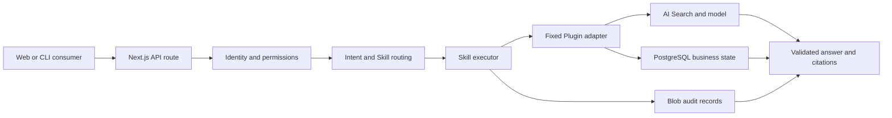

# ESP Architecture

This document describes the current Enterprise Skill Platform prototype. The broader target architecture and product
direction remain in the [project README](../README.md#target-architecture). Stable cross-capability engineering
invariants are versioned in the [ESP Engineering Contract v1](specs/esp-engineering-contract-v1.md).

## System context

ESP accepts an employee intent, selects an eligible governed Skill, invokes its fixed Plugin binding, and returns a
validated result with evidence and audit metadata. The current consumers are the Web application and bounded CLI/HTTP
tools. Microsoft 365 Copilot, Copilot Studio, MCP, and external systems are target integrations, not current runtime
dependencies.



## Code boundaries

| Boundary                                    | Responsibility                                                                               | Must not own                                   |
| ------------------------------------------- | -------------------------------------------------------------------------------------------- | ---------------------------------------------- |
| [`src/app`](../src/app)                     | Next.js pages, UI state, and HTTP transport                                                  | Domain authorization or persistence invariants |
| [`src/lib/esp`](../src/lib/esp)             | Contracts, routing, permissions, execution, evidence checks, audit, and persistence adapters | Presentation-only state                        |
| [`src/data`](../src/data)                   | Versioned synthetic business and knowledge fixtures                                          | Credentials or real enterprise records         |
| [`scripts`](../scripts)                     | Local launch, deterministic generators, evaluators, packaging, and deployment controls       | Unreviewed production mutations                |
| [`infra`](../infra)                         | Bicep templates and environment parameters                                                   | Runtime business logic                         |
| [`.github/workflows`](../.github/workflows) | Pull-request validation and gated release automation                                         | Application policy decisions                   |

HTTP routes should parse and validate transport input, resolve identity, and call a domain service. Domain services own
permission, confirmation, idempotency, state-transition, and evidence rules. Storage and model adapters remain behind
those services so UI code cannot bypass the controls.

[`src/lib/esp/index.ts`](../src/lib/esp/index.ts) is the public entry point for cross-boundary consumers. Export only
stable, side-effect-free contracts and helpers there; application modules inside the boundary may continue using focused
imports.

The Node 24 devcontainer, `setup.sh`, and `npm run setup` provide a reproducible dependency and Hook bootstrap. They do
not provision Azure services, credentials, runtime data, or model access.

## Request lifecycle

1. Resolve the current identity and permissions.
2. Parse a bounded request with the shared Zod contracts.
3. Select only Skills and Plugin operations eligible for that identity.
4. Persist an audit start before a mutation is invoked.
5. Execute through the registered adapter; write operations require confirmation or approval where configured.
6. Validate returned contracts, source citations, and factual evidence before presenting success.
7. Persist the outcome and return safe error codes, request IDs, traces, and audit references.

Failure to record the audit start blocks a mutation. An audit finalization failure does not fabricate a failed business
operation; the response reports incomplete audit evidence. Unknown write outcomes are not retried automatically.

## Data and trust boundaries

- PostgreSQL stores ticket and approval business state. Blob Storage stores audit, review, and managed knowledge records.
- Azure AI Search retrieves published knowledge; model output is treated as untrusted until deterministic and semantic
  evidence checks pass.
- Repository fixtures are synthetic. Credentials and local environment files must not enter source control.
- The shared DEV identity is a demonstration boundary, not production user isolation or separation of duties.
- Cloud deployment, infrastructure, identity, migration, and live-model operations require explicit authorization.

## Validation and release

Pull requests run the application and infrastructure checks in
[`validate.yml`](../.github/workflows/validate.yml) and the CodeQL and secret-scanning checks in
[`security.yml`](../.github/workflows/security.yml). The local application equivalent is:

```powershell
npm run data:check
npm run docs:check
npm test
npm run lint
npm run format:check
npm run build
npm run test:e2e
```

[`release.yml`](../.github/workflows/release.yml) builds an immutable package and keeps deployment behind explicit
repository configuration, environment review, provenance checks, and rollback validation. A source merge does not
authorize a deployment.

The private repository plan does not provide GitHub Code Scanning storage. CodeQL therefore runs with upload disabled,
fails deterministically when SARIF contains findings or is missing, and retains the SARIF artifact for review instead of
relying on the Security tab.

[`codeblend-ai-readiness-evaluation.yml`](../.github/workflows/codeblend-ai-readiness-evaluation.yml) runs the vendored
CodeBlend evaluator only through manual dispatch. It uploads the generated reports and does not create issues, edit
source files, deploy, or run on a schedule.

[`ci-recovery.yml`](../.github/workflows/ci-recovery.yml) classifies failed same-repository `Validate` or `Security`
runs using a strict hosted-runner failure allowlist from the trusted default branch. It emits a bounded decision artifact
with classifier and failed-log digests, reruns failed jobs once only for a known transient signal, records the second
attempt's terminal outcome, and hands deterministic, unknown, or unavailable-log failures to humans. It does not execute
code from the failed ref, rerun successful jobs, retry a second failure, deploy, or mutate application data.

## Change guidance

- Change contracts before adapters and UI consumers when a public shape evolves.
- Add a discriminating test beside the owning domain module or route.
- Preserve exact source text, stable IDs, confirmation semantics, and audit ordering.
- Keep generated data changes in the generator and verify them with `npm run data:check`.
- Record skipped checks, residual risk, and rollback requirements in the pull request.
