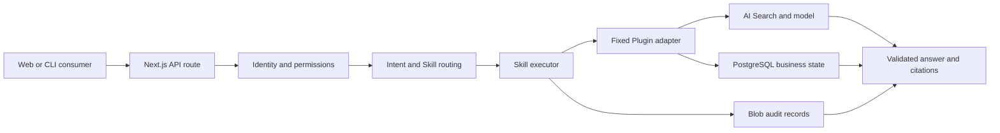

# ESP Architecture

This document describes the current Enterprise Skill Platform prototype. The broader target architecture and product
direction remain in the [project README](../README.md#target-architecture). Stable cross-capability engineering
invariants are versioned in the [ESP Engineering Contract v1](specs/esp-engineering-contract-v1.md).

## System context

ESP accepts an employee intent, selects an eligible governed Skill, invokes its fixed Plugin binding, and returns a
validated result with evidence and audit metadata. The current consumers are the Web application and bounded CLI/HTTP
tools. Microsoft 365 Copilot, Copilot Studio, MCP, and external systems are target integrations, not current runtime
dependencies.



## Code boundaries

| Boundary                                    | Responsibility                                                                               | Must not own                                   |
| ------------------------------------------- | -------------------------------------------------------------------------------------------- | ---------------------------------------------- |
| [`src/app`](../src/app)                     | Next.js pages, UI state, and HTTP transport                                                  | Domain authorization or persistence invariants |
| [`src/lib/esp`](../src/lib/esp)             | Contracts, routing, permissions, execution, evidence checks, audit, and persistence adapters | Presentation-only state                        |
| [`src/data`](../src/data)                   | Versioned synthetic business and knowledge fixtures                                          | Credentials or real enterprise records         |
| [`scripts`](../scripts)                     | Local launch, deterministic generators, evaluators, packaging, and deployment controls       | Unreviewed production mutations                |
| [`infra`](../infra)                         | Bicep templates and environment parameters                                                   | Runtime business logic                         |
| [`.github/workflows`](../.github/workflows) | Pull-request validation and gated release automation                                         | Application policy decisions                   |

HTTP routes should parse and validate transport input, resolve identity, and call a domain service. Domain services own
permission, confirmation, idempotency, state-transition, and evidence rules. Storage and model adapters remain behind
those services so UI code cannot bypass the controls.

[`src/lib/esp/index.ts`](../src/lib/esp/index.ts) is the public entry point for cross-boundary consumers. Export only
stable, side-effect-free contracts and helpers there; application modules inside the boundary may continue using focused
imports.

The Node 24 devcontainer, `setup.sh`, and `npm run setup` provide a reproducible dependency and Hook bootstrap. They do
not provision Azure services, credentials, runtime data, or model access.

## Request lifecycle

1. Resolve the current identity and permissions.
2. Parse a bounded request with the shared Zod contracts.
3. Select only Skills and Plugin operations eligible for that identity.
4. Persist an audit start before a mutation is invoked.
5. Execute through the registered adapter; write operations require confirmation or approval where configured.
6. Validate returned contracts, source citations, and factual evidence before presenting success.
7. Persist the outcome and return safe error codes, request IDs, traces, and audit references.

Failure to record the audit start blocks a mutation. An audit finalization failure does not fabricate a failed business
operation; the response reports incomplete audit evidence. Unknown write outcomes are not retried automatically.

## Data and trust boundaries

- PostgreSQL stores ticket and approval business state. Blob Storage stores audit, review, and managed knowledge records.
- Azure AI Search retrieves published knowledge; model output is treated as untrusted until deterministic and semantic
  evidence checks pass.
- Repository fixtures are synthetic. Credentials and local environment files must not enter source control.
- The shared DEV identity is a demonstration boundary, not production user isolation or separation of duties.
- Cloud deployment, infrastructure, identity, migration, and live-model operations require explicit authorization.

## Validation and release

Pull requests run the application and infrastructure checks in
[`validate.yml`](../.github/workflows/validate.yml) and the CodeQL and secret-scanning checks in
[`security.yml`](../.github/workflows/security.yml). The local application equivalent is:

```powershell
npm run data:check
npm run docs:check
npm run docs:drift
npm run agent-findings:check
npm run agent-improvement:check
npm test
npm run lint
npm run format:check
npm run build
npm run test:e2e
```

[`release.yml`](../.github/workflows/release.yml) builds an immutable package and keeps deployment behind explicit
repository configuration, environment review, provenance checks, and rollback validation. A source merge does not
authorize a deployment.

The private repository plan does not provide GitHub Code Scanning storage. CodeQL therefore runs with upload disabled,
fails deterministically when SARIF contains findings or is missing, and retains the SARIF artifact for review instead of
relying on the Security tab.

[`codeblend-ai-readiness-evaluation.yml`](../.github/workflows/codeblend-ai-readiness-evaluation.yml) runs the vendored
CodeBlend evaluator only through manual dispatch. It uploads the generated reports and does not create issues, edit
source files, deploy, or run on a schedule.

[`ci-recovery.yml`](../.github/workflows/ci-recovery.yml) classifies failed same-repository `Validate` or `Security`
runs using the versioned [self-healing containment policy](../.github/self-healing.json) and a strict hosted-runner
failure allowlist from the trusted default branch. It emits a bounded decision artifact
with classifier and failed-log digests, applies one flaky-infrastructure rerun only for a known transient signal, records the second
attempt's terminal outcome, and hands deterministic, unknown, or unavailable-log failures to humans. It does not execute
code from the failed ref, rerun successful jobs, retry a second failure, deploy, or mutate application data.

The [Agent Findings Ledger](agent-findings/README.md) stores only human-reviewed findings and proof-of-fix metadata.
Agent Review artifacts never update the ledger automatically; ledger changes use the normal pull-request validation and
ownership path. The [learned-rule corpus](agent-findings/learned-rules.json) promotes a control only from multiple
resolved findings with existing proof tests and explicit candidate, active, or retired lifecycle state. The deterministic
[improvement dashboard](../dashboards/agent-improvement.json) reports finding status, active rules, source coverage, and
uncovered findings. `npm run agent-improvement:check` rejects unresolved promotion evidence, stale lifecycle ordering,
missing controls or tests, duplicate source assignment, and stale dashboard metrics.

[`agent-review.yml`](../.github/workflows/agent-review.yml) is a manual, read-only Copilot review of one exact commit or
same-repository pull request. It separates trusted review code from untrusted target code, disables target instructions,
exposes only file-view/search tools, validates JSON output, and uploads provenance-bound artifacts without comments,
commits, approvals, issues, deployments, or ledger changes. The machine-readable
[`copilot-code-review.yml`](../.github/copilot-code-review.yml) policy pins the model, CLI, AI credit limit, trusted
review inputs, and read-only tool set; preparation and finalization both validate it, and the artifact context binds its
digest.

[`agent-repair-proposal.yml`](../.github/workflows/agent-repair-proposal.yml) is a manually dispatched agent-repair
surface for one exact commit and an explicit allowlist of existing files. Copilot receives view, search, and edit tools
but no shell or network tool; the workflow has no repository write permission. The trusted contract rejects staged,
untracked, deleted, renamed, out-of-allowlist, oversized, or unapproved-tool changes and emits only a digest-bound patch
artifact. Every proposal requires human review and manual application; it never commits, pushes, opens a pull request,
deploys, or mutates application data.

[`agent-findings-audit.md`](../.github/workflows/agent-findings-audit.md) is the declarative source for a weekly and
manually triggered GitHub Agentic Workflow. Its compiler-generated
[`agent-findings-audit.lock.yml`](../.github/workflows/agent-findings-audit.lock.yml) runs Copilot in a network-controlled
sandbox with bounded turns and AI credits, threat detection, read-only repository permissions, and one path-restricted
artifact output. It audits ledger proof but cannot mutate the ledger or create issues, comments, pull requests, commits,
approvals, or deployments. `Validate` recompiles all agentic workflows with pinned `gh-aw v0.88.7` and fails when source
and lock files differ. `npm run agentic-workflows:check` also parses the generated manifest to reject GitHub MCP access,
workspace edit or shell tools, persistent repository write permissions, or missing sandbox, threat-detection, budget, and
report-size controls.

The repository-local [ESP governance MCP server](../scripts/esp-governance-mcp-server.mjs), configured by
[`.vscode/mcp.json`](../.vscode/mcp.json), exposes only a validated governance snapshot and the non-mutating validation
plan. Both tools have fixed empty inputs, structured Zod outputs, read-only annotations, and no shell, network, or file
mutation capability.

## Change guidance

- Change contracts before adapters and UI consumers when a public shape evolves.
- Add a discriminating test beside the owning domain module or route.
- Preserve exact source text, stable IDs, confirmation semantics, and audit ordering.
- Keep generated data changes in the generator and verify them with `npm run data:check`.
- Record skipped checks, residual risk, and rollback requirements in the pull request.
